# BitResidual FIA Dequant 优化报告（P0–P12）

> 范围：`BitResidualFiaPagedK8v4` AIV 反量化与相关热路径  
> 验收口径：L6 `prof_tnd_pa_bit_residual.sh`，`kv=2000`，device=0，msprof Task Duration  
> 关键代码：`br_dequant_device.h`、`fia_block_vec_turboquant_p0.h`（及 Cube Acc@Π 相关）

---

## 1. 总览

早期瓶颈是 **AIV-bound**：每行/每 tile 的 meta DMA、`GetValue`/`V_S` 同步、以及 K8/V4 decode 向量链。后续优化按「先消同步与 DMA，再瘦 decode，再流水」推进。

### 1.1 性能轨迹（decode / prefill，µs）

| 阶段 | decode | prefill | 相对上一有效基线 | 合入建议 |
|------|--------|---------|------------------|----------|
| 早期 P0–P2 后（约） | ~1528 | ~1553 | — | 已合入 |
| P4–P6 后 | ~887 | ~926 | 大幅下降 | **合入** |
| P8 V4 LUT | ~1700 | ~1735 | **+90%** | **勿合入** |
| P9（n≤16 hoist） | ~908 | ~928 | −1~2% | **合入** |
| P9 + P12 | ~900 | ~928 | 小幅 | **合入** |
| **P9b（64 行全 hoist）** | **~807** | **~834** | **−10%+** | **合入** |
| P7a（减 PipeBarrier） | ~824 | ~860 | 回退 | **回退/勿合入** |
| P10（128B bank pad） | ~803 | ~835 | ≈噪声 | 可选/弱收益 |

当前生产基线以 **P9b** 为准（commit `c40ff40a`）。P10 在工作区可保留作布局实验，端到端几乎无墙钟收益。

### 1.2 合入 / 否决一览

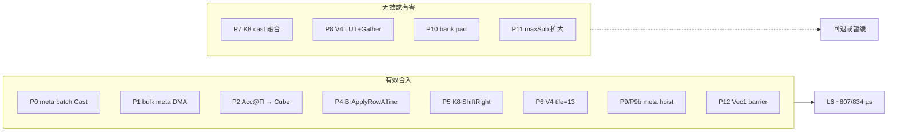

---

## 2. 背景：Dequant 热路径

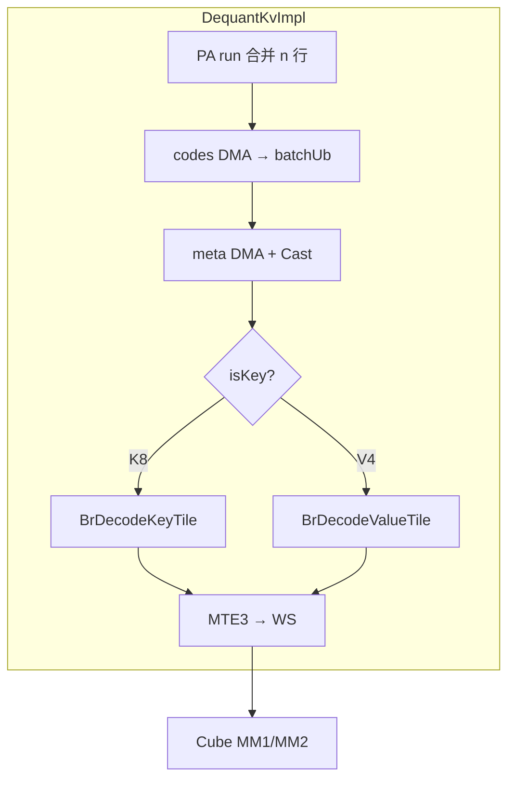

优化前的典型浪费：每行 meta + `V_S`、K8 float sign、AIV Acc@Π、V4 小 tile 多循环。

---

## 3. 有效优化（已合入）

每项均含 **Before / After 图示**、实现要点与实测收益。

---

### 3.1 P0 — Meta 批量 Cast（去 `V_S` / `GetValue`）

**问题**：K8/V4 反量化每行需要两个标量 meta（K8 的 `base`/`step`，V4 的 `vmin`/`vstep`）。优化前在 **AIV 上用标量读 UB**，每读一次就要 **`V_S` 同步**（等 NPU 把数送回 CPU 侧标量寄存器），decode 一 tile 8~13 行就要同步十几次，profile 里 AIV scalar 占比 ~50%。

---

#### 举例：K8 反量化 4 行（n=4）

每行 token 有一个 packed `code[128]`（uint8）和两个 half 标量：

```text
行 j   codes[j]          base[j]   step[j]     公式
────────────────────────────────────────────────────────────
 0     [c0..c127]         1.20      0.05    y = sign*(base + q7*step)
 1     [c0..c127]         1.18      0.06
 2     [c0..c127]         1.22      0.04
 3     [c0..c127]         1.19      0.055
```

P0 只改 **meta 怎么进 UB、怎么变成 fp32**；codes 的 DMA 和 sign/q7 逻辑不在本节。

---

#### Before P0：逐行 Cast + 标量 GetValue

**UB 布局（旧）**：每行 meta 占一个 **32B 槽**（实际只用前 2B），Cast 成 1 个 fp32 后再 `GetValue`：

```text
UB（旧，每行独立 32B 槽）
┌──────── 32B ────────┬──────── 32B ────────┬──────── 32B ────────┬──────── 32B ────────┐
│ meta0 row0 (2B有效) │ meta0 row1        │ meta0 row2        │ meta0 row3        │
│ [base0][pad......]  │ [base1][pad......]│ ...               │ ...               │
└─────────────────────┴─────────────────────┴─────────────────────┴─────────────────────┘
  同样再来 4 个 32B 槽存 step0..step3
```

**逐行处理流程（j=0 为例，重复 4 次）**：

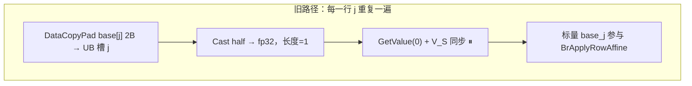

```text
时间线（4 行 × 2 个 meta = 8 次 V_S）:

  row0: Cast base ──V_S──► Cast step ──V_S──► decode row0
  row1: Cast base ──V_S──► Cast step ──V_S──► decode row1
  row2: ...
  row3: ...

  每个 ⏸ = AIV 流水线停顿，等标量值就绪
```

**旧代码形态（概念上）**：

```text
for j in 0..n-1:
  BrCopyMetaPair(..., row j)          // 2× DataCopyPad 2B
  base  = BrReadMeta16FromUb(...)     // Cast(1) + GetValue + V_S  ← 热点
  step  = BrReadMeta16FromUb(...)     // 又一次 V_S
  BrDecodeKeyRow(..., base, step, ...) // 标量传入 decode
```

---

#### After P0：整批 Cast，向量消费

**核心想法**：meta 在 GM 本来就是 **按行连续存放** 的（SoA），一次拷 `n×2B`，一次 `Cast(n)`，得到 **fp32 向量**，后面用 `Brcb` 行广播，全程不碰 `GetValue`。

**UB 布局（P0 后，n=4 举例）**：

```text
packedMetaUb（half 区，8B 有效 + 对齐填充）
┌────┬────┬────┬────┬ ... pad ... ┐
│b0  │b1  │b2  │b3  │             │  ← meta0 base，4×half = 8B
└────┴────┴────┴────┴─────────────┘
┌────┬────┬────┬────┬ ... pad ... ┐
│s0  │s1  │s2  │s3  │             │  ← meta1 step，4×half = 8B
└────┴────┴────┴────┴─────────────┘

         Cast(n=4) 一次
              ↓
meta0Fp32[4]          meta1Fp32[4]
┌──────┬──────┬──────┬──────┐   ┌──────┬──────┬──────┬──────┐
│ 1.20 │ 1.18 │ 1.22 │ 1.19 │   │ 0.05 │ 0.06 │ 0.04 │0.055 │
└──────┴──────┴──────┴──────┘   └──────┴──────┴──────┴──────┘
  idx0   idx1   idx2   idx3         同上，供 Brcb 用
```

**整批处理流程**：

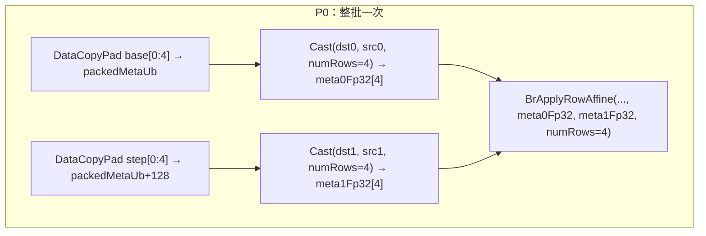

**P0 在 decode 里怎么用 meta（以 4 行为例）**：

```text
BrApplyRowAffine 内部（P4 配合 P0）:

  meta1Fp32 = [0.05, 0.06, 0.04, 0.055]  ← 已是向量，无 GetValue
       │
       ▼ Brcb：每个标量扩成 8 个 fp32（一行 headDim 的一个 block）
  broadcast_step 形状 ≈ [4 行 × 8 列块 × ...]
       │
       ▼ Mul：q7_fp32[4×128] × broadcast_step（按行广播）
       ▼ Add：+ broadcast_base
       ▼
  dst[4×128]  完成 4 行反量化

  全程 VEC 指令，0 次 V_S
```

**对比图（4 行 K8 tile）**：

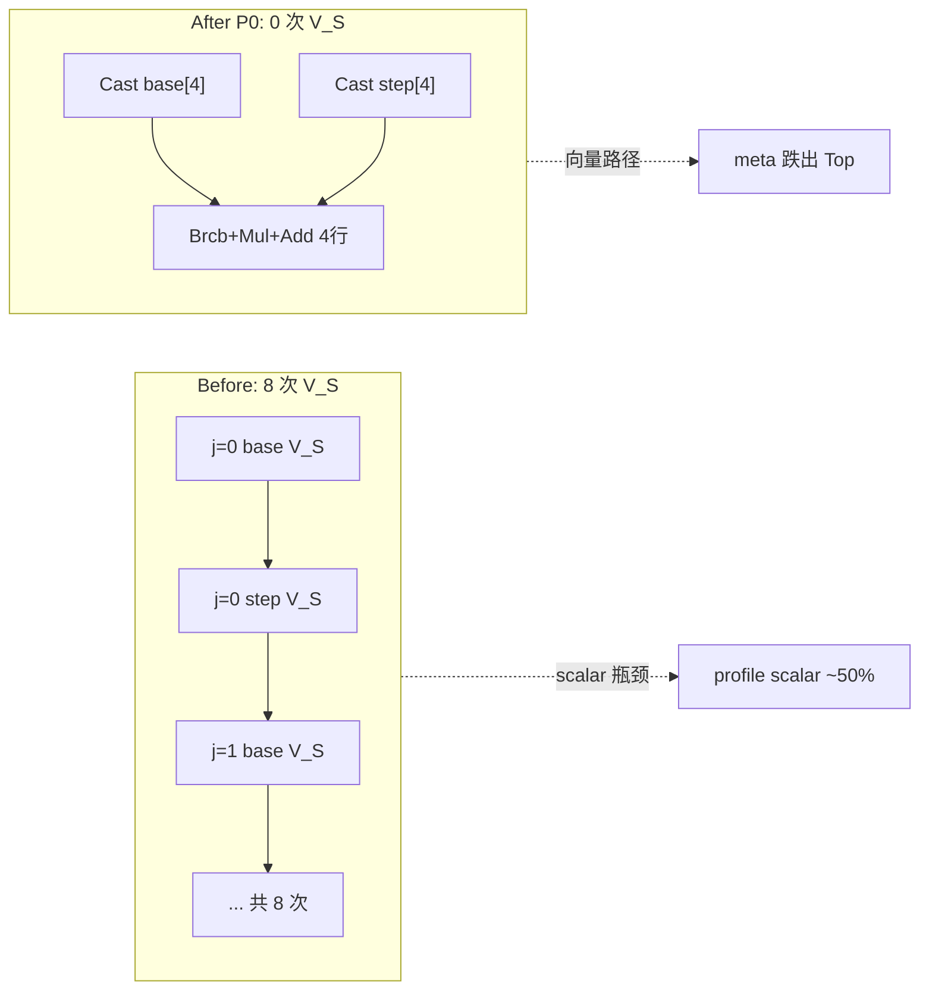

---

#### 和 P1 / P4 / P9 的关系

```text
P0  批量 Cast(n)           ← 本节：去掉 GetValue / V_S
P1  bulk DMA 2 次/run     ← 减少 MTE2 事务（配合 P0）
P4  BrApplyRowAffine       ← 消费 meta0Fp32[] 向量，Brcb 行广播
P9b 整 run 只做 1 次 P0+P1 ← meta 不再 per-tile 重复
```

| 阶段 | Cast 次数 (n=4) | GetValue / V_S | meta DMA |
|------|-------------------|----------------|----------|
| 优化前 | 8 次（每 meta 1 次） | **8 次** | 8×2B 小拷贝 |
| P0 后 | **2 次**（base+step 各 Cast 4） | **0 次** | 仍可能逐行（P1 再优化） |

---

#### 实现对应

| 步骤 | 函数 / 代码 |
|------|-------------|
| half → fp32 批量 | `BrCastPackedMetaToFp32(packedMetaUb, n, meta0Fp32, meta1Fp32)` |
| 向量行广播消费 | `BrApplyRowAffine(..., bases=meta0Fp32, scales=meta1Fp32, numRows=n, ...)` |
| 禁止再用的旧路径 | `BrReadMeta16FromUb` → `GetValue` + `V_S`（仅 legacy 单 row API 保留） |

**收益**：去掉 meta 热路径标量同步；为 P1 bulk DMA、P4 向量 affine、P9 meta hoist 铺路。

---

### 3.2 P1 — Pack 布局 bulk meta DMA

**问题（接 P0 §3.1）**：P0 解决了 Cast/`GetValue`，但若 meta 仍 **逐行 `DataCopyPad 2B`**，MTE2 仍要发 **2n 次小事务**（n=4 → 8 次）。Pack 布局里 meta 在 GM 已是 **SoA 连续数组**，完全可以 **2 次 bulk DMA** 整段搬进 UB，再交给 P0 的 `Cast(n)`。

---

#### 继续 P0 例子：K8 反量化 n=4，pos0=0

沿用 §3.1 的 4 行数据（`base[0:3]`、`step[0:3]`）。假设 PA block 内从 **第 0 行** 起连续取 4 行，`blockSize=128`，`headBase` 为该 kvHead 在 pack cache 的起始地址。

**Pack 布局在 GM 中的真实形状**（codes 与 meta **分段存放**）：

```text
headBase
│
├─ codes 区（每行 128B，行优先连续）
│   ┌──────── 128B ────────┬──────── 128B ────────┬─ ... ─┬──────── 128B ────────┐
│   │ codes[0]             │ codes[1]             │       │ codes[127]           │
│   +0                     +128                   +16384  (128 行 × 128B)
│
├─ base 区（SoA：所有行的 base 紧挨在一起，各 2B half）
│   ┌────┬────┬────┬────┬─ ... ─┬────┐
│   │b0  │b1  │b2  │b3  │       │b127│   ← headBase + 128×128 = +16384
│   └────┴────┴────┴────┴─ ... ─┴────┘
│         ↑ pos0=0 起 n=4 行 = 连续 8B  ← P1 bulk 源
│
└─ step 区（SoA：所有行的 step 紧挨在一起）
    ┌────┬────┬────┬────┬─ ... ─┬────┐
    │s0  │s1  │s2  │s3  │       │s127│   ← headBase + 128×130 = +16640
    └────┴────┴────┴────┴─ ... ─┴────┘
          ↑ 同样连续 8B
```

**偏移公式**（`br_pack_layout.h`）：

```text
meta0GmOff = headBase + blockSize×128 + pos0×2     // base[pos0]
meta1GmOff = headBase + blockSize×130 + pos0×2     // step[pos0]
拷贝长度   = numRows × 2B                          // n=4 → 8B
```

> 注意：单行逻辑上 `{codes, base, step}` 在 GM **不邻接**（codes 与 base 相距 ~16KB），但 **同 PA block 多行的 base[]、step[] 各自内部连续** —— 这正是 P1 能 bulk 的前提。

---

#### Before P1：逐行 2B 小 DMA（配合旧 `BrCopyMetaPair`）

每处理一行 j，MTE2 发 **2 次 2B** 拷贝到 UB 里分散的 32B 槽：

```text
for j = 0..3:
  BrCopyMetaPair(srcGm, ub, baseOff(j), stepOff(j))
    DataCopyPad 2B  GM[headBase+16384+j×2]  →  ub[32B槽 j]      ← 事务 1
    DataCopyPad 2B  GM[headBase+16640+j×2]  →  ub[32B槽 j+128]  ← 事务 2
```

**GM → UB 事务图（n=4，共 8 次 MTE2）**：

```text
GM base 区                    GM step 区
[b0][b1][b2][b3]              [s0][s1][s2][s3]
 │    │    │    │               │    │    │    │
 │2B  │2B  │2B  │2B             │2B  │2B  │2B  │2B
 ▼    ▼    ▼    ▼               ▼    ▼    ▼    ▼
UB 32B槽×4（base）             UB 32B槽×4（step）
[ b0 pad..][ b1 pad..]...      [ s0 pad..][ s1 pad..]...
```

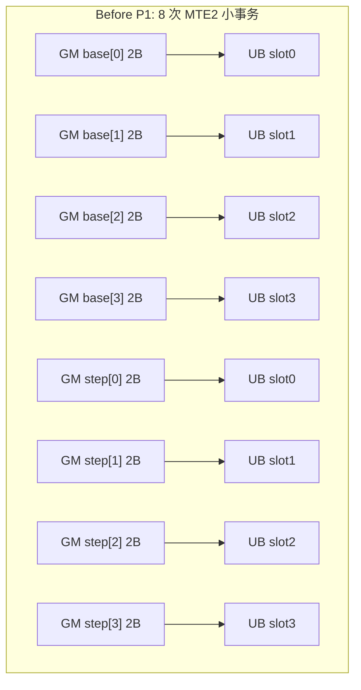

**代价**：每次 2B 事务都有 MTE2 启动/对齐开销；UB 侧还要 **4×32B = 128B** 槽位存 8B 有效数据，浪费且不利于后续 `Cast(n)` 连续读。

---

#### After P1：2 次 bulk DMA + P0 批量 Cast

`BrCopyPackedMetaTile` 只发 **2 次** `DataCopyPad`，长度 `numRows×2B`：

```text
BrCopyPackedMetaTile(srcGm, packedMetaUb, meta0GmOff, meta1GmOff, n=4)

  事务 A: GM[headBase+16384 : +8)  ──8B──►  packedMetaUb[0   : 128)   // meta0 run
  事务 B: GM[headBase+16640 : +8)  ──8B──►  packedMetaUb[128 : 256)   // meta1 run

  然后 P0: BrCastPackedMetaToFp32(..., n=4)  → meta0Fp32[4], meta1Fp32[4]
```

**GM → UB 一次到位（n=4）**：

```text
GM                              UB packedMetaUb
base: [b0][b1][b2][b3]  ──8B──► [0:128)   half meta0 run（Cast 源，32B 对齐区）
step: [s0][s1][s2][s3]  ──8B──► [128:256) half meta1 run
                                      │
                               Cast(n=4)  ← P0
                                      ▼
                               [256:512) meta0Fp32[4]
                               [512:768) meta1Fp32[4]
```

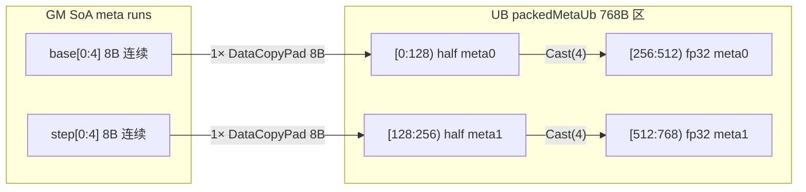

**P9b UB 完整布局（768B，meta 区上限 64 行；实际 n 见 §3.7.1）**：

```text
dequantInt8Buf_ / packedMetaUb
┌──────── meta0 half ×64 ────────┬──────── meta1 half ×64 ────────┐
│ 0                          128 │ 128                       256  │  ← P1 bulk DMA 落点
├──────── meta0 fp32 ×64 ────────┼──────── meta1 fp32 ×64 ────────┤
│ 256                       512  │ 512                       768  │  ← P0 Cast 落点
└─────────────────────────────────┴────────────────────────────────┘
         Cast 源 32B 对齐 ↑                decode 切片 meta0Fp32[j0]
```

n=4 时只用到每区前 8B（half）/ 16B（fp32），余量 pad 保证 **32B 对齐**，满足 `Cast` 与 `Brcb` 要求。768B 为 **容量上限**，不等于每次 run 都会 hoist 满 64 行（详见 §3.7.1）。

---

#### P0 + P1 串联（n=4 完整 meta 路径）

```text
① codes DMA（与 P1 独立，n 行 codes 也可 1 次 bulk：4×128B=512B 连续）
   GM codes[0:4] ──512B──► batchUb

② P1 meta bulk（2 次 MTE2）
   GM base[0:4] ──8B──► packedMetaUb[0:128)
   GM step[0:4] ──8B──► packedMetaUb[128:256)

③ P0 批量 Cast（2 次 VEC，0 次 V_S）
   Cast(4) → meta0Fp32[4], meta1Fp32[4]

④ P4 decode 消费
   BrDecodeKeyTile(..., meta0Fp32[j0], meta1Fp32[j0], nb, ...)
```

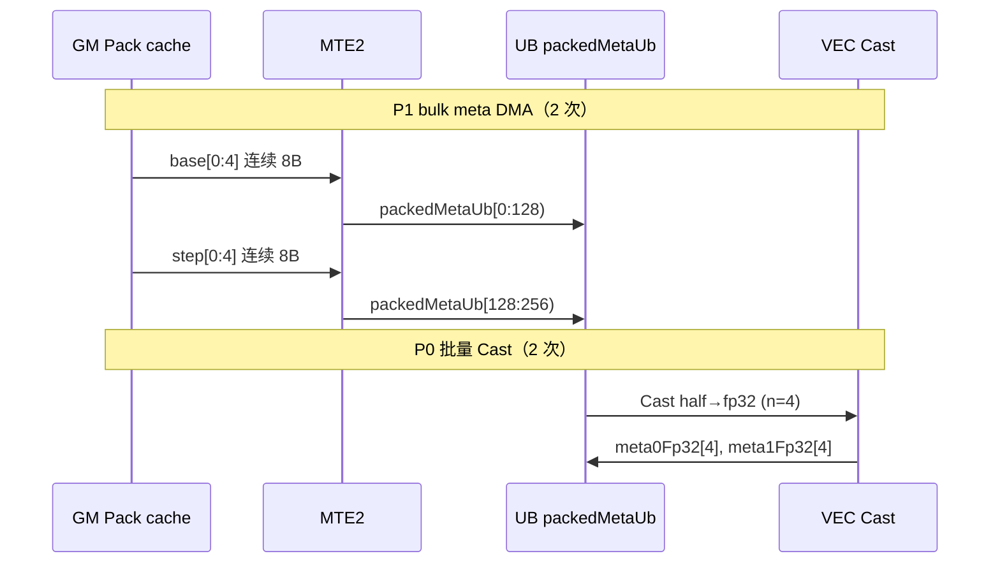

---

#### 和 P0 / P9b 的分工

| 优化 | 解决什么 | n=4 量化 |
|------|----------|----------|
| **P0** | Cast/`GetValue`/`V_S` | Cast 8→**2** 次；V_S **8→0** |
| **P1** | MTE2 meta 小事务 | DMA **8→2** 次；UB 槽 **4×32B→2×128B 对齐区** |
| **P9b** | meta 重复搬运 | 整 PA run 只做 **1 次 P1+P0**（最多 64 行），tile 循环只 decode |

P1 **单独**不消除 V_S（那是 P0）；P0 **单独**仍可能保留 8 次 2B DMA。两者合入后 meta 热路径才是：**2 bulk DMA + 2 batch Cast + 0 V_S**。

---

#### 实现对应

| 步骤 | 函数 / 参数 |
|------|-------------|
| bulk meta DMA | `BrCopyPackedMetaTile(srcGm, packedMetaUb, meta0GmOff, meta1GmOff, numRows)` |
| K8 偏移 | `BrKeyBaseOffset` / `BrKeyStepOffset(headBase, blockSize, pos0)` |
| V4 偏移 | `BrValVminOffset` / `BrValVstepOffset`（同理 SoA bulk） |
| 调用点 | `DequantKvImpl` 每个 run：`BrCopyPackedMetaTile` → `BrCastPackedMetaToFp32` |
| 旧路径（勿用） | `BrCopyMetaPair`：每行 2× `DataCopyPad 2B` |

**收益**：meta DMA 从 `O(n)` 次 2B 事务 → **2 次 bulk**；与 P0 共用对齐 UB 区；P9b 进一步降为 **每 PA run 2 次 bulk**（不再 per-tile 重复）。

---

### 3.3 P2 — Acc@Π 迁到 Cube

**问题**：Π 旋转在 AIV 上做大块矩阵乘，Cube 空闲（cube_ratio ~1%），AIV scalar/vec 过载。

**Before / After（数据流）**

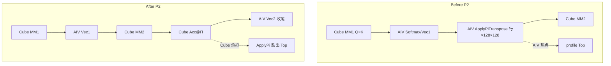

**实现**：输出路径 Acc@Π 改走 Cube matmul（对齐 TQ FIA P0）。

**收益**：整体从 ~1528 µs 级显著下降；`ApplyPiTransposeToRows` 跌出热点。

---

### 3.4 P4 — `BrApplyRowAffine`（行广播 Mul/Add）

**问题（接 P0 §3.1）**：P0/P1 已把 `base[]`、`step[]` 变成 UB 里的 **fp32 向量**。decode 核心公式是：

```text
K8:  err[row, col] = base[row] + q7[row, col] × step[row]
V4:  err[row, col] = vmin[row] + idx4[row, col] × vstep[row]
```

若仍用 **逐行标量** 或 **逐元素** 写 `base[row]`、`step[row]`，要么回到 `GetValue`/V_S，要么产生大量标量/低效 vec 循环。P4 用 **`Brcb` 行广播 + `Mul`/`Add` repeat**，一次处理 **numRows × headDim** 整块。

---

#### 继续 P0 例子：2 行 × 8 列（缩略 headDim=128）

为便于画表，先用 **n=2、headDim=8**（真实 K8 是 headDim=128，后面单独说明）。meta 来自 P0/P1：

```text
行 r   base[r]   step[r]     q7[r, 0..7]（已由 BrDecodeKeyTile 解出）
────────────────────────────────────────────────────────────────────
 0      1.20      0.05        [10, 20, 30, 40, 50, 60, 70, 80]
 1      1.18      0.06        [ 5, 15, 25, 35, 45, 55, 65, 75]
```

目标：每格 `err[r,c] = base[r] + q7[r,c] × step[r]`，例如 `err[0,0] = 1.20 + 10×0.05 = 1.70`。

---

#### Before P4：标量 / 逐元素思路（概念上）

```text
for r = 0..1:
  base_r = bases[r]      // 若 GetValue → V_S
  step_r = steps[r]
  for c = 0..7:
    dst[r,c] = base_r + src[r,c] * step_r
```

```text
行0: 需要 base_0, step_0 参与 8 次乘加  ─┐
行1: 需要 base_1, step_1 参与 8 次乘加  ─┘  共 16 次「行标量 × 列向量」
     标量路径或细粒度 loop，无法一次 VEC repeat 覆盖 2×8 块
```

---

#### After P4：两步向量行广播

`BrApplyRowAffine(dst, src, offsets, scales, broadcast, numRows, headDim)` 在 K8 里对应：

```text
src      = scratchC   ← q7 的 fp32 矩阵 [numRows × headDim]
offsets  = bases      ← meta0Fp32[]（base / vmin）
scales   = steps      ← meta1Fp32[]（step / vstep）
dst      = scratchA   ← 输出 err，再乘 sign 写 out
```

**Step 1 — Brcb(step) + Mul（按行广播 step）**

`Brcb` 把每行 **1 个标量 step[r]** 扩成 **8 个相同 fp32**（一个 FP32 block）：

```text
steps[] = [0.05, 0.06]          Brcb 后 broadcast（每行 8 格相同）
              │                         │
              ▼                         ▼
行0 step:  0.05  →  [0.05, 0.05, 0.05, 0.05, 0.05, 0.05, 0.05, 0.05]
行1 step:  0.06  →  [0.06, 0.06, 0.06, 0.06, 0.06, 0.06, 0.06, 0.06]
```

`Mul(dst, src, broadcast, columnCount=8, numRows=2)`：**同一行的 8 列共用 step[r]**

```text
              c=0    c=1    c=2    c=3    c=4    c=5    c=6    c=7
q7 行0:      10     20     30     40     50     60     70     80
× step 0.05
────────────────────────────────────────────────────────────────────
dst 行0:    0.50   1.00   1.50   2.00   2.50   3.00   3.50   4.00

q7 行1:       5     15     25     35     45     55     65     75
× step 0.06
dst 行1:    0.30   0.90   1.50   2.10   2.70   3.30   3.90   4.50
```

**Step 2 — Brcb(base) + Add（按行广播 base）**

```text
bases[] = [1.20, 1.18]

Brcb 后:
行0: [1.20, 1.20, 1.20, 1.20, 1.20, 1.20, 1.20, 1.20]
行1: [1.18, 1.18, 1.18, 1.18, 1.18, 1.18, 1.18, 1.18]

Add(dst, dst, broadcast, ...):
行0: 1.70, 2.20, 2.70, 3.20, 3.70, 4.20, 4.70, 5.20   ← 0.50+1.20, 1.00+1.20, ...
行1: 1.48, 2.08, 2.68, 3.28, 3.88, 4.48, 5.08, 5.68
```

**图示（2 行 × 8 列）**：

```text
         src (q7)                    scales (step)              offsets (base)
    ┌─────────────────┐         ┌───┬───┐                 ┌──────┬──────┐
    │ 10 20 ... 80    │ 行0     │0.05│   │                 │ 1.20 │      │
    │  5 15 ... 75    │ 行1     │    │0.06│                 │      │ 1.18 │
    └─────────────────┘         └───┴───┘                 └──────┴──────┘
              │                       │ Brcb                      │ Brcb
              │                       ▼                           ▼
              └──────► Mul ◄── [0.05×8] [0.06×8]  ──► Add ◄── [1.20×8] [1.18×8]
                           dst = q7×step                    dst += base
```

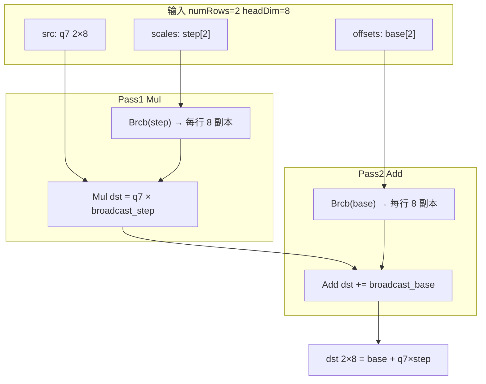

---

#### 真实 K8：headDim=128 时怎么跑

headDim=128 = **16 个 FP32 block**（每 block 8 元素）。`BrApplyRowAffine` 用 **columnLoops** 沿列分块，每轮最多 **64 列**（`FP32_REPEAT_ELEMS`）：

```text
headDim=128, numRows=4（P0 的 n=4 例子）

columnLoop=0: Mul/Add 列 [0:64)    ← 1 次 repeat，4 行 × 64 列
columnLoop=1: Mul/Add 列 [64:128)  ← 再 1 次 repeat

rowStrideBlocks = 128/8 = 16       ← 换行时 UB 步进 16 个 block
src1BlkStride = 0                  ← broadcast 侧：块内 8 列复用同一 step/base
src1RepStride = 1                  ← 换行时用下一行的 Brcb 块
```

```text
UB 视角（4 行 × 128 列，逻辑二维；内存一行 128 连续 float）

行0  q7[0,0..127]  ──× step[0]──►  + base[0]  ──► err[0,0..127]
行1  q7[1,0..127]  ──× step[1]──►  + base[1]  ──► err[1,0..127]
行2  q7[2,0..127]  ──× step[2]──►  + base[2]  ──► err[2,0..127]
行3  q7[3,0..127]  ──× step[3]──►  + base[3]  ──► err[3,0..127]

一次 BrApplyRowAffine 覆盖 4×128 = 512 个乘加，无标量 loop
```

---

#### 在 `BrDecodeKeyTile` 中的位置（K8 全链路）

接 P0/P1 的 n=4 例子，单 tile decode 数据流：

```text
codes[4×128] uint8
    → Cast / ShiftRight / And     解 q7、sign
    → scratchC = q7_fp32[4×128]
    → BrApplyRowAffine(scratchA, scratchC, meta0Fp32, meta1Fp32, ...)  ← P4
    → scratchA = base + q7×step
    → Mul(scratchA, sign_fp32)    应用符号
    → Cast → out fp16/bf16
```

P4 **只负责 affine**；sign 提取是 P5/P6，meta 向量是 P0/P1。

---

#### K8 / V4 共用同一 primitive

```text
K8:  BrApplyRowAffine(dst, q7_fp32,  bases=meta0Fp32, scales=meta1Fp32, ...)
V4:  BrApplyRowAffine(dst, idx4_fp32, offsets=meta0Fp32, scales=meta1Fp32, ...)
     公式相同：offsets + src × scales，仅 src 来源不同（q7 vs idx4）
```

---

#### P0 / P1 / P4 分工（n=4, headDim=128）

| 阶段 | 做什么 | 本例 |
|------|--------|------|
| **P1** | bulk DMA meta → UB half | 2×8B |
| **P0** | `Cast(4)` → `meta0Fp32`, `meta1Fp32` | 0 V_S |
| **P4** | `Brcb` + `Mul` + `Add` on 4×128 | 512 次乘加，2 pass × 2 columnLoop |
| 旧标量路 | 每格读 base/step | 512× 潜在标量依赖 |

---

#### 实现对应

| 步骤 | 代码 |
|------|------|
| 行广播 primitive | `BrApplyRowAffine` @ `br_dequant_device.h` |
| K8 调用 | `BrDecodeKeyTile`：`BrApplyRowAffine(scratchA, scratchC, bases, steps, ...)` |
| V4 调用 | `BrDecodeValueTile`：同一函数，`vmins`/`vsteps` |
| Brcb 临时 buffer | `broadcast` ← `halfScratch` reinterpret 为 `float` |
| repeat 参数 | `src1BlkStride=0`（块内广播），`dstRepStride=rowStrideBlocks`（换行） |

**收益**：K8/V4 统一 affine；与 P0 向量 meta 配套，decode 内 **零 meta 标量路径**。

---

### 3.5 P5 — K8 sign 用 `ShiftRight`

**问题**：旧路径 `sign = floor(code/128)` 走 float 除法 + Cast，指令多。

**K8 code 位布局**

```text
uint8 code (widened to u16):
  bit7 = sign (0→+, 1→-)
  bit6..0 = q7
  ┌───┬─────────────────┐
  │ S │ q7 (7 bits)     │
  └───┴─────────────────┘
   7       6 ... 0
```

**Before / After**

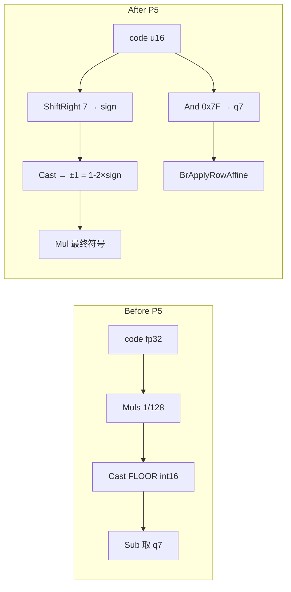

**实现**：`BrDecodeKeyTile` — `ShiftRight(signStorageU16, codeU16, 7)` + `And 0x7f`。

**收益**：少 2~3 条向量 pass；比 int16 直接 Mul 更安全（后者 507015）。

---

### 3.6 P6 — V4 decode tile 扩大到 13

**问题**：V4 tile 小 → 内层 decode 循环次数多；与 meta 循环叠加（P9 前更明显）。

**循环次数对比（n=64 行 V4 decode）**

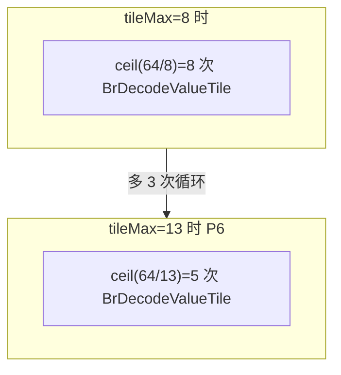

**UB scratch 占用**

```text
tmpBuff1 尾部 (32KB)
┌──────────────── staging ping/pong ────────────────┬─ scratch ─┐
│  codes + out rows                                │ V4:       │
│                                                  │ A B half  │
│  tile=13 → 13×128 elem × 2 fp32 + half           │ (无 fp32C)│
└──────────────────────────────────────────────────┴───────────┘
         K8: tile=8, 3×fp32 + half
         V4: tile=13, 2×fp32 + half  ← P6 关键改动
```

| | K8 | V4 |
|--|----|----|
| `BR_*_DECODE_TILE_MAX` | 8 | **13** |
| FP32 scratch | A, B, C | A, B |
| `fp32UbC` | tmpBuff1 | `dequantFp32Buf_` |

**收益**：P6 基线约 **887 / 926 µs** decode/prefill。

---

### 3.7 P9 / P9b — Meta DMA 按 run 全量 hoist

**问题**：P1 后仍 per-tile meta；`n>16` 时 else 分支是 profile 热点（1489/1508 行）。

**P9 → P9b 演进**

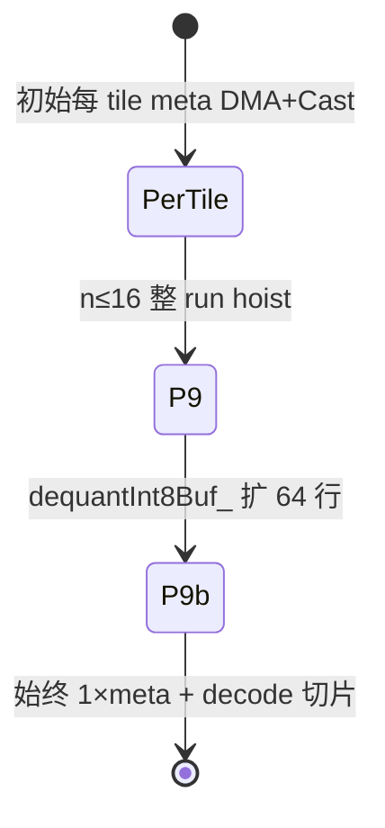

**Before / After（n=64 行 PA run）**

```mermaid
gantt
  title Meta + Decode 时序对比（示意）
  dateFormat X
  axisFormat %s

  section Before P9b n=64
  meta tile0   :0, 1
  decode t0    :1, 2
  meta tile1   :2, 3
  decode t1    :3, 4
  meta tile2   :4, 5
  decode t2    :5, 6

  section After P9b
  meta once    :0, 1
  decode t0    :1, 2
  decode t1    :2, 3
  decode t2    :3, 4
```

**hoistTile 与 Brcb 对齐**

```text
V4 tileMax=13，但 hoistTile = floor(13/8)*8 = 8

meta0Fp32 布局（fp32 索引）:
  [0..7 | 8..15 | 16..23 | ... ]  ← 每段 8 float = 32B 对齐
       ↑ j0=0      ↑ j0=8   ↑ j0=16

若 j0=13 不对齐 → Brcb 读 UB 非 32B 边界 → 507015
```

#### 3.7.1 `DECODE_TILE_MAX`(8/13) vs `BR_S2_SUB_MAX`(64)：两层行数

常问：**Key 一次 decode 最多 8 行向量处理，P9b meta UB 却预留 64 行，多取的用不上？**

答案：**不矛盾**——8 与 64 管的是 **两个不同层级** 的「行数」，不是同一个循环变量。

**两个常量各管什么**

| 常量 | 值 | 作用域 | 含义 |
|------|-----|--------|------|
| `BR_KEY_DECODE_TILE_MAX` | 8 | **decode tile** | `BrDecodeKeyTile` 一次 VEC 能算几行 codes（受 `tmpBuff1` 尾部 fp32/half scratch 限制） |
| `BR_VALUE_DECODE_TILE_MAX` | 13 | **decode tile** | V4 scratch 上限；`hoistTile` 对齐后实际按 **8** 行切片 |
| `BR_S2_SUB_MAX` | 64 | **PA run** | 一个 run 最多批量几行 + `dequantInt8Buf_` meta UB **容量上限** |

**两层流水线（run 级 vs tile 级）**

```text
一个 run（n 行，n ≤ min(64, byUb)）
│
├─ ① run 级（P9b）：meta 只做 1 次
│     BrCopyPackedMetaTile(n) + BrCastPackedMetaToFp32(n)
│     → meta0Fp32[0..n-1], meta1Fp32[0..n-1]  落在 768B 区
│
└─ ② tile 级（kTileMax=8）：codes 分块 decode
      for j0 = 0; j0 < n; j0 += hoistTile:   // hoistTile=8（K8 / 对齐后 V4）
        BrDecodeKeyTile(..., meta0Fp32[j0], meta1Fp32[j0], nb≤8)
        ↑ fp32 数组切片指针，不再 DMA / Cast meta
```

- **8** 限制的是 codes / q7 / sign 的 **VEC scratch 一次能铺几行**。
- **64** 限制的是 **一次 run 里 meta hoist 多少行**，以及 meta 专用 UB 的上限。
- meta 在 **`dequantInt8Buf_`（768B）**；decode scratch 在 **`tmpBuff1` 尾部**——两块 UB **互不抢空间**。

**举例：n=32 的 K8 run**

```text
P9b（1 次）:
  meta DMA + Cast(32) → meta0Fp32[32], meta1Fp32[32]
                        （fp32 区用 32×4×2 = 256B，未满 512B 槽）

decode（4 次 tile，每次 8 行）:
  j0=0:  BrDecodeKeyTile(codes[0:8],   meta0Fp32[0],  nb=8)
  j0=8:  BrDecodeKeyTile(codes[8:16],  meta0Fp32[8],  nb=8)
  j0=16: BrDecodeKeyTile(codes[16:24], meta0Fp32[16], nb=8)
  j0=24: BrDecodeKeyTile(codes[24:32], meta0Fp32[24], nb=8)
```

若无 P9b、每 tile 都搬 meta：32 行需 **4 次** meta DMA+Cast。P9b 做 **1 次**，后续 tile **复用** 已 Cast 的 `meta0Fp32[]`。

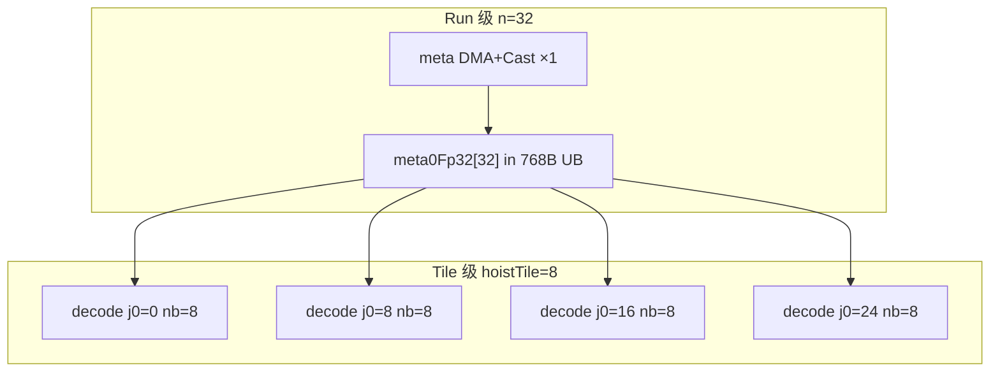

**64 行 UB 实际能满吗？**

**通常不满。** `DequantKvImpl` 里 `n` 还被 `tmpBuff1` batch 区限制：

```text
maxSub = BR_S2_SUB_MAX   // 64
byUb   = (kHalfBytes - 128) / perRow
n      = min(64, byUb, 同 block 剩余行数, siEnd - si)
```

粗算（K8，含 P10 bank pad，`kHalfBytes≈9KB`）：

```text
perRow ≈ codeRowBytes(128) + outRowBytes(256) = 384B
byUb   ≈ (9024 - 128) / 384 ≈ 23 行    ← 实际 n 上限常在此量级
```

| 问题 | 结论 |
|------|------|
| 8 与 64 矛盾吗？ | **不矛盾**：8 = decode tile 宽；64 = run 批 + meta UB 上限 |
| 64 行 meta 有用吗？ | **有用**：`n>8` 时一次 hoist、多 tile 切片消费 |
| 64 经常满吗？ | **通常不满**：`byUb` 先把 `n` 压在约 **20~27**（K8） |
| 768B 浪费吗？ | **成本低**：独立 `dequantInt8Buf_`；为 `BR_S2_SUB_MAX=64` 对齐及未来加大 batch 留 headroom |
| `n=8` 短 run 呢？ | meta 区只用 8/64，但仍是 **1 次** meta DMA+Cast，逻辑正确 |

**实现要点**：

1. `BR_PACKED_META_TILE_ROWS = 64`
2. `DequantKvImpl` 去掉 `if (n<=16)` / else
3. 一次 `BrCopyPackedMetaTile` + `BrCastPackedMetaToFp32(n)`
4. decode 循环 `j0 += hoistTile`（8 对齐）

**收益（L6）**：decode **~807 µs**，prefill **~834 µs**（相对 P6 约 −10%）。

---

### 3.8 P12 — Vec1 Softmax 路径减冗余 `PipeBarrier`

**问题**：`DealBmm1ResBaseBlock` 在 Elewise 与 Softmax 之间多一次 `PipeBarrier`，无数据依赖仍全核等待。

**Before / After（Vec1 单 tile）**

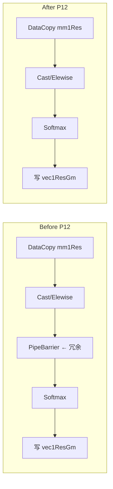

**实现**：删除 Elewise→Softmax 间 `PipeBarrier`（保留必要 MTE2_V / V_MTE3 event）。

**收益**：与 P9 叠加 decode **−1~2%**（~900→~900 µs 量级）；改动小、风险低。

---

## 4. 无效 / 有害 / 暂缓的优化

---

### 4.1 P7 — K8 Cast / sign 链融合 ❌

**意图**：减少 `BrDecodeKeyTile` 的 Cast 链与 PipeBarrier 数量。

**尝试路径**

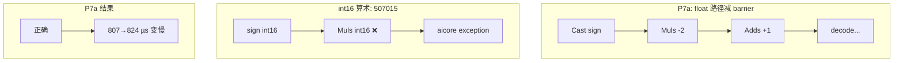

| 方案 | 结果 |
|------|------|
| int16 上直接算 ±1 | **507015** |
| P7a 去掉 2 个 PipeBarrier | 正确，**+17~26 µs** |
| Select 替 Muls/Adds | 未验证 |

**结论**：回退，勿合入。

---

### 4.2 P8 — V4 16-entry LUT + Gather ❌

**意图**：16 种 idx4 用 LUT 查表替代 `BrApplyRowAffine`。

**Before / After 计算路径**

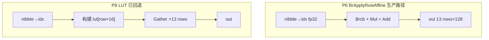

**为何慢（887 → ~1700 µs）**

```text
tile=13, headDim=128:
  BrApplyRowAffine: 2×Brcb + 2×列循环 Mul/Add（批量）
  LUT+Gather:       13行 × Gather + 大量 PipeBarrier + LUT 构建

Gather 随机访 UB >> 规则向量 Mul/Add
```

**结论**：勿合入；保持 `BrApplyRowAffine`。

---

### 4.3 P10 — UB bank pad（弱收益）⚠️

**意图**：scratch A/B/C/half 连续排列 → UB bank 冲突；插 128B pad 错开 bank。

**Before / After 布局**

```text
Before（连续，易同 bank 冲突）:
tmpBuff1 tail:
┌ staging ──────────────┬──A──┬──B──┬──C──┬half┐
│ ping | pong           │4096│4096│4096│2048│
└───────────────────────┴────┴────┴────┴────┘
                         ↑ BrApplyRowAffine 同时读 dst/src/broadcast

After P10（K8，+3×128B pad）:
┌ staging ────────────┬─A─┬pad┬─B─┬pad┬─C─┬pad┬half┐
│ 略缩小 kHalfBytes   │   │128│   │128│   │128│    │
└─────────────────────┴───┴───┴───┴───┴───┴───┴────┘
  kScratchBytes 含 pad → kStageBytes 同步减小（防 OOB）
```

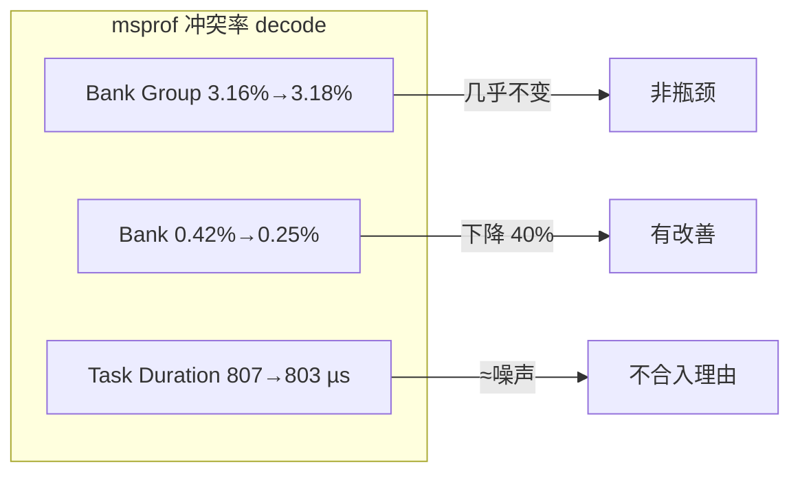

**结论**：组内 bank 冲突降，墙钟几乎不动；可选保留，不建议单独作为性能合入。

---

### 4.4 P11 — 扩大 PA run / `maxSub` ❌ 暂缓

**意图**：更大 `maxSub` → 更少外层 run 循环。

**UB 预算硬约束**

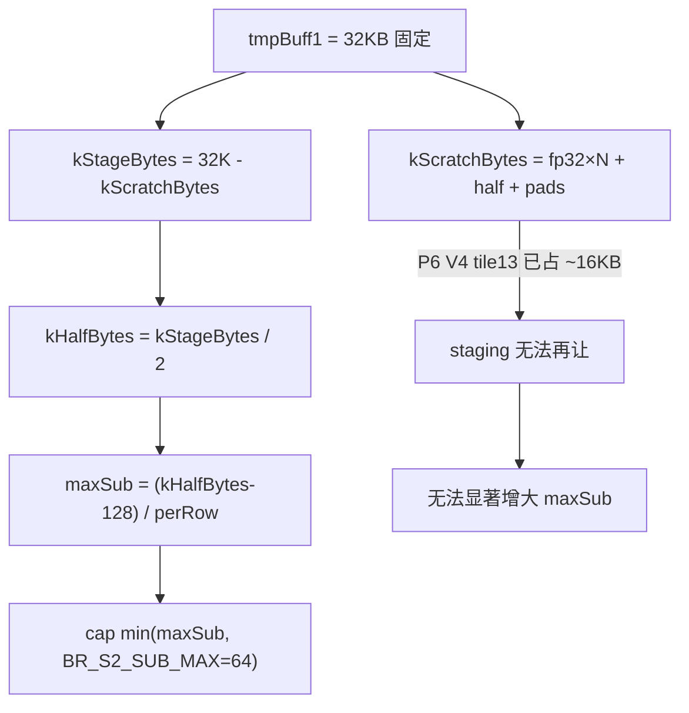

```text
K8 perRow ≈ 128 codes + 256 out = 384B
V4 perRow ≈ 64 codes + 256 out = 320B

maxSub 实际 ~20–24（由 UB 算出），不是 64 全满
→ 再扩 tile / 减 scratch 会 OOB 或 507015
```

**结论**：UB 已满；暂缓。

---

## 5. 实现对照表

| ID | 主要改动位置 | 图示章节 | 状态 |
|----|--------------|----------|------|
| P0 | `BrCastPackedMetaToFp32` | §3.1 | ✅ |
| P1 | `BrCopyPackedMetaTile` | §3.2 | ✅ |
| P2 | Cube Acc@Π | §3.3 | ✅ |
| P4 | `BrApplyRowAffine` | §3.4 | ✅ |
| P5 | `BrDecodeKeyTile` ShiftRight | §3.5 | ✅ |
| P6 | `BR_VALUE_DECODE_TILE_MAX=13` | §3.6 | ✅ |
| P7 | cast/barrier 融合 | §4.1 | ❌ |
| P8 | V4 LUT Gather | §4.2 | ❌ |
| P9/P9b | meta 64 行 hoist | §3.7（§3.7.1 两层行数） | ✅ |
| P10 | scratch 128B pad | §4.3 | ⚠️ |
| P11 | maxSub | §4.4 | ❌ |
| P12 | Vec1 barrier | §3.8 | ✅ |

---

## 6. 关键 UB 总览（P9b + 可选 P10）

```text
┌──────────────── tmpBuff1 32KB ────────────────────────────────┐
│ [staging ping | staging pong]  │ [A |pad| B |pad| C |pad| half] │
│  codes + dequant out rows      │  decode scratch (K8)           │
└────────────────────────────────┴────────────────────────────────┘

┌──────────── dequantInt8Buf_ 768B (P9b) ────────────┐
│ meta0 h×64 │ meta1 h×64 │ meta0 f32×64 │ meta1 f32×64 │
└────────────┴────────────┴──────────────┴──────────────┘
  容量上限 64 行；实际 run 的 n ≈ min(64, byUb) 通常 ~20+（K8），见 §3.7.1
  decode 仍按 hoistTile=8 切片消费 meta0Fp32[j0]，与 BR_KEY_DECODE_TILE_MAX 分工不同
```

---

## 7. 经验教训

1. **先消 DMA/同步，再抠 VEC 指令**：P9b >> P7a。
2. **对齐约束优先于 tile 尺寸**：hoistTile 必须 8 对齐。
3. **run 批行数 ≠ decode tile 行数**：`BR_S2_SUB_MAX=64` 是 meta hoist 上限；`BR_KEY_DECODE_TILE_MAX=8` 是 VEC scratch 一次宽度（§3.7.1）。
4. **LUT 不总是更快**：P8 约 2× 回退。
5. **msprof 冲突率 ≠ 墙钟**：P10 典型反例。
6. **勿 int16 Mul 造符号**：507015。
7. **slim rebuild ≠ serving build**：serving 需完整 `build_so`。

---

## 8. 建议的下一步

| 优先级 | 方向 | 说明 |
|--------|------|------|
| 高 | 保持 P9b 基线 | 已验证 |
| 中 | Dequant ↔ Cube 更深流水 | 架构级 |
| 低 | Vec1 再减 GM 往返 | P12 后边际小 |
| 跳过 | P7/P8/P11；P10 弱收益 | 见 §4 |

---

## 9. 相关文件

| 文件 | 角色 |
|------|------|
| `op_kernel/vendored/arch32/br_dequant_device.h` | decode / meta / affine |
| `op_kernel/vendored/arch32/fia_block_vec_turboquant_p0.h` | `DequantKvImpl`、Vec1 |
| `tools/bit_residual_fia_paged_k8v4/prof_tnd_pa_bit_residual.sh` | L6 msprof |
| `docs/architecture.md` | Pack 布局与整体架构 |
