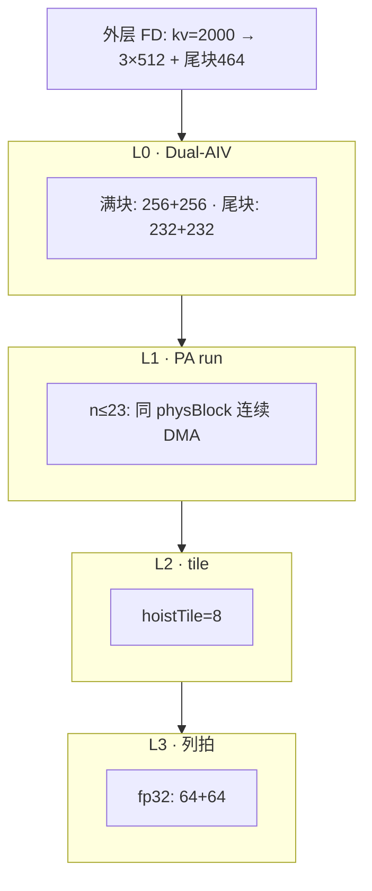
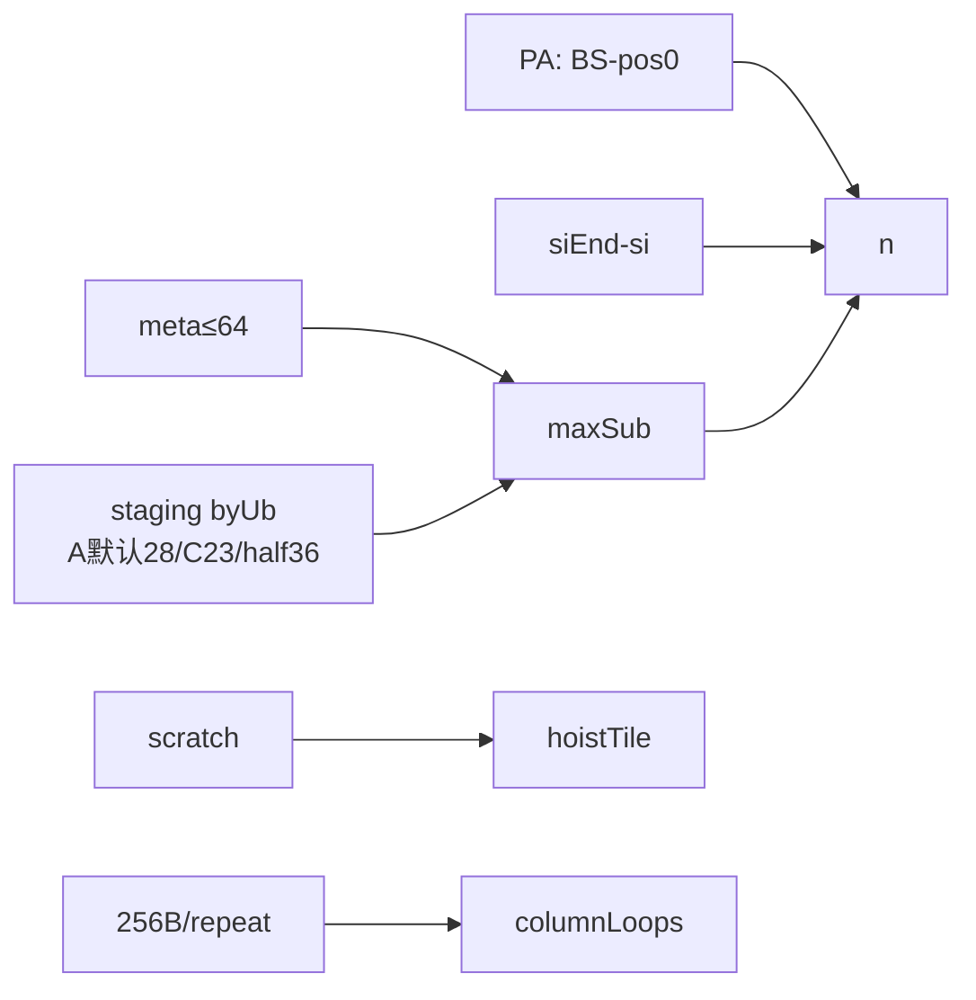
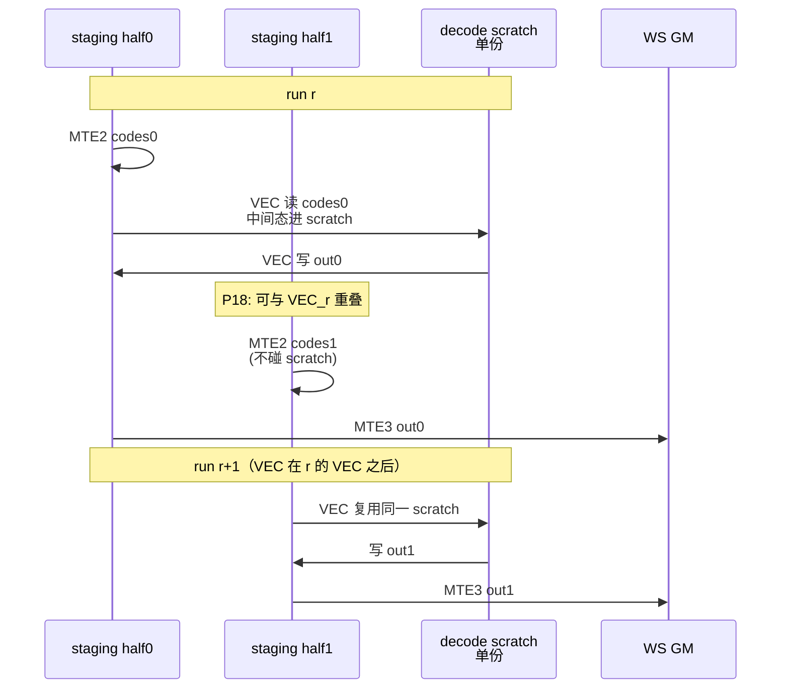
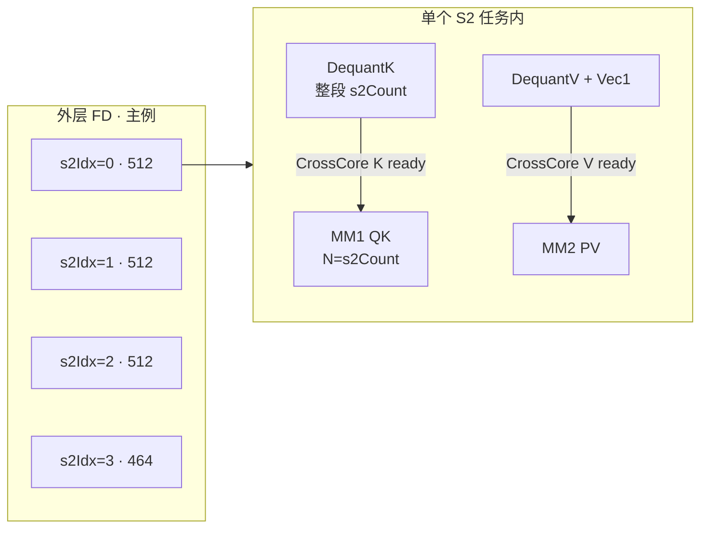
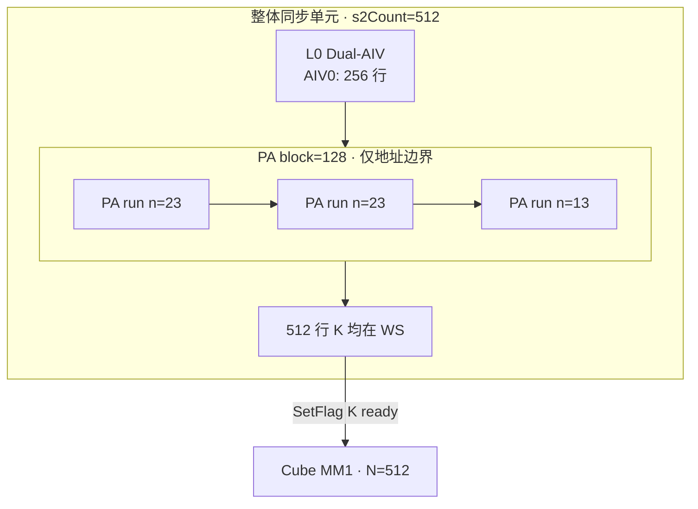
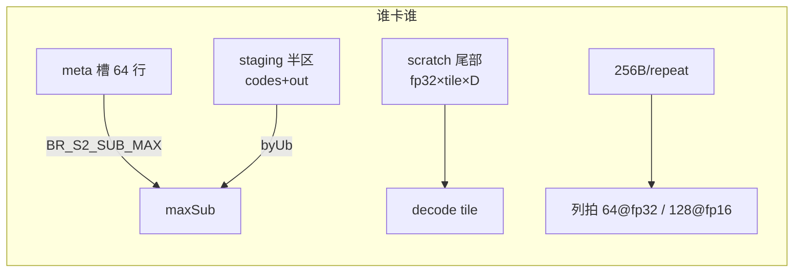
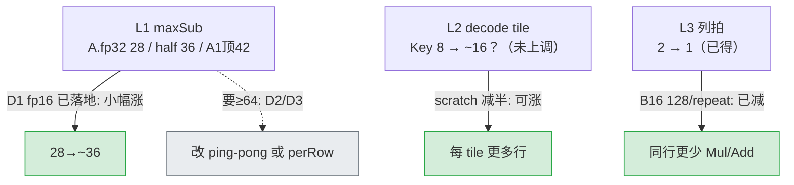

# BitResidual Dequant：PA Run / Tile / Affine 分层与 FP16 影响面

> 源码：`fia_block_vec_turboquant_p0.h`（`DequantKvImpl`）、`br_dequant_device.h`、`br_pack_layout.h`  
> 相关：[`br_dequant_decode_flow.md`](br_dequant_decode_flow.md)、[`dequant_opt_p0_p12_report.md`](dequant_opt_p0_p12_report.md)

本文说明反量化路径上的 **多层批大小**，以及 **affine 中间计算从 fp32 降到 fp16** 时，**哪一层能多处理数据、哪一层不会自动变大**。

---

## 术语：S1 / S2 / N1 / N2 / G / BS 等

这套术语沿用 CANN FIA（`FusedInferAttentionScore`）host tiling 的命名（见 `fia_tiling_info.h` 的 `bSize/n1Size/n2Size/s1Size/s2Size/gSize`）。先统一口径，否则下文公式里的字母容易和「KV head 数」「batch」混。

| 符号 | 全称 | 含义 | 本文主例值 |
|------|------|------|-----------|
| **B** | batch | 请求数（推理 batch size） | 16 |
| **S1** | query seq len | Q 侧序列长（每 batch 的 token 数）。TND 下用「每 batch S1 的 **max**」作为 tiling 的 `s1Size`，**不是 1**（即便 decode S1=1 也取 max，避免触发 FIA 的 `S1_EQUAL1` mask 布局） | prefill 240 / decode 16 |
| **S2** | kv seq len | KV 侧序列长（每 batch 已写入的历史 token 数）。tiling 用「每 batch S2 的 **max**」= `maxKvSeq` | 2000 |
| **N1** | num heads (Q) | Q 头数 = `num_heads` | —（见 N2/G） |
| **N2** | num kv heads | KV 头数 = `num_kv_heads`（GQA 的 K/V 头数，mBA/dPA 等模型常 =8） | 8 |
| **G** | group size | GQA group = `N1 / N2`（每个 KV head 服务 G 个 Q head） | `N1/8` |
| **D** | head dim | 每头维度。本算子硬约束 `head_size == 128` | 128 |
| **BS** | block size | paged-attention 物理 block 行数（`block_size`，须是 16 的倍数） | 128 |
| **s2Base** | S2 base tile | S2 方向外层基本块（host `kS2BaseSize=512`，且向 BS 对齐）。FD 按此切 chunk | 512 |
| **mBase** | M base tile | M（=S1×G）方向外层基本块（host `kMBaseSize=512`，对齐 FIA TND `M_BASE_SIZE_512`） | 512 |
| **maxSub** | PA run 行数 | 单次 PA run 反量化的 KV 行数上限 = `min(BR_S2_SUB_MAX=64, byUb)` | 见 §1.3.5，随 scheme/dtype 变 |
| **byUb** | staging 半区行数 | 一个 ping-pong staging half 能装下的「codes+out 同驻」行数 | 同上 |
| **hoistTile** | decode tile | 一次 `BrDecode*Tile` 处理的行数（Brcb 32B 对齐 → 8 的倍数） | Key 8 / Val 13 |

**几个易混点**：

- **N1/N2 vs NKV**：本文与代码里「KV head 数」用 **N2**（FIA 命名）；`NKV` 是同一概念在 pack/文档别处的别名，**N2 = NKV = num_kv_heads**。`N1 = N2 × G`。
- **S1G**：外层 SplitCore 的 M 轴实际是 `S1 × G`（把 G 个 Q head 摊进 M），代码里记作 `s1GBaseNum = ceil(S1*G / mBase)`。所以「M 轴」「S1G 轴」是同一件事。
- **S2 在 dequant 里有三级**：外层 FD 切的 `s2Count`（≈ s2Base 或尾块）→ L0 Dual-AIV 对半的 `[siStart,siEnd)` → L1 PA run 的 `n`。别把 `kvSeq=2000` 直接塞进 `n` 的公式。
- **BS（block_size）≠ s2Base**：BS=128 是 paged 物理页行数，只卡连续 DMA 与 `pos0`；s2Base=512 是 FD 外层切 chunk 的大小。

### Scheme（Key 反量化公式，决定 scratch fp32 槽数）

`BR_KEY_UNIFORM_SCHEME`（`br_dequant_device.h`，**默认 = 1**）：

| Scheme | 公式 | scratch fp32 槽 | 默认编译? |
|--------|------|----------------|----------|
| **A (1, 默认)** | `y = base + q*step`，q∈[0,255] uint8 | **2×fp32** + 1×half | ✅ 默认 |
| B (2) | `y = s*(q-127.5)`，meta0=-127.5*s, meta1=s | 2×fp32 + 1×half | 否 |
| C (3, legacy) | `y = sign*(base+q7*step)`，code=(q7<<1)\|sign | **3×fp32** + 1×half | 否（需 `-D...=3`） |

> ⚠️ 下文若见「Key 3×fp32 / maxSub=23 / scratch=14336B」，那是 **Scheme C** 的数字。**默认 Scheme A** 编译下 Key 是 **2×fp32**，scratch=10240B，`byUb≈28`（见 §1.3.5 的 scheme 对比表）。本文 §1.3.5 起已按 scheme 分列。

### Dequant 分层对 prefill / decode 相同

都走 `DequantKvImpl`；差别在外层 Q/Cube/Softmax，不在 L1–L3 公式。
`Q=240` / `B=16` **不进入** `siStart/siEnd` 与 `n` 的公式，只影响调度多少任务和 Cube 侧 M 维。

---

## 用例口径

与仓库 L6 / longquery 对齐：

| 用例 | 入口 | 典型 shape | 说明 |
|------|------|------------|------|
| **L6 prefill** | `prof_tnd_pa_bit_residual.sh … --workload=prefill --kv=2000` | Q=240（q/seq≈15），B=16，kvSeq=2000，`s2Base=512`，BS=128 | 下文主例；P18 Task Duration ≈ **663 µs** |
| **L6 decode** | 同上 `--workload=decode` | Q=16（q/seq=1），其余同左 | 同 S2 反量化量；P18 ≈ **639 µs** |
| **longquery serving** | `xrx_bit_residual_k8v4_long_query_profile.py` | prefill 块 Q≈241；decode Q=16；prompt≈2000 | 与 L6 同数量级 S2；pack 只写新 token |

**贯穿主例（下文每层都用它）**：

```text
Prefill L6: Q=240（q/seq≈15）, B=16, kvSeq=2000, s2Base=512, BS=128
            N2=8, D=128；hoistTile=8（Key）/ 13（Val）
            Key 有效 maxSub：默认 Scheme A ≈28；Scheme C ≈23；half-affine ≈36
```

---

## 0. 主例：外层 FD 先切 `kvSeq`（再进 `DequantKvImpl`）

Dual-AIV 的三行公式 **只看到当前任务的 `s2Count`**，看不到整段 2000。先由 FlashDecoding 按 `s2Base=512` 切开：

```text
kvSeq = 2000, s2Base = 512
→ ceil(2000/512) = 4 个 S2 chunk

s2Idx=0:  token [0, 512)       s2Count = 512   ← 满块
s2Idx=1:  token [512, 1024)    s2Count = 512
s2Idx=2:  token [1024, 1536)   s2Count = 512
s2Idx=3:  token [1536, 2000)   s2Count = 2000 - 1536 = 464  ← 尾块（不是 488）

每个 (bIdx, n2Idx, s2Idx) 调用一次（或等价一次）Dequant 路径时:
  s2Count = actualSingleProcessSInnerSize  ∈ {512, 512, 512, 464}
```

```text
token 0                          1536              1999
|------ chunk0 512 ------|------1------|------2------|--- chunk3 464 ---|
s2Idx=0                  1             2             3
```

之后 **§1.2 L0** 才对某个 chunk 的 `s2Count` 做 `%2` 对半。

---

## 1. 概念一览（由外到内）

| 层级 | 名字 | 主例上的典型值 | 一次处理什么 | 主要受谁约束 |
|------|------|----------------|--------------|--------------|
| （外） | **FD S2 chunk** | 3×512 + **1×464** | 一段连续 KV | `s2Base=512` |
| L0 | **S2 子核区间** | 满块每核 256；尾块每核 **232** | `[siStart, siEnd)` | Dual-AIV 对半 |
| L1 | **PA run** | Key `n≤28`（Scheme A 默认）/ `≤23`（Scheme C）/ `≤36`（half-affine） | 同 PA block 连续 `n` 行 DMA+decode | PA∩子核剩余∩`maxSub` |
| L2 | **Decode tile** | `hoistTile=8`；`n=23`→3 tile | 一次 `BrDecode*Tile` | scratch + Brcb 8 对齐 |
| L3 | **Affine 列拍** | 每行 **2** 拍 @fp32 / **1** 拍 @fp16 | `headDim=128` 的 Mul/Add | 256B/repeat |

**一句话**：FD 决定「这次 dequant 面对多长的 S2」；L0 决定「两个 AIV 各拿一段」；PA run 决定「一次从 GM 拉多少行」；tile 决定「拉进来后一次 VEC 算多少行」；列拍决定「一行 128 维要几次 Mul/Add」。

> **约束公式**见 [§1.1–§1.5](#11-约束总图谁卡谁)（每层含主例）。  
> **整体流水 vs Dequant 内部流水（图示）**见 [§1.6](#16-主例整体流水-vs-dequant-内部流水图示)。  
> **Prefill vs Decode / longquery / fp16**见 [§1.7](#17-prefill-vs-decode-longquery-与-fp16)。  
> **Host 侧 SplitCore 核间负载均衡**（FD chunk 由谁切、每核拿哪段 S2）见 [§1.8](#18-host-侧-splitcore核间负载均衡cube-分核)。



---

## 1.1 约束总图：谁卡谁

```text
  外层 FD          kvSeq → 多个 s2Count（主例: 512 或 464）
                         │
                    ┌────▼─────────────────────────────────────┐
   L0 Dual-AIV      │ si ∈ [siStart, siEnd) = 对半(s2Count)    │
                    └────┬─────────────────────────────────────┘
                         │ 本核还剩多少 token
                    ┌────▼─────────────────────────────────────┐
   PA               │ maxInBlock = BS - pos0                   │
                    │ pos0 = globalS2 % BS（块内行下标）         │
                    └────┬─────────────────────────────────────┘
                         │
                    ┌────▼─────────────────────────────────────┐
   L1 n = min(…)    │ maxSub = min(64 meta, byUb staging)      │
                    │   byUb: A默认≈28 / Scheme C≈23 / half≈36 │
                    └────┬─────────────────────────────────────┘
                         │
                    ┌────▼─────────────────────────────────────┐
   L2               │ hoistTile=8（scratch + Brcb 对齐）         │
                    └────┬─────────────────────────────────────┘
                         │
                    ┌────▼─────────────────────────────────────┐
   L3               │ columnLoops = ceil(128 / (256/sizeof))   │
                    └──────────────────────────────────────────┘
```



---

## 1.2 L0：Dual-AIV（主例：满块 512 / 尾块 464）

代码：

```cpp
uint32_t subCoreId = GetBlockIdx() % 2U;
uint32_t siStart = (s2Count * subCoreId) / 2U;
uint32_t siEnd   = (s2Count * (subCoreId + 1U)) / 2U;
```

| 约束来源 | 机制 | 不满足会怎样 |
|----------|------|----------------|
| 双 AIV 绑核 | 每个 cube 挂 2 个 vector；`% 2` 把 **当前** `s2Count` 对半 | 单核做完 → 墙钟近似 ×2 |
| 写 WS 不重叠 | 两核写不相交的 `si` 行 | 交叠会打坏 dequant WS |

**这三行不管什么**：整段 `kvSeq=2000`、`Q=240`、`B=16`、`BS=128`。那些由 FD / 调度 / 后面的 `pos0` 处理。

### 主例数值

| 当前任务 | `s2Count` | AIV0 `[siStart,siEnd)` | AIV1 | 每核行数 |
|----------|-----------|------------------------|------|----------|
| `s2Idx=0,1,2` 满块 | **512** | `[0, 256)` | `[256, 512)` | 256 |
| `s2Idx=3` **尾块** | **464** | `[0, 232)` | `[232, 464)` | **232** |

```text
满块 s2Count=512（subCoreId 只有 0/1，来自 GetBlockIdx()%2，不是 s2Idx）:
  subCoreId=0: siStart=(512*0)/2=0,   siEnd=(512*1)/2=256  → [0,256)
  subCoreId=1: siStart=(512*1)/2=256, siEnd=(512*2)/2=512  → [256,512)
                              ↑                    ↑
                         subCoreId=1         (subCoreId+1)=2  ← 只是 end 公式里的乘数

尾块 s2Count=464（2000−1536=464）:
  subCoreId=0: [0,232)
  subCoreId=1: [232,464)
  → s2Count 为偶数则两核均分；若为奇数，整数除法使两核差 0～1 行
```

尾块只是 **`s2Count` 更短**，对半规则不变——不是另一种特殊公式。

---

## 1.3 L1：PA run 与 `pos0`（主例）

### 1.3.1 `pos0` 是什么

```cpp
globalS2 = info.s2Idx * s2BaseSize + si;   // 序列上全局 KV 下标
blockInBatch = globalS2 / BS;              // 第几个逻辑 PA block
pos0 = globalS2 % BS;                      // ★ 块内行下标，从 0 起
maxInBlock = BS - pos0;                    // 本块从 pos0 到块尾还能连续读几行
```

```text
一个 PA block（BS=128）:
  行:  0 … pos0 … 127
            ▲
            本 run 从这里开始拷 codes/meta
  maxInBlock = 128 - pos0   （不能跨下一块的不连续物理页）
```

### 1.3.2 `n` 三道闸

```cpp
n = min(maxInBlock, siEnd - si, maxSub);
// maxSub = min(BR_S2_SUB_MAX=64, byUb)  → Key 有效：A默认 28 / Scheme C 23 / half 36
```

| 闸门 | 主例含义 |
|------|----------|
| `maxInBlock` | 同物理块内连续行；跨块必须换 `physBlock` / `headBase` |
| `siEnd-si` | 不写过本 AIV 的 L0 区间 |
| `maxSub≈28`（A默认）/ `23`（C）/ `36`（half） | staging 半区装不下更多（meta 64 仍松） |

### 1.3.3 主例：满块 `s2Idx=0`，AIV0，`si` 从 0 起（块对齐）

`s2Idx=0` → `globalS2 = 0+si`。AIV0：`si∈[0,256)`。

```text
si=0   → globalS2=0   → pos0=0   → maxInBlock=128
si=23  → … 第一段 run 吃完后继续
…

AIV0 的 256 行覆盖 2 个满 PA block:
  si [0,128)   → 一个 BS=128 的块，pos0 从 0 起
  si [128,256) → 下一块，同样从 pos0=0 起

每个满 block 内（maxSub=23）:
  run 长度: 23,23,23,23,23,13   → 6 次 PA run
  两 block → 12 次 PA run / AIV0 / 本 chunk / Key
  （AIV1 的 [256,512) 同样 12 次；再 × Value）
```

### 1.3.4 主例：尾块 `s2Idx=3`，`s2Count=464`

```text
globalS2 = 3*512 + si = 1536 + si
si=0 → globalS2=1536 → 1536%128=0 → pos0=0（尾块起点也块对齐）

AIV0: si∈[0,232)  → 232 行
AIV1: si∈[232,464) → 232 行

232 = 128 + 104:
  先一个满 PA block（6 runs，同满块算法）
  再半块 104 行: n 序列为 23×4 + 12 → 5 runs
  → 每 AIV 约 6+5=11 次 Key PA run（尾块比满块的 12 略少）
```

### 1.3.5 `maxSub`：为何远小于 64（布局约束）

`maxSub` 取两道闸的更紧者：

```cpp
maxSub = min(BR_S2_SUB_MAX /*=64, meta 槽*/, byUb /*staging 半区能装几行*/);
```

`byUb` 随 **scheme + dtype** 变（详见下表与 §C）：Scheme A（默认，2×fp32）Key `byUb≈28`；Scheme C（legacy 3×fp32）`≈23`；half-affine（已落地）`≈36`。三者都 `<64`，所以有效 maxSub 都被 staging 卡住，而非 meta。

> ⚠️ 下文 §1.3.5–§1.6 的逐行数值推演以 **Scheme C（maxSub=23）** 为示例口径（6 run/128 的叙述最直观）；**默认 Scheme A 编译**下把 23 换成 28、`ceil(128/28)=5 run`，几何关系完全一致。各 scheme 的精确 `byUb` 见本节 §A 末与 §C 表。

#### A. 两块独立 UB，卡的不是同一处

```text
┌── dequantInt8Buf_（独立 TBuf，P18 双槽各 768B）──────────────┐
│ 每槽: meta0/1 half×64 + meta0/1 fp32×64                     │
│ → BR_S2_SUB_MAX = 64（meta 行容量天花板）                    │
│ 主例: 未碰到；把 maxSub 提到 30 也仍 <64                     │
└──────────────────────────────────────────────────────────────┘

┌── tmpBuff1 = 32KB（dequant 期间独占）────────────────────────┐
│  ┌─ A1 ping-pong staging（前部）─ 决定 byUb / 有效 maxSub ─┐ │
│  │  half0 │ half1   各装: codes[n] + out[n]                │ │
│  └─────────────────────────────────────────────────────────┘ │
│  ┌─ decode scratch（尾部）─ 决定 TILE_MAX ─────────────────┐ │
│  │  Key: 3×fp32[tile×128] + half[tile×128]                 │ │
│  └─────────────────────────────────────────────────────────┘ │
│  staging + scratch = 32KB（零和）                             │
└──────────────────────────────────────────────────────────────┘
```

**meta=64 与 staging（A默认28 / C23 / half36）是两道闸**；今天绑死的是 **staging `byUb`**（meta 64 仍松）。
下面把 `tmpBuff1` 里 **ping-pong 存什么、scratch 存什么、Key 为何要 3×fp32** 展开。

##### A.1 A1 ping-pong staging：存什么、为何双份

`tmpBuff1` 前部 `kStageBytes` 切成两半（`kHalfBytes` 各一份），由 `runId % 2` 选 `half0` / `half1`：

```cpp
batchUb = tmpBuff1.GetWithOffset<uint8_t>(kHalfBytes, bufIdx * kHalfBytes);
// bufIdx = runId % 2
```

**每个 half 里同时驻留两类数据**（同一 run 的 `n` 行）：

```text
half[bufIdx]  （主例 Key: kHalfBytes=9216(Scheme C)/11264(A默认)/14304(half)，n≤maxSub）
┌─────────────────────────────────────────────────────────────┐
│ codes 区（MTE2 从 GM pack cache 读入）                        │
│   Key: n × 128 B  uint8 codes     （每行 128 维 q7|sign）   │
│   Val: n ×  64 B  uint8 nibbles   （每行 128 个 int4 打包） │
├─────────────────────────────────────────────────────────────┤
│ out 区（VEC decode 写完 → MTE3 拷到 dequant WS）             │
│   紧接 codes 之后，偏移 = AlignUp32(n × codeRowBytes)         │
│   n × headDimAlign × sizeof(WS_T)                            │
│   主例: n × 128 × 2B（half/bf16）                            │
└─────────────────────────────────────────────────────────────┘
  perRow = codeRowBytes + outRowBytes = 128+256 = 384 (Key)
```

| 区域 | 谁写 | 谁读 | 生命周期 |
|------|------|------|----------|
| **codes** | MTE2（GM→UB） | VEC（`BrDecode*Tile` 输入） | 本 run decode 结束前 |
| **out** | VEC（Cast 到 `WS_T`） | MTE3（UB→dequant WS GM） | 本 run MTE3 排空前 |

**为何 ping-pong（两份 half）**：

```text
run r 用 half0:  MTE2→VEC→MTE3
run r+1 用 half1: 可在 run r 的 MTE3 尚未结束时，就开始往 half1 做 MTE2
（A1：跨 run 的 MTE2∥MTE3；P18 进一步把下一 run MTE2 叠进当前 VEC）

若只有单 half：必须等 MTE3 写完 WS 才能覆盖 codes/out → 管道串行
```

```text
时间轴（示意）:
  half0: [MTE2_r][==== VEC_r ====][MTE3_r........]
  half1:              [MTE2_r+1][==== VEC_r+1 ====][MTE3_r+1]
                       ↑ A1/P18 重叠窗口
```

**不在 ping-pong half 里的东西**：

- **meta**（base/step 或 vmin/vstep）→ 独立 `dequantInt8Buf_` 双槽（P18）
- **decode 中间张量**（q7、sign、affine 临时）→ 尾部 scratch（见 A.2）

##### A.1b 为何 decode scratch **不需要** ping-pong（图示）

核心对比：**staging 上存在「上一 run 的 MTE3 还在读 out」与「下一 run 的 MTE2 要写」的冲突；scratch 只服务「当前正在飞的那一段 VEC」，下一 run 的 VEC 要等当前 VEC 结束后才开始。**

**1）谁和谁抢同一块 UB**

```text
                    staging half          decode scratch
                    (codes + out)         (A/B/C + half)
  ─────────────────────────────────────────────────────────
  MTE2 写 codes         ✓ 会写                  ✗ 不碰
  VEC 读 codes / 写 out ✓ 读写                  ✓ 只在 VEC 期用
  MTE3 读 out           ✓ 还在读                ✗ 不碰
  ─────────────────────────────────────────────────────────
  跨 run 冲突点:   MTE3_r 读 half0.out
                   同时 MTE2_r+1 写 half0?  → 必须换 half1
  跨 run 冲突点:   VEC_r 用 scratch
                   同时 VEC_r+1 用 scratch? → 不会同时发生
```

**2）时间轴：staging 双份 vs scratch 单份（P18）**

```text
时间 →

staging half0:
  [MTE2_r][======== VEC_r (读 codes0 / 写 out0) ========][==== MTE3_r 读 out0 ====]
staging half1:
                    [MTE2_r+1 写 codes1]                    [==== VEC_r+1 ====][MTE3…]
                         ▲
                         与 VEC_r 重叠（P18）；写的是 half1，不踩 half0

decode scratch（仅一份）:
           [=========== 仅 VEC_r 使用 ===========]
                                                      [==== 仅 VEC_r+1 使用 ====]
           ◄──────── 互不重叠 ────────►              ◄── 等 VEC_r 结束后才开始

meta slot0 / slot1:  与 staging 一样按 run 交替（P18 已双槽）
```



**3）若强行给 scratch 也做 ping-pong，会怎样**

```text
假设 scratch0 / scratch1 各一份（尾部字节 ×2）:
  → kScratchBytes 变大 → kStageBytes 变小 → byUb / maxSub 下降
  → 但 VEC_r 与 VEC_r+1 仍串行，叠不出第二段 VEC∥VEC
  → 纯属浪费 staging 容量，无流水收益
```

**4）一句话**

| Buffer | 要 ping-pong？ | 原因 |
|--------|----------------|------|
| staging half | **要** | MTE3_r 与 MTE2_r+1 **时间重叠**且都碰「codes/out 驻留区」 |
| meta 槽 | **要**（P18） | 同上，下一 run meta DMA ∥ 当前 VEC |
| decode scratch | **不要** | 只被 VEC 用；**相邻 run 的 VEC 不重叠**，单份串行复用即可 |

##### A.2 decode scratch：存什么、Key 为何 3×fp32

尾部从 `kStageBytes` 起，按 **一个 decode tile** 的最大行数预留（Key `tile=8`，Value `tile=13`）：

```text
kScratchElems = TILE_MAX × 128
Key:  8×128 = 1024 elems
Val: 13×128 = 1664 elems
```

**Key（`BrDecodeKeyTile`）需要的缓冲：**

| 符号 | 大小 | 在公式里的角色（会随流水复用/覆写） |
|------|------|--------------------------------------|
| `halfScratch` | `tile×128` × **half** | ① u8→half 拓宽；② 复用为 `0x01` mask；③ 再 reinterpret 为 affine 的 `Brcb` 广播缓冲 |
| `fp32UbA` / scratchA | `tile×128` × **fp32** | ① 先当 int16 存 code；② 再当 q7 位运算工作区；③ 最后写 `err=base+q7*step`，再 `×sign` → 待 Cast 的 y |
| `fp32UbB` / scratchB | `tile×128` × **fp32** | 专放 **sign→±1** 的 fp32 向量（`Cast→Muls(-2)→Adds(1)`），最后与 err 做 `Mul` |
| `fp32UbC` / scratchC | `tile×128` × **fp32** | ① 先当 int16 抽 **sign bit**；② 再 Cast 成 **q7 的 fp32**，作为 affine 的 `src` |

对应 `BrDecodeKeyTile` 数据流（同一 tile 内）：

```text
codesUb (在 staging half 里，不占 scratch)
   │
   ▼ Cast u8→half          → halfScratch
   ▼ Cast half→int16       → scratchA (codeI16)
   │
   ├─ And 0x01             → scratchC  (sign 的 int16)
   │     └─ Cast/Muls/Adds → scratchB  (sign 的 ±1 fp32)  ← 需要独立 B
   └─ >>1                  → scratchA  (q7 仍在 A，int16)
         └─ Cast           → scratchC  (q7 fp32，覆写原 sign 槽) ← 需要 C
               │
               ▼ BrApplyRowAffine(dst=A, src=C, base, step, brcb∈halfScratch)
                  scratchA ← err = base + q7*step
               ▼ Mul(A, B)  scratchA ← y = err * sign
               ▼ Cast       → outUb（写回 staging half 的 out 区）
```

**为何是 3 个 fp32，而不是 2 个：**

在 sign 已变成 `scratchB`（±1 fp32）之后，还要同时保留：

1. **q7 的 fp32**（affine 的 `src`）→ 占一块  
2. **affine 输出 err**（再与 sign 相乘）→ 占一块  
3. **sign 的 ±1** 必须留到最后的 `Mul(err, sign)` → 又占一块  

若只有 A/B 两块：`Cast(q7)`、`Affine` 写回、`sign±1` 三者会互相踩。当前实现用 **C 承载 q7 fp32、B 固定扛 sign、A 出 err/y**，所以 Key 是 **3×fp32 + 1×half**。

```text
同一时刻（affine 前后）至少要活着的张量:
  scratchB:  sign_fp32     ← 不能丢
  scratchC:  q7_fp32       ← affine 输入
  scratchA:  err / y       ← affine 输出再 ×sign
  halfScratch: Brcb 广播槽 ← 与 half 拓宽复用同一块
→ 3 个 fp32 工作区 + 1 个 half 工作区
```

**Value（`BrDecodeValueTile`）只要 2×fp32：**

```text
nibbles → Cast → halfScratch → Cast → scratchA (s 的 fp32)
                BrApplyRowAffine(dst=B, src=A, vmin', vstep)
                scratchB = y → Cast → out
→ 没有 sign 链，少一块 fp32C（代码里 Val 的 fp32UbC 改指向独立 dequantFp32Buf_ 小缓冲，不算进 tmpBuff1 尾部 3 槽）
```

**字节（主例 Key tile=8）：**

```text
3 × 1024 × 4B  = 12288   fp32 A/B/C
1 × 1024 × 2B  =  2048   halfScratch
合计 scratch     = 14336 B  （占满 32KB 后部；前部留给双 half staging）
```

##### A.3 和 meta 槽的分工（避免混淆）

| Buffer | 粒度 | 内容 |
|--------|------|------|
| staging half0/1 | **PA run**（最多 maxSub 行：A默认28/C23/half36） | codes + 反量化后的 out |
| decode scratch | **decode tile**（Key 8 行） | 解 bit / sign / affine 临时 |
| `dequantInt8Buf_` slot | **PA run**（设计最多 64 行） | meta0/1 packed + fp32 meta（给 Brcb） |

三者同时存在：run 级 DMA 用 staging+meta；tile 级 VEC 用 scratch 从 staging 的 codes 切片上算，写回 staging 的 out。

---

```text
1) scratch（Key, tile=8）
   elems = 8 × 128 = 1024
   fp32×2 (Scheme A/B) = 1024 × 2 × 4 =  8192 B
   fp32×3 (Scheme C)  = 1024 × 3 × 4 = 12288 B
   half×1             = 1024 × 2     =  2048 B
   ─────────────────────────────────────────────
   kScratchBytes:  Scheme A = 10240 B；Scheme C = 14336 B

2) staging 总预算（A1 双缓冲）
   Scheme A:  kStageBytes = 32768 − 10240 = 22528 B → kHalfBytes = 11264 B
   Scheme C:  kStageBytes = 32768 − 14336 = 18432 B → kHalfBytes =  9216 B

3) 每行要同时驻留的东西（关键）
   codes: BR_KEY_CODE_BYTES = 128 B/行
   out:   headDimAlign × sizeof(WS_T) = 128 × 2 = 256 B/行
   perRow = 128 + 256 = 384 B/行
   （meta 在独立 buffer，不占这 384）

4) byUb = (kHalfBytes − 128) / perRow
   Scheme A: (11264 − 128) / 384 = 11136 / 384 = 28.999… → 整数 28
   Scheme C: ( 9216 − 128) / 384 =  9088 / 384 = 23.666… → 整数 23

5) maxSub = min(64, byUb)
   Scheme A 默认 = 28；Scheme C = 23
```

Value（`perRow=64+256=320`，tile=13 → scratch 更大）同理：Scheme A 下 `byUb=24`、有效 maxSub=24（Scheme C 因 fp32 槽同 Key，scratch 更大，`byUb` 更小）。

```text
         meta 槽允许 ──────────────────────── 64
                          ╲
                           ╲ min
                            ╲
         staging byUb ───────●── 28 (Key, Scheme A 默认)   ← 当前绑点
                             │    23 (Key, Scheme C legacy)
                             │   ~36 (Key, half-affine, 见 §C 表)
                             n ≤ maxSub
```

主例「每 128 行约 6 次 PA run」对应 Scheme C（`ceil(128/23)=6`）；Scheme A 默认下 `ceil(128/28)=5`。与 meta 64 无关。

#### C. 为何「只改 dtype（affine→fp16）」也到不了 64

dtype 只变瘦 **scratch**（尾部），staging 仍是 **A1 双 half + 每行 codes∥out**：

| 布局假设 | Key scratch | `kHalfBytes` | `byUb` | 能否到 64？ |
|----------|-------------|--------------|-------|-------------|
| Scheme C fp32 scratch (3×fp32+half), tile=8, A1 双 half | 14336 | 9216 | **23** | 否 |
| **Scheme A fp32 scratch (2×fp32+half), tile=8, A1 双 half — 默认编译** | 10240 | 11264 | **28** | 否 |
| **half-affine 已落地**（WS_T=half, Scheme A/B, scratch=2×half+32B meta对齐槽） | 4160 | 14304 | **36** | 否（抬一截，仍远低于 64） |
| Scheme C 只改 affine→fp16（tile 仍 8，scratch 按 2B×3 + half） | 8192 | 12288 | **31** | 否 |
| 极限：scratch=0，仍 A1 双 half | 0 | 16384 | **42** | **否**（双缓冲硬顶） |
| 要 `byUb≥64` 且保留 A1 双 half | — | ≥24704 | ≥64 | **不可能**：需 `kStageBytes≥49408 > 32KB` |

```text
A1 双 half 在 32KB 内的 Key 理论上限:
  kHalfBytes ≤ 16384
  byUb ≤ (16384−128)/384 = 42

要 64 行 × 384 B/行 × 2 个 half ≈ 49KB > 32KB
→ 在「双 staging + codes/out 同驻」前提下，dtype 怎么改都不够
```

所以：**fp16 已落地（见下）**，确实把列拍 2→1、并把 Key `byUb` 从 28→~36；  
**但它解不开「冲到 64」**——那是 **A1 双缓冲 × perRow=384** 的几何问题，不是 meta、也不是 Cast 精度问题。

#### D. 若要扩大 `maxSub`，可以怎么走

按侵入性从低到高（主例 Key）：

| 路径 | 做法 | 预期 Key `byUb` | 代价 / 风险 |
|------|------|-----------------|-------------|
| **D1. 减 scratch（含 fp16）** | affine→fp16（**已落地**），或减 fp32 临时张量 | 28→**~36**（实测） | 精度；与加大 tile **零和** |
| **D2. 取消 A1 双 half** | staging 单区，靠 MTE3 排空后再 MTE2 | 现 scratch 下 ~**47**；fp16 scratch ~**63**；零 scratch ~**85** | 失去 A1 的 MTE2∥MTE3；可能回退 P18 部分重叠收益 |
| **D3. 缩小 `perRow`** | staging 只留 codes，out 改写到别的 Que/立即 MTE3 不长期占 half | A1+零 scratch 时 codes-only：`(16384−128)/128≈127` | 同步与流水重做；实现量大 |
| **D4. 扩 / 改 meta 槽** | 仅当 `byUb` 已 >64 时才有意义；改 `BR_S2_SUB_MAX` 与 768B 布局 | 解除 64 天花板 | 今日未碰到；单独做无收益 |
| **D5. 更大 staging 来源** | 从别的 TBuf 挪空间给 `tmpBuff1`，或接受更小 Vec1 窗口 | 视挪多少 | 与 softmax/其它路径抢 UB |

建议顺序：

1. **D1（fp16）已落地**：主例 Key maxSub 28→~36，每 128 行 run 数 5→约 4；顺带 L3 列拍减半。下一步可把省下的字节分给 tile（见 §5）。  
2. 若 profile 仍显示 PA run / DMA 次数是热点，再评估 **D2 或 D3**（架构级），不要指望「再削一点 dtype」到 64。  
3. **D4** 放在 staging 已经 ≥64 之后。

```text
扩 maxSub 决策树（Key）:

  默认 28 想到 36+ ──────────► D1 fp16（已实现）/ 瘦 scratch
  想接近 64 且保双缓冲 ──────► 32KB 几何不够 → 必须 D3 或加 UB
  想 ≥64 且可接受单 staging ► D2（+可选 D1）→ byUb~47..85，再 min(meta,…)
  想 >64 ───────────────────► D2/D3 之后再 D4 扩 meta
```

---


## 1.4 L2：Decode tile（主例示例 `n=23`，即 Scheme C 口径）

```cpp
hoistTile = 8;   // Key: TILE_MAX=8；Val TILE_MAX=13 也对齐成步长 8
for (j0 = 0; j0 < n; j0 += hoistTile)
    BrDecode*Tile(..., nb = min(hoistTile, n - j0));
```

| 约束 | 机制 |
|------|------|
| scratch | Key 要 3×fp32×tile×128 + half；定 `TILE_MAX=8` |
| Brcb | `meta0Fp32[j0]` 须 32B 对齐 → `j0` 步长 8 |

### 主例：一个 `n=23` 的 PA run（Key）

```text
j0=0  → nb=8   BrDecodeKeyTile 行 0..7
j0=8  → nb=8   行 8..15
j0=16 → nb=7   行 16..22
→ 3 次 tile / run

满块单 AIV 12 run × 3 tile ≈ 36 次 Key DecodeTile / chunk / AIV
尾块单 AIV ~11 run ×（多数 3 tile）略少
```

加大 `TILE_MAX` 会多吃 scratch → staging↓ → 主例的 `maxSub`（A默认28/C23/half36）可能再降（L1/L2 零和）。

---

## 1.5 L3：Affine 列拍（主例 `headDim=128`）

与 UB 无关：

```text
256B/repeat → fp32 每拍 64 元 → D=128 必须 columnLoops=2
            → fp16 每拍 128 元 → columnLoops=1
```

### 主例（fp32，Scheme C 示例口径）

```text
BrApplyRowAffine 每个 tile 的每一行:
  Mul [0:64), Mul [64:128);  Add 同理 → 每行 2 拍 Mul + 2 拍 Add

一个 n=23 的 run、3 个 tile:
  仍是「按行 × 2 列拍」；不因 prefill/decode 或满块/尾块改变
```

---

## 1.6 主例：整体流水 vs Dequant 内部流水（图示）

主例不变：`Prefill Q=240, B=16, kvSeq=2000, s2Base=512, BS=128, Key maxSub=示例23(Scheme C)/默认28(A)/36(half)`。

先分清两级「流水单元」：

| 层级 | 单元 | 主例大小 | 含义 |
|------|------|----------|------|
| **整体（与 Cube 同步）** | 一个 S2 任务 / FD chunk | **512**（尾块 **464**） | 这段 K（或 V）全部写入 dequant WS 后，才 `CrossCoreSetFlag`，Cube 才做 MM1/MM2 |
| **Dequant 内部** | 一个 PA run | **示例23(C)/默认28(A)/36(half)**（Key） | 一次 MTE2→VEC→MTE3；A1/P18 ping-pong 按此转 |
| PA block | 物理页 | **128** | 只限制连续 DMA，**不是**与 QK 的同步单元 |

---

### 1.6.1 整体流水（FIA `ExecuteTaskTq`，主例）

外层先按 FD 切 KV，再按任务流水（预取槽 `extraInfo0/1/2`）重叠不同阶段：

```text
kvSeq=2000
token: 0────────512───────1024──────1536──────2000
       | chunk0  | chunk1  | chunk2  | chunk3 |
s2Idx:     0         1         2         3
s2Count:  512       512       512       464
```

每个 S2 任务在核上的 **大同步**（以 `s2Idx=0`、s2Count=512 为例）：

```text
时间 →

AIV:  [======== DequantK：扫完 512 token ========] SetFlag(K)
      │  内部：多次 PA run(示例23/默认28/half36) × 双 AIV 对半 │
AIC:  WaitFlag(K) [======== MM1 QK，N=512 ========] SetFlag(C1)

AIV:  …（预取槽上另一任务）…  [==== DequantV 整段 s2Count ====]→Vec1
AIC:                          WaitFlag(V) [==== MM2 PV ====]

※ 不是「dequant 完一个 PA block=128 就 QK」
※ 是「dequant 完本任务全部 s2Count（512/464）才与 Cube 握手」
```



`ExecuteTaskTq` 伪时间线（不同 `extraInfo*` 可重叠；同步仍按「整段 s2Count」）：

```text
         extraInfo0              extraInfo2              extraInfo1
AIV:  DequantK(chunk)      ComputeVec1(=DequantV+Softmax)   Vec2
AIC:  MM1(chunk)           MM2(chunk)                       Acc@Π
      ◄── K 整段齐才 MM1 ──►
```

主例一条序列要跑 **4** 个 S2 任务（3×512+464）；每个任务里 K、V 各做一次「整段 dequant → 对应 MM」。

---

### 1.6.2 Dequant 内部流水（一个 S2 任务里，主例 Key）

以 **`s2Idx=0`、s2Count=512、Key、AIV0** 为例（AIV1 对称处理 `[256,512)`）：

```text
① L0：本核 si ∈ [0, 256)
② 256 行覆盖 2 个 PA block（BS=128）
③ 每个 block 内按 maxSub=23 切 PA run：23×5 + 13 = 128
④ 每个 run 内再切 tile：n=23 → 8+8+7

AIV0 · Key · chunk0:

si:  0          128         256
     |← PA blk A →|← PA blk B →|
run: 23 23 23 23 23 13  23 23 23 23 23 13     ← 12 次 PA run
     └─ 每个满 23 的 run 内部 ─┘
        tile: [8][8][7]
```

**单次 PA run（流水小拍）——P18：**

```text
run r (half0):
  [MTE2 codes+meta] → [VEC: tile×3 Decode] → SetFlag(V_MTE3)
                         │
                         └─ 同时可: MTE2_r+1 → half1   ← 内部流水重叠
  WaitFlag → [MTE3 → Key WS]

run r+1 (half1): 同样模式
```



**Value**：同一 `si` 区间再扫一遍，`maxSub≈24`（run 边界可与 Key 不同）；整段齐后才给 MM2。

---

### 1.6.3 两级流水对照（一张总图）

```text
主例 Prefill · 一条序列 · 一个 KV head 路径（示意）

┌─ 整体流水（与 QK/PV 同步）─────────────────────────────────────┐
│  chunk0(512)     chunk1(512)     chunk2(512)     chunk3(464)   │
│  ┌──────────┐    ┌──────────┐    ┌──────────┐    ┌──────────┐  │
│  │DequantK  │    │DequantK  │    │   …      │    │DequantK  │  │
│  │  ↓ flag  │    │  ↓ flag  │    │          │    │  ↓ flag  │  │
│  │ MM1 QK   │    │ MM1 QK   │    │          │    │ MM1 QK   │  │
│  │DequantV  │    │   …      │    │          │    │   …      │  │
│  │  ↓ flag  │    │          │    │          │    │          │  │
│  │ MM2 PV   │    │          │    │          │    │          │  │
│  └──────────┘    └──────────┘    └──────────┘    └──────────┘  │
└────────────────────────────────────────────────────────────────┘
        │
        ▼  放大「DequantK · chunk0 · AIV0」
┌─ Dequant 内部流水（不与 Cube 按 128 握手）──────────────────────┐
│  PA blk 128:  run23│run23│run23│run23│run23│run13               │
│  PA blk 128:  run23│run23│run23│run23│run23│run13               │
│                 ▲                                               │
│                 └── 每一拍: MTE2∥(可) + VEC + MTE3（ping-pong） │
│  全部 12 run 结束 → 才 SetFlag(K) → MM1                          │
└────────────────────────────────────────────────────────────────┘
```

```text
层次口诀（主例数字，示例按 Scheme C）:
  512  — 与 Cube 同步的「大拍」（尾块 464）
  128  — PA 物理块，只卡连续寻址
   23  — Dequant 小流水拍（Scheme C；默认 A=28，half=36；Value≈24）
    8  — Decode tile
```

### 1.6.4 层次速查 + 调参绑点

```text
① FD: 3×512 + 尾块464
② L0: 512→256+256（尾块 232+232）
③ L1: maxSub≈示例23(C)/默认28(A)/36(half)，pos0=globalS2%128
④ L2: n=23 → 8+8+7
⑤ L3: 每行 affine 2 列拍 @fp32
Q=240/B=16: 只影响任务数与 Cube M 维，不改 ②–⑤ 批大小公式
```

| 想提高… | 主例绑点 | 手段 |
|---------|----------|------|
| 单次 DMA 行数 | `maxSub≈示例23(C)/默认28(A)/36(half)` | 减 scratch / 改 staging（half 已落地到 36） |
| 单次 Decode 行数 | tile=8 | 减 scratch 或 fp16（tile 上调待办） |
| 一行更少拍 | 列拍=2(fp32)/1(half) | fp16 affine（已落地） |
| Dequant∥Cube 更深 | 整段 512 才 flag | 架构级（如按更小 S2 握手，文档 P19 类） |

---

## 1.7 Prefill vs Decode、longquery 与 fp16

### 1.7.1 Prefill vs Decode（同一套 L0–L3）

| 项目 | L6 Prefill | L6 Decode | 对 L0–L3 |
|------|------------|-----------|----------|
| `kvSeq` / `s2Base` / BS | 2000 / 512 / 128 | 同左 | **相同**（含尾块 464） |
| Q（S1） | 240 | 16 | 只影响 Cube/Vec1 |
| P18 墙钟 | ≈ **663 µs** | ≈ **639 µs** | 均 AIV-bound |
| Vec FOPS | ≈12.6M | ≈11.2M | prefill 总向量略多 |

验收应 **decode + prefill 都看**。

### 1.7.2 longquery serving

```text
prompt≈2000 ×16 seq；FIA prefill 块 Q≈241（≈L6 的 240）；decode Q=16
Pack 写新 token ≠ FIA dequant 读历史（分层只描述读侧）
```

### 1.7.3 fp16 落在主例上的体感

对 **满 chunk、单 AIV、Key、256 行**（下表以 Scheme C fp32 为"改前"口径对照；默认 Scheme A 把 23/6 换成 28/5）：

| 改动 | fp32（改前） | half-affine（已落地） |
|------|-----|-------------|
| L3 列拍 | 256×2 | **256×1**（已得） |
| L2 tile 8→16 | 每 run 3 Decode | tile 暂未上调，仍 3 Decode（待办） |
| L1 maxSub 23→~36 | 每 128 行 **6** run（C）/ 5 run（A） | 约 **4** run/AIV（A 口径 28→36） |
| meta 64 | 未碰 | 仍未碰 |

尾块 464：同样比例削减，绝对 run 数比满块少一截。  
`tmpBuff1` 上加大 tile 与加大 `maxSub` **零和**，不能两头都按上限叠满；当前实现把 half 省下的字节主要给了 staging（maxSub↑），tile 未上调。

---

## 1.8 Host 侧 SplitCore：核间负载均衡（cube 分核）

上面 §0–§1.7 都讲 **单核内部**（Dual-AIV、PA run、tile、列拍）。本节切到 **host 侧**：进 device 之前，`BitResidualFiaPagedK8v4TilingFunc`（`bit_residual_fia_paged_k8v4_tiling.cpp:426`）先调用 **`SplitCore`**（`op_host/vendored/split_core.cpp`），把整个 `(B, N2, G, S1, S2)` 任务空间切成「每个 cube 核负责哪一段」——输出的右开区间三元组 `(bN2End[i], gS1End[i], s2End[i])` 就是 device 侧每个核的数据起止。FD chunk（§0 的 `s2Base=512` 切分）只是这套分核的一个内部维度。

> 源码：`op_host/vendored/split_core.h`（结构体 + `IsWithinTolerance`）、`split_core.cpp`（实现）、`bit_residual_fia_paged_k8v4_tiling.cpp:402-437`（调用与校验）。`FA_TOLERANCE_RATIO=2`、`FD_TOLERANCE_RATIO=2`、`gS1BaseSizeOfFd=8`（host 常量 `kFdGS1BaseSize`）。

### 1.8.1 任务空间与游标

整个任务空间是 4 维 `(b, n2, s1g, s2)`，被压成 **3 层游标**（外→中→内）：

| 游标 | 轴 | 含义 | 基本块（host 常量） |
|------|----|------|---------------------|
| `BN2` | `b × n2`（展平） | batch × KV-head 复合外层 | — |
| `S1G` | `s1 × g`（= M 轴，GQA 把 G 个 Q head 摊进 M） | 一个 batch 内的 M 行 | `mBase = kMBaseSize = 512` |
| `S2` | kv seq | KV 序列方向 | `s2Base = kS2BaseSize = 512`（向 BS=128 对齐） |

分核 = 把这个 3 层游标顺序区间切成 `usedCoreNum` 段。每个核拿到一个 **右开区间三元组** `(bN2End[i], gS1End[i], s2End[i])`：核 i 在 BN2 轴做到 `bN2End[i]`、S1G 轴做到 `gS1End[i]`、S2 轴做到 `s2End[i]`，下一个核从该点续接。`UpdateCursor`（`split_core.cpp:339`）负责块满→行满→batch 满的级联推进。

### 1.8.2 Cost 模型：`CalcCost` 与 `CalcCostTable`

**单块开销**（`split_core.cpp:86`）：

```cpp
alignBasicM  = ceil(basicM  / 16);   // M 轴按 16 对齐
alignBasicS2 = ceil(basicS2 / 64);   // S2 轴按 64 对齐
cost = 6 * alignBasicM + 10 * alignBasicS2;
```

这是 cube MMAD（`C[M,N]=A[M,K]×B[K,N]`，M=S1G、N=S2、K=headDim=128）的 **线性开销代理**：

- **16** = cube M 轴天然块（Mmad 的 `m0=16` 行一块）；**64** = N 轴 fp16/bf16 的 L0 块。对齐粒度匹配硬件块，使「块数 ≈ 真实 MMAD 拍数」。
- **6 / 10** 是经验标定系数，**10 > 6** 反映 S2（N）轴每块更重 —— softmax、mask、KV 的 L1 重载都沿 S2 走，M 轴相对「干净」。
- `ceil` 对齐 → 一块 M=1 与 M=16 同价；S2=1 与 S2=64 同价。

**`CalcCostTable`**（`split_core.cpp:95`）：每 batch 有 M 尾（`s1GTailSize`，只在最后一个 S1G 块）和 S2 尾（`s2TailSize`，只在最后一个 S2 块）。组合出 2×2 cost 表 `BlockCost[2][2]`：`[NORMAL|TAIL][NORMAL|TAIL]`，尾块尺寸为 0 时该格 cost=0。这让分核能区分「满块」与「便宜的尾块」，避免把尾块当满块高估。

**主例 cost**（`mBase=s2Base=512`）：

| 块类型 | (M, S2) | cost | 计算 |
|---|---|---|---|
| 满块 | (512, 512) | **272** | 6·32 + 10·8 |
| S2 尾块（kv=2000→464，§0 chunk3） | (512, 464) | **272** | 6·32 + 10·ceil(464/64)=10·8 → ⚠️ 464 与 512 同价 |
| M 尾块（s1G=120） | (120, 512) | **128** | 6·ceil(120/16)=6·8 + 80 |
| 小块 | (16, 64) | **16** | 6·1 + 10·1 |

**评估**：

- ✅ 闭式、host 侧 O(1) 可算，无 profiling。
- ✅ `CalcS2Range`（`split_core.cpp:106`）按稀疏 mask 算每行的 **有效** S2 block 区间 `[s2Start, s2End)`，全无效行 → `s1GBlock=0`、cost=0，分核时被跳过。cost 反映有效计算量，不是盲目 `ceil(S2/s2Base)`。
- ✅ 区分尾块，避免尾块高估。
- ⚠️ 纯 cube MMAD 代理，**忽略 softmax、dequant（AIV）、L2/带宽、流水重叠**。两个等 cost 的方案实际墙钟可能不同（cache 局部性、bank conflict）。
- ⚠️ 系数 6:10 是标定常数，非推导；跨硬件/shape 泛化性存疑。
- ⚠️ `ceil` 对齐 **高估小尾块**（S2=464 与 512 同价；M=1 与 16 同价），使贪心对尾块容忍度偏松。
- ⚠️ 不感知跨核 KV 复用 / L2 局部性。

### 1.8.3 `CalcSplitPlan`：三级贪心 + 强制兜底（核心）

`SplitCore`（`split_core.cpp:655`）对候选核数范围 `[minCore, maxCore]` 扫描，每个候选跑一次 `CalcSplitPlan`（`split_core.cpp:545`），保留 **慢核 maxCost 最小** 的方案。这是经典的 **multiprocessor scheduling / makespan 最小化** 贪心。

**核数范围**（`split_core.cpp:673-676`）：

```cpp
maxCore = min(coreNum, totalBlockNum);                    // 不能超过块数（ForceAssign 保证每核 ≥1 块）
minCore = round(sqrt(totalBlockNum));                     // 启发下限
```

`minCore = sqrt(N)`：块数 N 一定时，核数太少→每核过载；太多→调度/同步开销大。`sqrt(N)` 是经验折中，且作为下限避免试小核数（必然过载）。host 侧 `aicNum = TQ_FIA_MAX_AIC_CORE_NUM = 26`。

**每个核的预算（动态重算）**（`split_core.cpp:577`）：

```cpp
assignContext.coreCache.costLimit = assignContext.unassignedCost / (coreNum - curCoreIdx);
```

每核预算 = 剩余总负载 / 剩余核数。**动态重算**保证末核恰好兜底（剩余负载用完），不会越分越松。`result.maxCost` 作为 prune 上限：`if (maxCost > costLimit) return`（`split_core.cpp:566`）提前剪枝。

**四级贪心**（`split_core.cpp:580-588`）：每核按粒度从粗到细分四级填，判据统一为 **容忍度判据**：

```cpp
// split_core.h:62
inline bool IsWithinTolerance(T limit, T tolerance, T value) {
    return limit + tolerance >= value;   // 允许超额 ≤ tolerance
}
```

| 级别 | 函数 | 单元 | 超额容忍 `tolerance` |
|---|---|---|---|
| 1 整 batch | `AssignByBatch`(`:388`) | 整个 batch×N2 | `bN2LastBlockCost / FA_TOLERANCE_RATIO` |
| 2 整行 | `AssignByRow`(`:426`) | 一个 S1G 行（全部有效 S2 块） | `s1GLastBlockCost / FA_TOLERANCE_RATIO` |
| 3 单块 | `AssignByBlock`(`:452`) | 单个 S2 块 | `curCost / FA_TOLERANCE_RATIO` |
| 4 强制 | `ForceAssign`(`:477`) | 1 块（无视预算） | — |

判据统一为 `costLimit + 单元代价/2 >= 累计+单元代价`，即 **允许超额不超过所加单元代价的一半**（`FA_TOLERANCE_RATIO=2`）。容忍度随粒度收紧：batch 级容忍最大（整批搬，超半块无所谓），块级最严（单块精确）。

**关键控制流**：`AssignByBatch` 之后若 batch 没塞满预算才进 `AssignByRow`；行没塞满才进 `AssignByBlock`；若一块都没分到（`coreCache.block == 0`）→ `ForceAssign` 兜底 1 块，保证进度（防空核、防死循环）。`ForceAssign` 后调 `UpdateCursor` 级联推进游标。

每核结束记录三元组（`split_core.cpp:590-592`，右开）：

```cpp
result.bN2End[i] = assignContext.curBN2Idx;
result.gS1End[i] = assignContext.curS1GIdx;
result.s2End[i]   = assignContext.curS2Idx;
result.maxCost = std::max(result.maxCost, assignContext.coreCache.cost);
assignContext.unassignedCost -= assignContext.coreCache.cost;
```

### 1.8.4 FD（跨核行归约）的记录

当一个 S1G 行的 S2 被 **跨核切分**（核 i 停在行中 `curS2Idx ∈ (s2Start, s2End]`），该行就成了一个 **FD head**，需在 vector 核做归约（cube 核各算一段 partial，vec 归约）。记录分两步：

**① 切分计数**（`split_core.cpp:604-607`）：

```cpp
if (assignContext.curS2Idx > assignContext.s1GCache.s2Start &&
    assignContext.curS2Idx <= assignContext.s1GCache.s2End) {
    assignContext.curKvSplitPart++;   // 本行又被多切一份
}
```

`curKvSplitPart` 初始 = 1（`split_core.h:225`），每跨核切一次 +1，记录该行 S2 被切成几份。`s2SplitStartIdxOfCore[i] = curKvSplitPart - 1`（`split_core.cpp:574`）记录核 i 从第几 split 起（归约 workspace 索引用）。

**② 滞后记录**（`IsNeedRecordFDInfo` `:500` + `RecordFDInfo` `:519`）：FD head **不在切分当下记录，而在下一个核处理到新切分点时滞后记录上一个**。注释（`split_core.cpp:502`）：「切分点大概率不在行尾，故滞后」。判据：

```cpp
// IsNeedRecordFDInfo: 核0不处理；curKvSplitPart<=1 无跨核行；上一个切分行还没处理完则不记
if (curCoreIdx == 0) return false;
if (curKvSplitPart <= 1) return false;
if (curBN2Idx == bN2End[curCoreIdx-1] && curS1GIdx == gS1End[curCoreIdx-1]) return false;  // 还在同一行
return true;
```

`RecordFDInfo` 记录上一个核切分点所在行的 FD 信息：行的 `(bN2Idx, gS1Idx)`、`s2SplitNumOfFdHead = curKvSplitPart`、M 轴 FD 切分 `curFdS1gSplitPart = ceil(curFdS1gSize / gS1BaseSizeOfFd=8)`（`split_core.cpp:532`）与尾块大小。记录后 `curKvSplitPart = 1` 重置。

> ⚠️ **末核终末切分的边界行为**：滞后语义下，若跨核切分发生在最后一个核的末行（之后没有「下一个切分点」触发记录），该 FD head 在此路径下不被记录。vendored CANN 代码的已知边界；真实多 batch×N2 负载里末核终末切分占比小，但单 batch 极端 shape 复现时需 device 侧核实归约路径。

host 在 `bit_residual_fia_paged_k8v4_tiling.cpp:431-437` 校验 `usedCoreNum / numOfFdHead / maxS2SplitNum ≤ aicNum`，越界则 `GRAPH_FAILED`。

### 1.8.5 `SplitFD`：vector 侧归约均衡（`split_core.cpp:613`）

FD head 的归约不在 cube 核做，而是摊到 **vector 核**（`vecCubeRatio = aivNum/aicNum`，910B = 2）。把每个 FD head 的归约单元 `(S2-split, M-split)` 展平成一维，每单元负载 = 该行的 `s2SplitNumOfFdHead[h]`：

```cpp
totalFDLoad      = Σ_h s2SplitNumOfFdHead[h] * gS1SplitNumOfFdHead[h];  // 总单元负载
totalFDHeadSplit = Σ_h gS1SplitNumOfFdHead[h];                          // 总 M-split 单元数
maxVectorNum = min(totalFDHeadSplit, usedCoreNum * vecCubeRatio);       // 可用 vec 上限
loadThrOfVector = totalFDLoad / maxVectorNum;                           // 每 vec 均摊
```

逐单元塞当前 vec，若下一单元 `fDKVSplitNum > remainSpace * FD_TOLERANCE_RATIO`（`FD_TOLERANCE_RATIO=2`，同款容忍）→ 溢到下一 vec，**重算阈值** `loadThr = totalFDLoad/(maxVectorNum-curCoreIndex)` 保证末 vec 兜底。输出 `gS1IdxEndOfFdHead[v] / gS1IdxEndOfFdHeadSplit[v]`：每个 vec 负责的（head 索引, split 索引）二级右开区间。`usedVecNumOfFd` = 实际用几个 vec。模式和 `CalcSplitPlan` 同构（等分预算 + 容忍度贪心 + 末核兜底），只是作用在 vec 维、对象是归约单元而非 MMAD 块。

### 1.8.6 主例 trace

**(a) 均衡，无 FD**（`B=N2=G=1, S1=2048(4 行), S2=512(1 块/行), mBase=s2Base=512, aic=4`）：

4 行 × 1 块 = 4 块，cost 272/块，totalCost=1088，blocks=4。`maxCore=min(4,4)=4`，`minCore=round(sqrt(4))=2`。扫 2/3/4：

| 核数 | 各核块数 | maxCost |
|---|---|---|
| 4 | 1/1/1/1（每核整 1 行） | **272** ✓ |
| 3 | 2/1/1 | 544 |
| 2 | 2/2 | 544 |

选 **4 核，maxCost=272**。每核拿整行（`s2End=1=s2End`），无跨核行 → **无 FD**。完美均衡。

**(b) 触发 FD**（`B=N2=G=1, S1=1024(2 行), S2=2048(4 块/行), mBase=s2Base=512, aic=3`）：

2 行 × 4 块 = 8 块，cost 272/块，totalCost=2176。`maxCore=3, minCore=round(sqrt(8))=3`。只试 3 核，`limit=2176/3≈725`：

| 核 | AssignByBlock 结果 | 三元组 (bN2End, gS1End, s2End) | cost |
|---|---|---|---|
| 0 | 行0 块0,1,2（超 725+136=861 后停） | (0,0,3) | 816 |
| 1 | 行0 块3 + 行1 块0,1 | (0,1,2) | 816 |
| 2 | 行1 块2,3 | (0,1,4) | 544 |

**行0 被核0/核1 切分**（核0 取块0-2，核1 取块3）→ 跨核行 → FD head。核1 处理完（已进到行1，越过行0 切分点）→ 触发 `IsNeedRecordFDInfo` 记录行0 的 FD：

- `bN2IdxOfFdHead=0, gS1IdxOfFdHead=0`（行0 位置）
- `s2SplitNumOfFdHead = curKvSplitPart = 2`（行0 S2 被切 2 份）
- `curFdS1gSize=512` → `gS1SplitNumOfFdHead = ceil(512/8) = 64`，`gS1LastPartSizeOfFdHead=8`（M 轴 FD 块 `gS1BaseSizeOfFd=8`，host 常量 `kFdGS1BaseSize`）
- `numOfFdHead=1`

随后 `SplitFD` 把这 64 个 M-split 归约单元均衡摊到 `min(64, 3*2=6) = 6` 个 vector（`usedVecNumOfFd=6`），每 vec 约 11 个 split。

### 1.8.7 整体评估

| 方面 | 评价 |
|---|---|
| **算法** | makespan 最小化，贪心 + 全核数扫描 + 三级粒度 + 强制兜底；非全局最优（NP-hard）但实践足够 |
| **cost 模型** | 闭式代理，粒度对齐硬件，稀疏感知；但忽略 softmax/dequant/带宽/重叠，且 ceil 高估尾块 |
| **容忍度** | 随粒度收紧（batch > 行 > 块），设计合理；`FA_TOLERANCE_RATIO=2` 固定，无自适应 |
| **FD** | 滞后记录，跨核行 → vec 归约均衡；末核终末切分的边界行为值得 device 侧核实 |
| **结果** | `bN2End/gS1End/s2End` 三元组 + FD 表，直接喂 device；host 在 `tiling.cpp:431` 校验 `usedCoreNum/numOfFdHead/maxS2Split ≤ aicNum` |

**与单核内部（§1.2–§1.5）的关系**：SplitCore 决定「每个 cube 核面对多长的 S2」（即 §0 的 FD chunk、§1.2 的 `s2Count`、§1.3 的 `siStart/siEnd` 都来自这里给每个核分配的 S2 区间）；单核内部的 Dual-AIV 对半 / PA run / tile / 列拍则在拿到这段 S2 后再逐层细分。两级流水（§1.6）的「整段 s2Count 才与 Cube 握手」就是以 SplitCore 分给本核的 S2 区间为粒度。

---

## 2. 调用关系（代码视角）

```text
DequantK / DequantV
  └─ DequantKvImpl(info, isKey)
       │
       │  si 从 siStart 走到 siEnd
       ▼
     while (si < siEnd):                    ← 多个 PA run
         n = min(同 block 剩余, siEnd-si, maxSub)
         MTE2: codes[n] + meta[n]           ← L1 批量
         Cast meta → fp32[n]                ← 整 run 一次（P9b）
         for j0 in 0..n step hoistTile:     ← L2 切 tile
             BrDecode*Tile(..., nb=hoistTile)
                 └─ BrApplyRowAffine        ← L3 按列拍切 headDim
         MTE3: out[n] → dequant WS
         （P18：下一 run 的 MTE2 可与本 run VEC 重叠）
```

对应常量：

| 符号 | 定义处 | 含义 |
|------|--------|------|
| `BR_S2_SUB_MAX` | `br_dequant_device.h` = **64** | PA run 行数硬上限（与 meta 槽行数一致） |
| `maxSub` | `DequantKvImpl` 运行时 | `min(BR_S2_SUB_MAX, staging 半区能放下的行数)` |
| `BR_KEY_DECODE_TILE_MAX` | **8** | Key 单次 tile 最大行数 |
| `BR_VALUE_DECODE_TILE_MAX` | **13** | Value 单次 tile 最大行数 |
| `hoistTile` | `floor(kTileMax/8)*8` | meta `Brcb` 要求 `meta0Fp32[j0]` 32B 对齐 → 步长为 8 的倍数；Key 常为 **8** |

---

## 3. UB 地图：三块缓冲区各管一层

> **细拆（ping-pong 存什么、scratch 为何 3×fp32、scratch 为何不双缓冲）**见 [§1.3.5 A.1–A.1b–A.3](#a1-a1-ping-pong-staging存什么为何双份)。

`tmpBuff1`（32KB）在 dequant 期间被拆成 **前半 staging（双缓冲）+ 尾部 scratch**；meta 在独立的 `dequantInt8Buf_`（P18：2×768B ping-pong）。

```text
┌──────────────────────── tmpBuff1 · 32KB ────────────────────────┐
│                                                                  │
│  ┌── A1 ping-pong staging（kStageBytes）──────────────────────┐ │
│  │  half0 (run even)     │  half1 (run odd)                   │ │
│  │  ┌ codes n×row ┐      │  ┌ codes … ┐                       │ │
│  │  │ out   n×D×2B│      │  │ out  …  │                       │ │
│  │  └─────────────┘      │  └─────────┘                       │ │
│  │  ↑ 限制 maxSub（与 meta 一起）                              │ │
│  └────────────────────────────────────────────────────────────┘ │
│  ┌── decode scratch（kScratchBytes）──────────────────────────┐ │
│  │  Key: 3×fp32[tile×128] + half[tile×128]                    │ │
│  │  Val: 2×fp32[tile×128] + half[tile×128]                    │ │
│  │  ↑ 限制 L2 tile（BR_*_DECODE_TILE_MAX）                     │ │
│  └────────────────────────────────────────────────────────────┘ │
└──────────────────────────────────────────────────────────────────┘

┌── dequantInt8Buf_ · P18 双槽（各 768B）──────────────────────────┐
│ slot0 / slot1:                                                   │
│   [0,256)   meta0/1 packed half ×64                              │
│   [256,768) meta0/1 fp32 ×64                                     │
│   ↑ 限制 BR_S2_SUB_MAX = 64（L1 meta 容量）                      │
└──────────────────────────────────────────────────────────────────┘
```



**不矛盾**：`maxSub=64` 与「scratch 减半」说的是 **不同 UB、不同层**。

---

## 4. 数据流纵切（主例：一个 `n=23` 的 Key PA run）

```text
GM pack cache（pos0 起连续 23 行）
  │
  │  L1：一次 MTE2 拉 n=23
  ▼
UB staging:  codes[23×128 B] + meta half[23]
  │  Cast meta → fp32[23]
  ▼
  ├── tile0: 行 0..7   → BrDecodeKeyTile
  ├── tile1: 行 8..15  → …
  └── tile2: 行 16..22 → …          ← L2：3 次 tile
        │
        └─ 每行 L3: Mul/Add [0:64)+[64:128) @fp32
  ▼
WS: dequantKey 写出 maxSub × 128（本 AIV 的一段 si；示例按 Scheme C=23 行）
```

（示例按 Scheme C `maxSub=23`；默认 Scheme A=28、half-affine=36，单 run 不会出现 32 行。）

---

## 5. FP16（half-affine）：哪一层「能多处理」

这里的 FP16 指：**affine（及与之绑定的 q7/s、meta broadcast）中间计算用 half**，不是改 pack 格式，也不是改 Cube 输入 dtype（WS 本就是 `Q_T`）。

> **落地状态：已实现**。触发条件 `kUseHalfAffine = IsSameType<WS_T,half>::value`（Scheme C 除外），对应 `BrApplyRowAffine(half)` 重载 + `BrDecodeKeyTileHalf` / `BrDecodeValueTileHalf`。bf16 OutT 仍走 fp32 affine + Cast→bf16（910B 无 half↔bf16 直 Cast，见 [[cann-dav-c220-no-half-bf16-cast]]）。

### 5.1 对照表

| 层级 | FP32（Scheme A 默认） | FP16 affine（已落地） | 能否多处理数据？ |
|------|-----------|-------------------|------------------|
| **L3 列拍** | 64 elem/拍，D=128 → **2** 次 Mul + **2** 次 Add | 128 elem/拍 → **1** 次 Mul + **1** 次 Add | **是（同数据更少拍）** — 与 UB 无关，已得 |
| **L2 tile** | Key 8 / Val 13（scratch 按 **4B×元素**） | scratch 按 **2B** → 可加大 `TILE_MAX`（需 8 对齐） | **是（可选：把省下的字节给 tile；尚未上调）** |
| **L1 有效 maxSub** | 默认绑在 **staging `byUb≈28`**（Scheme A）；Scheme C≈23 | scratch↓ → `kHalfBytes`↑ → **`byUb`≈36**（Key tile 仍 8） | **是（已得：28→36；可选再给 staging）** |
| L1 meta `BR_S2_SUB_MAX` | 槽位仍 64 | 只改 affine **不改** 768B 槽布局 | **否**；且即便 byUb>64 也被钉在 64，除非改 meta |
| Dual-AIV S2 | 对半 | 不变 | **否** |

> **注意**：`tmpBuff1` 上 L1 staging 与 L2 scratch **零和**。fp16 省下的字节要在「更大 tile」和「更大 maxSub」之间做分配，不能两头都按理论最大值叠满。当前实现把省下的字节主要让给了 staging（maxSub 28→36），`TILE_MAX` 暂未上调。

### 5.2 图示：受益面（绿）vs 不动面（灰）

```text
                    ┌─────────────────────────────────────┐
  S2 区间           │  siStart ──► siEnd                  │  灰色：不动
                    └─────────────────────────────────────┘
                                      │
                    ┌─────────────────▼───────────────────┐
  L1 PA run         │  n ≤ maxSub                         │
  maxSub            │  Scheme A fp32 ~28；half-affine ~36  │  浅绿：dtype 已小幅抬
                    │  A1 双 half 硬顶 ~42；要 64 须改布局 │  灰/红：64 要 D2/D3
                    └─────────────────┬───────────────────┘
                                      │
              ┌───────────────────────┼───────────────────────┐
              ▼                       ▼                       ▼
        ┌───────────┐           ┌───────────┐           ┌───────────┐
  L2    │ tile 0    │           │ tile 1    │    …      │ tile k    │
  tile  │ 现: 8 行  │           │           │           │           │
        │ fp16后:   │           │           │           │           │
        │ 可 →~16 行│ ←── 绿色：同 run 内 tile 变大、次数变少（可选，未上调）
        └─────┬─────┘           └───────────┘           └───────────┘
              │
              ▼
        ┌──────────────────────────────────────┐
  L3    │ 每行 affine                          │
  列拍  │  fp32: [0:64) + [64:128)  ← 2 拍     │
        │  fp16: [0:128)            ← 1 拍     │ ← 绿色：同 tile 内更少拍（已得）
        └──────────────────────────────────────┘
```



### 5.3 数量级直觉（主例 Key，一个 `n=maxSub` 的 PA run）

| 指标 | Scheme A fp32（默认） | half-affine（已落地） | 变化 |
|------|---------|-------------------|------|
| 本 run DMA 行数 | 28 | 36（maxSub 抬后） | DMA 行数↑ |
| 本 run tile 次数 | 8+8+8+4 = **4** | tile 仍 8 时 8+8+8+8+4 = **5**（行多了） | 略增 |
| 每行 affine 列拍 | **2** | **1** | 列方向减半 |
| 满块单 AIV Key runs | `ceil(128/28)=5` | `ceil(128/36)=4` | run 数↓ |

### 5.4 抬 `maxSub` 分档（与 §1.3.5 一致）

| 目标 | 只改 affine/dtype？ | 做法 | Key `byUb` 量级 |
|------|---------------------|------|-----------------|
| 28 → ~36 | **够（已落地）** | D1：fp16 瘦 scratch，tile 先不动 | **~36** |
| 接近硬顶 ~42 | **不够** | 还要几乎清空 scratch，且仍保 A1 双 half | ≤**42** |
| ≥**64** | **不够** | 必须 D2（取消双 half）和/或 D3（缩小 perRow）；meta 仍松 | D2+fp16 ~**63**；D2 零 scratch ~**85** |
| >64 | 还要 D4 | staging 已 >64 后再扩 meta 槽 | — |

详见 [§1.3.5](#135-maxsub为何是-23-不是-64布局约束)。

---

## 6. 与「scratch 减半」和「maxSub=64」为何不矛盾

```text
问：scratch 减半了，为什么还提 maxSub=64？

答（分层 + 布局）:
  ① 有效 maxSub 默认 Scheme A =28，绑在 staging byUb —— half-affine 已抬到 ~36。
  ② A1 双 half + perRow=384 在 32KB 内硬顶 ~42 —— dtype 再瘦也过不去。
  ③ 设计常数 BR_S2_SUB_MAX=64 是 meta 槽 —— 今日未碰到；
     真要有效 64，先改 staging 布局（D2/D3），再考虑动 meta（D4）。

  「scratch 减半」松的是 L2 / 部分 L1；
  「到 64」要动的是 A1 双缓冲或 codes∥out 同驻，不是再改一次 dtype。
```

---

## 7. 已落地 / 待办：动哪些文件

**affine→fp16（已落地）**

1. `BrApplyRowAffine(half)` 重载：`FP16_BLOCK=16`，`REPEAT=128`，单列拍 ✅  
2. `BrDecodeKeyTileHalf` / `BrDecodeValueTileHalf`：q7/s 与 affine 留在 half ✅  
3. `DequantKvImpl`：`kUseHalfAffine` 分支，scratch 按 half 重算 ✅  
4. `BR_S2_SUB_MAX` 未改（仍 64），meta 布局未动 ✅（符合预期）  

**待办 / 可选**

- 上调 `BR_KEY_DECODE_TILE_MAX`（8→16）/ `BR_VALUE_DECODE_TILE_MAX`：把 half 省下的字节分给 tile（与 maxSub 零和，需 profile 决策）  
- D2/D3 架构级扩 maxSub（仅当 PA run/DMA 仍是热点）  
- bf16 OutT 仍走 fp32 affine（910B 无 half↔bf16 直 Cast）  

**验收**

- UT / FIA smoke golden（半精度误差）  
- L6 decode：Task Duration、`aiv_vec`、Vec FOPS  
- longquery：`BitResidualFiaPagedK8v4` decode med  

合入建议：decode 墙钟 **≥2%** 且数值全过；若精度过但 &lt;2%，记录为「为更大 tile 打底」。

---

## 8. 速查

| 想多处理… | 真正绑点 | 改什么 |
|-----------|----------|--------|
| 同一行更少 VEC 拍 | L3：256B/repeat | affine dtype → **fp16（已落地）** |
| 同一次 `BrDecode*` 更多行 | L2：scratch 字节 | scratch 改 half → **加大 tile**（与 maxSub 零和；待上调） |
| 同一次 DMA 更多行（有效） | L1：staging `byUb≈28`（A默认）/ `≈36`（half） | D1 瘦 scratch **已到 36**；硬顶 A1 双 half ~42 |
| 冲到 ≥64 行/run | L1：32KB 装不下 `2×64×384` | D2 取消双 half 和/或 D3 缩小 perRow；再 D4 meta |
| 超过 64 | L1：meta 槽 | D4 扩 `BR_S2_SUB_MAX`（staging 先够） |
| 同一次 launch 更多 S2 | L0 | Dual-AIV / 外层调度 |

---

*文档状态：说明性。贯穿主例为 L6 Prefill `Q=240,B=16,kv=2000,s2Base=512,BS=128`（尾块 **464**=`s2Idx=3`）。P18 墙钟与 longquery 口径见 §1.7。**Host 侧 SplitCore 核间负载均衡**（cost 模型 `6·ceil(M/16)+10·ceil(S2/64)`、三级贪心 + 强制兜底、FD 跨核行归约）见 §1.8。**maxSub 默认值按编译 scheme 分列**：Scheme A（默认 2×fp32）Key `byUb≈28`；Scheme C（legacy 3×fp32）`≈23`；half-affine（已落地）`≈36`。affine→fp16 已实现，`TILE_MAX` 上调为可选待办。*
