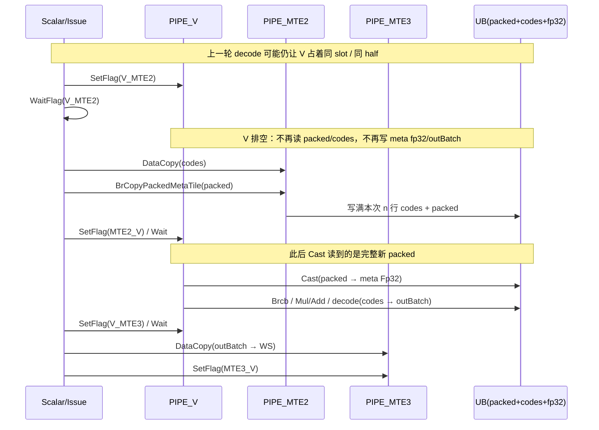
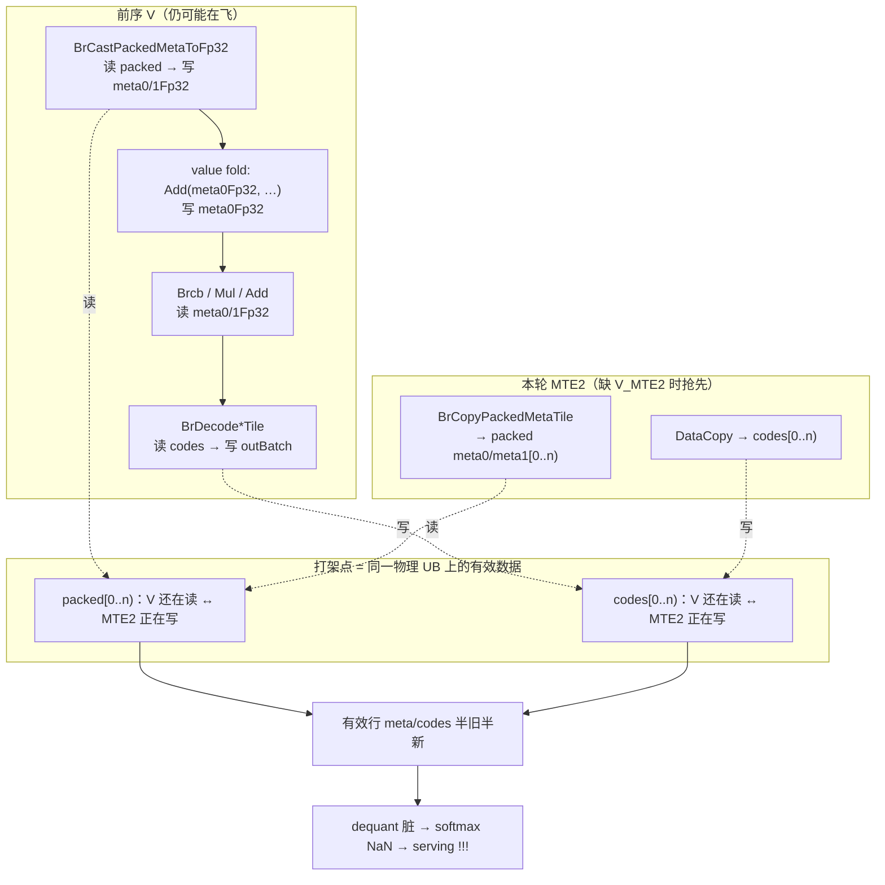
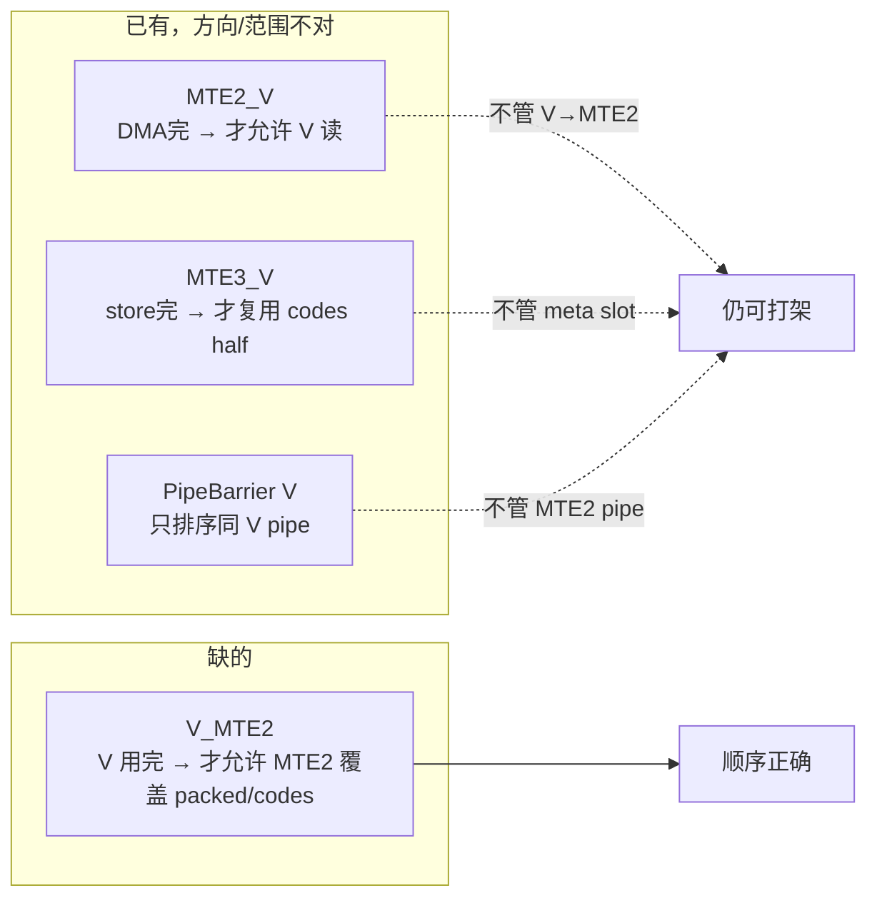

# Dequant：缺 `V_MTE2` 时谁和谁打架

> 范围：`DequantKvImpl`（`fia_block_vec_turboquant_p0.h`）里 codes + packed meta 的 MTE2。  
> 结论（ablation C1/C2/C3）：NaN 根因是 **前序 V 仍占用 UB 时，MTE2 开始覆盖同一批 buffer**；不是 packed 尾清零，也不是 Cast→Brcb 缺 `V_S`。

---

## 1. 涉及哪些 UB

```text
dequantInt8Buf_  (meta ping-pong, 2 × 768B)
┌───────────────────────────────────────────── slot bufIdx ──┐
│ packed meta0  [0, 128)     ← MTE2 写；Cast 读              │
│ packed meta1  [128, 256)   ← MTE2 写；Cast 读              │
│ meta0Fp32     [256, 512)   ← Cast/fold 写；Brcb 读         │
│ meta1Fp32     [512, 768)   ← Cast 写；Brcb 读              │
└────────────────────────────────────────────────────────────┘

tmpBuff1  (codes/out ping-pong half + scratch)
┌───────────────────────────────────────────── half bufIdx ──┐
│ codes[0..n)     ← MTE2 DataCopy 写；decode Cast 读         │
│ outBatch[...]   ← decode 写；MTE3 store 读                 │
└────────────────────────────────────────────────────────────┘
│ scratch (fp32UbA/B, halfScratch)  ← 仅 V，两 half 共用     │
```

**同一次 MTE2 burst 覆盖的是**：`packed meta0/meta1` + `codes`。  
**前序 V 用的是**：读 packed / 写读 `meta*Fp32` / 读 codes / 写 `outBatch`。

---

## 2. 正常顺序（有 `V_MTE2`）



要点：`V_MTE2` 挡的是 **「V 还在用 → MTE2 开写」**；后面的 `MTE2_V` 挡的是 **「MTE2 还在写 → V 开读」**。两个方向都要，缺前者会 NaN。

---

## 3. 缺同步时谁和谁打架（总图）



---

## 4. 时间线对照（同一 slot / 同一 half）

### 4.1 缺 `V_MTE2`（错误）

```mermaid
gantt
  title 缺 V_MTE2：V 与 MTE2 时间重叠
  dateFormat  X
  axisFormat  %s

  section PIPE_V
  Cast读packed / decode读codes     :active, v1, 0, 8
  Brcb+Mul 用可能已脏的meta/codes  :crit, v2, 5, 10

  section PIPE_MTE2
  DataCopy codes + CopyPackedMeta  :crit, m1, 3, 7

  section 结果
  packed/codes 半旧半新            :crit, r1, 5, 10
```



文字版：

```text
时间 →

V:     |---- Cast(读 packed) ----|-- Brcb/decode(读 codes, 用 meta) --|
                    ↑ 仍在读                ↑ 读到脏数据
MTE2:           |==== 写 packed + codes ====|
                    ↑ 覆盖有效区 [0,n)

冲突窗口：两条管道同时碰 packed[0..n) 和/或 codes[0..n)
```

### 4.2 有 `V_MTE2`（正确）

```mermaid
gantt
  title 有 V_MTE2：先排空 V，再 DMA，再 Cast
  dateFormat  X
  axisFormat  %s

  section sync
  Wait V_MTE2 排空前序 V           :done, s1, 0, 2

  section PIPE_MTE2
  DataCopy codes + CopyPackedMeta  :active, m1, 2, 5

  section PIPE_V
  Wait MTE2_V 后 Cast→decode       :done, v1, 5, 12
```



文字版：

```text
时间 →

V:     |-- 前序 V --|          (空)           |-- Cast → decode --|
                   ↑
              Wait V_MTE2
MTE2:              |==== 写 packed+codes ====|
                                              ↑
                                         Wait MTE2_V
```

---

## 5. 按 buffer 拆开的读写冲突表

| UB 区间 | 前序 V | 本轮 MTE2 | 缺同步时 |
|--------|--------|-----------|----------|
| `packed meta0/1 [0,n)` | Cast **读** | `BrCopyPackedMetaTile` **写** | 读到部分旧/部分新 scale → 有效行 meta 错 |
| `codes [0,n)` | decode Cast **读** | `DataCopy` **写** | 读到撕裂的量化码 → 有效行 q/s 错 |
| `meta0/1Fp32` | Cast/fold **写**，Brcb **读** | MTE2 **不写** | 不直接和 MTE2 抢；但 Cast 源已脏则整条链脏 |
| `outBatch` | decode **写** | MTE2 **不写**（写的是 codes 前缀） | 由 `MTE3_V` 管 store 复用，不是本问题主因 |

`meta*Fp32` 本身不进 MTE2；它变脏是因为 **上游 packed 已被并发覆盖**，Cast 用了坏源。

---

## 6. 为何已有 event 挡不住



| Event | 保护的方向 | 管不管 meta packed |
|-------|------------|-------------------|
| `MTE2_V` | MTE2 → V | 管「写完再读」，不管「读完再写」 |
| `MTE3_V` | MTE3 → V | 只管 `outBatch` store 复用，**不管 meta slot** |
| `PipeBarrier<PIPE_V>` | V → V | 挡不住 MTE2 |
| **`V_MTE2`** | **V → MTE2** | **正是 packed/codes 覆盖前需要的** |

---

## 7. 和 ablation 的对应

| 实验 | 行为 | 结果 | 说明 |
|------|------|------|------|
| C1 | 无 Duplicate，仅 `V_MTE2` | nan=0/50 | 内容清零不必要，同步必要 |
| C2 | Duplicate=0，无 `V_MTE2` | 大面积 NaN | Duplicate 是 V **写** packed，与 MTE2 **抢 [0,n)**，比尾 stale 更狠 |
| C3 | Duplicate=1.0 + `V_MTE2` | nan=0/50 | 尾写成啥无关 |
| 去 `V_S` | Cast→Brcb 不插 V_S | nan=0/50 | 不是 V↔V 时序问题 |

C2 打架更直观：

```text
V:   Duplicate(packed[0..padded)=0)  ----仍在写/刚写完未对 MTE2 可见----
MTE2:     DataCopy/BrCopy 写 packed[0..n)
          ↑ 有效区被两管同时改 → 必然脏
```

---

## 8. 代码落点（修复后）

`fia_block_vec_turboquant_p0.h` · `DequantKvImpl`：

```text
// 冷路径 / 非 prefetch：
Wait MTE3_V (half 复用, runId≥2)
Set/Wait V_MTE2          ← 排空前序 V（NaN 根因修复）
DataCopy(codes) + BrCopyPackedMetaTile(packed)
Set/Wait MTE2_V          ← 再交给 Cast

// prefetch 路径同样在发下一 slot 的 MTE2 前 Set/Wait V_MTE2
// V_MTE3 仍可 P18 重叠（Set → prefetch → Wait → store）；双 event 非必需
```

最小 fix：

1. **meta/codes MTE2 前的 `V_MTE2`**（本文件所述根因）  
2. ~~`V_MTE3` 双 event + 先 Wait 再 store~~：ablation 证明非 NaN 必需  
3. ~~Duplicate 清 packed 尾 / `V_S` / staging / castRows~~：非必需  

回归：`test_decode_kv_len_regression`；说明见本文件。

---

## 9. 一句话

> **打架的是：PIPE_V 上仍在读（或写）的 `packed meta` / `codes`，和 PIPE_MTE2 上即将覆盖同一 `[0,n)` 有效区的 `DataCopy` + `BrCopyPackedMetaTile`。**  
> `V_MTE2` 保证「V 先放手，MTE2 再动刀」。
