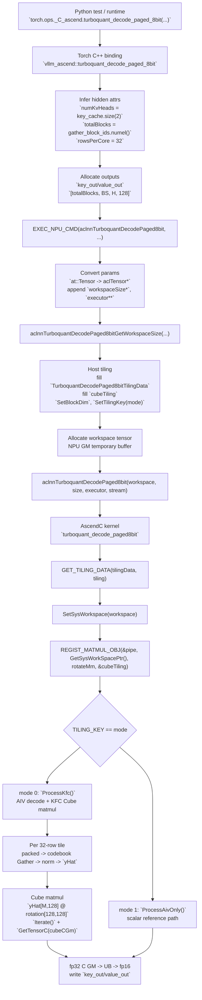
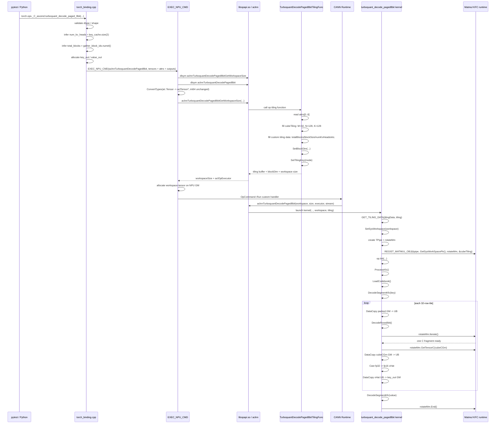

# TurboQuant Decode Paged 8-bit Call Chain

This note summarizes the call chain for `torch.ops._C_ascend.turboquant_decode_paged_8bit`, from the PyTorch binding through `EXEC_NPU_CMD`, aclnn workspace setup, tiling, kernel launch, and KFC matmul registration.

## Python To aclnn Parameter Mapping

The Python-visible Torch op takes five tensors and four scalar arguments:

```python
key_out, value_out = torch.ops._C_ascend.turboquant_decode_paged_8bit(
    key_cache,
    value_cache,
    gather_block_ids,
    codebook,
    rotation,
    head_size,
    block_size,
    out_dtype_code,
    mode,
)
```

The aclnn operator has more attributes than the Python op exposes. The C++ binding fills the missing ones from tensor shapes:

| Python / binding value | aclnn attr | Source |
| --- | --- | --- |
| `head_size` | `headSize` | Python scalar, currently must be `128` |
| `block_size` | `blockSize` | Python scalar, usually `128` |
| `key_cache.size(2)` | `numKvHeads` | inferred in `torch_binding.cpp` |
| `gather_block_ids.size(0)` | `totalBlocks` | inferred in `torch_binding.cpp` |
| `32` | `rowsPerCore` | legacy constant, tiling currently does not use it |
| `out_dtype_code` | `outDtype` | Python scalar, `0` means fp16 |
| `mode` | `mode` | Python scalar, `0` = KFC, `1` = AIV-only |

For the unit test shape:

```text
key_cache:        [6, 128, 8, 130] uint8
gather_block_ids: [5] int32
key_out:          [5, 128, 8, 128] fp16
```

The inferred attrs are:

```text
headSize=128
blockSize=128
numKvHeads=8
totalBlocks=5
rowsPerCore=32
outDtype=0
mode=0 or 1
```

## Call Chain Overview



## End-to-End Sequence



## `EXEC_NPU_CMD` Behavior

`EXEC_NPU_CMD(aclnnTurboquantDecodePaged8bit, ...)` performs the standard aclnn two-stage flow:

1. Dynamically resolves `aclnnTurboquantDecodePaged8bitGetWorkspaceSize` and `aclnnTurboquantDecodePaged8bit` from `libopapi.so`.
2. Converts `at::Tensor` values to `aclTensor*`; scalar integer attrs are passed through.
3. Calls `GetWorkspaceSize(...)`, appending two output parameters: `uint64_t* workspaceSize` and `aclOpExecutor** executor`.
4. Allocates a temporary NPU workspace tensor if `workspaceSize != 0`.
5. Enqueues `aclnnTurboquantDecodePaged8bit(workspace, workspaceSize, executor, stream)` on the current PyTorch NPU stream through `OpCommand`.
6. Releases the temporary acl wrapper objects after launch.

The first stage (`GetWorkspaceSize`) receives all tensors, attrs, outputs, and output pointers:

```text
keyCache, valueCache, gatherBlockIds, codebook, rotation,
headSize, blockSize, numKvHeads, totalBlocks, rowsPerCore, outDtype, mode,
keyOut, valueOut,
workspaceSize*, executor**
```

The second stage receives only:

```text
workspace, workspaceSize, executor, stream
```

The input tensors and attrs are already captured in the `aclOpExecutor`.

## Tiling Buffer And Workspace In GM

`tiling` and `workspace` are separate kernel arguments with different roles.

```mermaid
flowchart TD
    subgraph Executor["aclOpExecutor / launch metadata"]
        TilingBuf["tiling buffer (runtime managed)\nTurboquantDecodePaged8bitTilingData\n- cubeTiling\n- totalBlocks\n- blockSize\n- numKvHeads\n- headSize\n- packedBytes\n- blocksPerCore\n- outDtype\n- mode"]
    end

    subgraph Workspace["workspace tensor (NPU GM, allocated by EXEC_NPU_CMD)"]
        W0["workspace base\nGetSysWorkSpacePtr()"]
        Wlib["[0, 256KB)\nreserved / KFC matmul runtime area"]
        WC["[TQ_CUBE_C_WS_OFFSET = 256KB, ...)\ncubeCGm_\nfp32 C scratch\n32 * 128 floats = 16KB"]
        Wrest["remaining workspace\nCANN / debug / matmul internal use"]
    end

    subgraph IO["input / output tensors (NPU GM)"]
        KC["key_cache / value_cache\n[num_blocks, BS, H, 130] uint8"]
        G["gather_block_ids\n[total_blocks] int32"]
        CB["codebook [256] fp16"]
        R["rotation [128,128] fp16"]
        KO["key_out / value_out\n[total_blocks, BS, H, 128] fp16"]
    end

    TilingBuf -->|kernel arg: tiling| K["kernel"]
    W0 -->|kernel arg: workspace| K
    KC --> K
    G --> K
    CB --> K
    R --> K
    K --> KO

    K -->|SetSysWorkspace(workspace)| W0
    K -->|REGIST_MATMUL_OBJ(..., workspace, ..., cubeTiling)| Wlib
    K -->|cubeCGm_.SetGlobalBuffer(wsBase + 256KB)| WC
```

### Tiling Buffer

The tiling function fills `TurboquantDecodePaged8bitTilingData`:

```text
cubeTiling        # matmul tiling, including baseM/baseN/baseK
totalBlocks       # gather_block_ids.numel()
blockSize         # BS
numKvHeads        # H
headSize          # 128
packedBytes       # 130
blocksPerCore     # compact blocks assigned per logical data core
outDtype          # 0 = fp16
mode              # 0 = KFC, 1 = AIV-only
```

The kernel reads this with:

```cpp
GET_TILING_DATA(tilingData, tiling);
```

### Workspace

The workspace is allocated by `EXEC_NPU_CMD` after `GetWorkspaceSize` returns. The kernel receives it as the `workspace` GM argument and calls:

```cpp
AscendC::SetSysWorkspace(workspace);
REGIST_MATMUL_OBJ(&pipe, GetSysWorkSpacePtr(), rotateMm, &cubeTiling);
```

The decode kernel also carves out a fp32 matmul C scratch:

```cpp
cubeCGm_.SetGlobalBuffer(
    reinterpret_cast<__gm__ float*>(wsBase + TQ_CUBE_C_WS_OFFSET),
    TQ_T_ROWS * headSize_);
```

With the current constants:

```text
TQ_CUBE_C_WS_OFFSET = 256KB
TQ_T_ROWS = 32
headSize = 128
cubeCGm_ size = 32 * 128 * sizeof(float) = 16KB
```

## Kernel Mode Split

`context->SetTilingKey(mode)` controls which branch the kernel enters:

```text
mode = 0 -> KERNEL_TYPE_MIX_AIC_1_2
          ProcessKfc()
          AIV does decode/Gather/norm
          AIC handles Cube matmul through KFC

mode = 1 -> AIV-only scalar reference path
          ProcessAivOnly()
          no Cube/KFC matmul
```

In KFC mode, `REGIST_MATMUL_OBJ` registers the matmul object with the system workspace and `cubeTiling`. `ProcessKfc` then decodes key and value segments tile by tile.

## Per-Tile Matmul

For each tile:

```text
M <= 32
D = 128
A = yHat[M, 128]       fp16, VECOUT
B = rotation[128,128]  fp16, GM
C = cubeCGm[M,128]     fp32, GM scratch
```

The matmul setup is:

```cpp
rotateMm.SetOrgShape(mPad, D, D);
rotateMm.SetSingleShape(M, D, D);
rotateMm.SetTensorA(yHat, false);
rotateMm.SetTensorB(rotationGm, false);
rotateMm.SetLocalWorkspace(rotateWork);
while (rotateMm.Iterate()) {
    rotateMm.GetTensorC(cubeCGm);
}
```

With the observed tiling:

```text
baseM = 32
baseN = 64
baseK = 128
```

The matmul `[32,128] @ [128,128]` is split as:

```text
M direction: 32 / 32  = 1 tile
N direction: 128 / 64 = 2 tiles
K direction: 128 / 128 = 1 tile
```

So `Iterate()` returns true twice. Each `GetTensorC(cubeCGm)` writes one `baseN` fragment into the correct position of the full `[M,128]` C matrix in GM. The kernel then reads the full C linearly:

```cpp
AscendC::DataCopy(cubeFp32, cubeCGm, M * D);
AscendC::Cast(xHat, cubeFp32, AscendC::RoundMode::CAST_NONE, M * D);
```

## Debugging Notes

- The `0` passed from Python is `out_dtype_code`, not `totalBlocks`.
- `totalBlocks` is inferred from `gather_block_ids.numel()`.
- `numKvHeads` is inferred from `key_cache.size(2)`.
- `rowsPerCore` is currently a legacy attr; the tiling function reads it but does not use it.
- `tiling buffer` is read-only configuration for the kernel.
- `workspace` is temporary GM memory used by CANN/KFC and by `cubeCGm_`.
