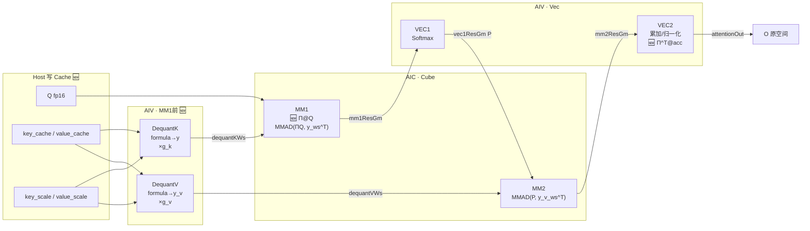
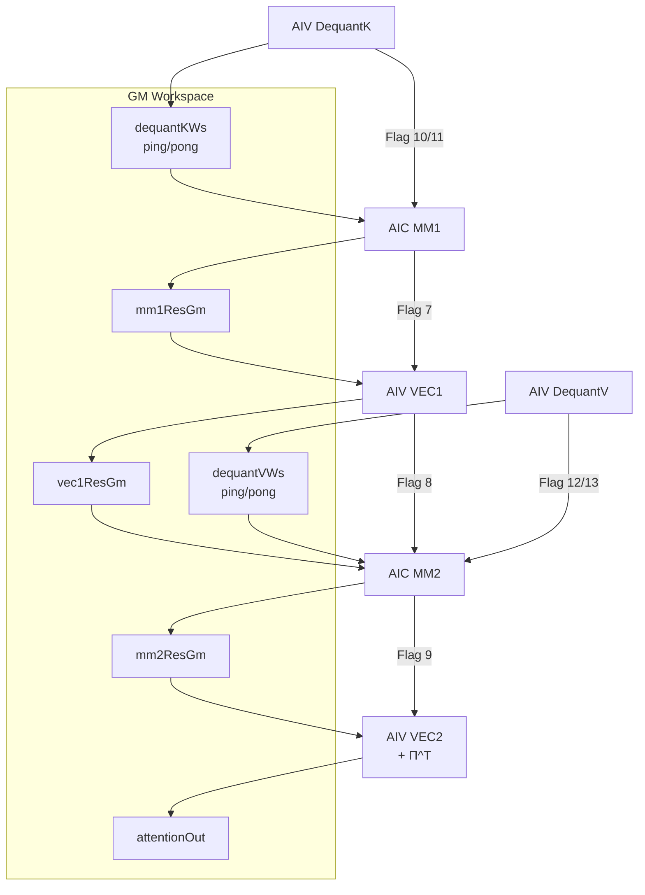

# vllm-ascend TurboquantFiaMse8bit 设计文档

本文档描述 vllm-ascend 独立自定义算子 **TurboquantFiaMse8bit**（`aclnnTurboquantFiaMse8bit`）
接入 **TurboQuant_mse** KV 量化的设计方案，包括算法原理、公式推导、GQA 数据布局、Kernel 流水与实现状态。

> **来源**：由 ops-transformer `attention/fused_infer_attention_score/docs/fia_turboquant_design.md`
> （FIA V4 TurboQuant P0）迁写适配。本仓实现为 **standalone custom op**，不依赖 CANN 内置
> `FusedInferAttentionScoreV4` 是否带 TQ。工程计划与验收见同目录上级
> [`DEVELOPMENT_PLAN.md`](../DEVELOPMENT_PLAN.md)。
> **与源仓最新差异清单**：[MIGRATION_DELTA.md](MIGRATION_DELTA.md)。

### API 命名对照（全文统一）

| FIA / ops-transformer | vllm-ascend `TurboquantFiaMse8bit` |
|----------------------|-------------------------------------|
| `antiquantScale`（Π） | `rotation` |
| `keyAntiquantScale` / `valueAntiquantScale`（γ） | `key_scale` / `value_scale` |
| key/value TensorList（PA） | `key_cache` / `value_cache` raw GM contiguous |
| `antiquantMode=6` | 模板内隐式 `FIA_TQ_MSE_8BIT_MODE` |
| `aclnnFusedInferAttentionScoreV4` | `aclnnTurboquantFiaMse8bit` |
| `FusedInferAttentionScore` | `TurboquantFiaMse8bit` |

**Attrs**：`num_heads`, `num_kv_heads`, `head_size`, `block_size`, `scale_value`,
`pre_tokens`, `next_tokens`, `sparse_mode`

---
## 1. 背景与目标

### 1.1 需求摘要

将 ops-transformer 中已验证的 **FIA TurboQuant P0（MSE 8bit, TND+PA+GQA）** 迁入
vllm-ascend `csrc/turboquant_fia_mse8bit/`，作为可独立编译、调用、profile 的 custom op。

| 项 | 说明 |
|----|------|
| 算法 | TurboQuant **MSE** 版本（`TurboQuant_mse`），不含 QJL / prod 无偏修正 |
| 场景 | **GQA**：`num_heads = Q`，`num_kv_heads = KV`，`group_size g = Q / KV` |
| 量化对象 | 每个 **(token, kv_head)** 的 K、V 独立量化；Q 保持 fp16 |
| **KV 位宽（P0）** | **MSE 8bit**（K/V 统一）；**4bit 为后续/非 P0**，公式见 §2.2，本仓尚未实现 |
| **存储** | **idx 与 γ 分开存储**（独立 Tensor；idx 统一 **DT_INT8**，按 uint8 解析） |
| 旋转 | **[D,D] 正交 Π**（输入名 `rotation`）：K/V Dequant **不做 Π^T**；MM1 用 **Π@Q**；输出 **Π^T@O** |
| Norm | 每个 kv head **一个 γ**（`key_scale` / `value_scale`）；除零保护 `/(γ + 1e-10)` |
| 反量化 | **不查表**，公式拟合 Lloyd-Max 质心 |
| 框架 | 自 NonQuant 流水线血统迁出的 `fia_kernel_turboquant_p0.h` + cube/vec P0 块 |
| P0 范围 | **TND + PA + GQA**，`D=128`，fp16；tiling key `0`=无 FD，`1`=FlashDecode |
| 测试 | `tools/turboquant_fia_mse8bit/`：`verify_pi_ortho.sh` / aclnn C++ / golden / msprof |

### 1.2 非目标（P0 / 首版）

- TurboQuant_prod / QJL 无偏内积
- WHT / 分块旋转
- per-block γ
- Q 的 TurboQuant 量化
- K/V 使用不同 bit 宽
- **4bit** 布局与 formula（保留算法说明，不作为本仓当前交付）
- 不以旧 scalar `turboquant_fused_infer_attention_score8bit` baseline 为正确性参考
- P0 不强制切换 serving 热路径（torch 绑定见 Phase 2，`DEVELOPMENT_PLAN.md`）

---
## 2. TurboQuant_mse 算法

### 2.1 论文要点

TurboQuant 通过 **随机正交旋转** 使各坐标近似独立，再对旋转域做 **标量 Lloyd-Max 量化**，以接近最优 rate-distortion。

**MSE 量化（Algorithm 1）**：

1. 生成正交矩阵 `Π ∈ R^{D×D}`
2. 归一化：`x_unit = x / (||x|| + ε)`
3. 旋转：`y = Π · x_unit`
4. 逐坐标量化：`idx_j = Quant(y_j)`
5. **分开存储** `γ = ||x||` 与 `idx`

**MSE 反量化（TurboQuant 论文 / Golden 对照用）**：

1. 旋转域重建：`y_i = Dequant_formula(idx_i, bitWidth)`（旋转域向量 `[D]`）
2. 逆旋转：`k_unit_hat = Π^T @ y`（**仅数学还原**，TurboquantFiaMse8bit Kernel **不对 K/V 做此步**，见 §2.5）
3. 恢复幅度：`k_hat = γ · k_unit_hat`

**TurboquantFiaMse8bit Kernel 实际反量化**（K/V **留在旋转域**）：

1. `y = formula(idx)` → 向量 `[D]`，**不乘 Π^T**
2. MM1 / MM2 中由 **Q 乘 Π**、**输出乘 Π^T** 完成旋转对齐（§2.5、§5）

### 2.2 公式反量化（不查表，按 bitWidth 二选一）

K 与 V 在相同 `bitWidth` 下使用 **同一套** 公式。本仓 P0 **仅实现 8bit**；4bit 公式保留作对照与后续扩展。

**8bit**，`idx_i ∈ [0, 255]`：

```
ỹ_i = 0.0026 × (idx_i - 127.5)
```

**4bit（未来 / 非本仓 P0）**，`idx_i ∈ [0, 15]`，令 `t = idx_i - 7.5`：

```
ỹ_i = 0.0001926 × t³ + 0.020799 × t
    = t × (0.020799 + t² × 0.0001926)          // Horner
```

### 2.3 归一化与除零保护

```python
x_lowp = x.to(dtype=table_dtype)
norms = torch.linalg.vector_norm(x_lowp, dim=-1, keepdim=True)
x_unit = x_lowp / (norms + 1e-10)
```

Kernel 等价：

```
γ = ||x||_2                              // 写入 γ Tensor（真实 norm）
x_unit = x / (γ + 1e-10)                 // ε = 1e-10
y = Π · x_unit
idx = Quant(y, bitWidth)               // 写入 idx Tensor
```

| 约定 | 说明 |
|------|------|
| γ Tensor | 真实 `||x||_2`，fp16，与 idx **分离** |
| idx Tensor | 仅量化 index，**不含** γ |
| 分母 | 仅量化时用 `γ + 1e-10` |

### 2.4 旋转矩阵 Π

```
Π ∈ R^{D×D}，正交：Π^T · Π = I
生成：离线 QR 分解
K/V 在相同 bitWidth 下可共用 Π，或分别提供 Π_K、Π_V
存储：optional input `[D, D]` fp16
```

**量化（Host / 写 Cache，仅 K/V）**：

```
y = Π @ k_unit          // K/V 写入 Cache 前旋转一次
idx = Quant(y)
```

**TurboquantFiaMse8bit Kernel 中 Π 的用法**（★ **不对 K/V idx 反量化结果做 Π^T**）：

```
Q_rot = Π @ Q           // MM1：旋转 Query（Q 不归一化）
S     = g_k * (Q_rot · y) / √D

acc_rot += P * g_v * y_v   // MM2：旋转域累加
O     = Π^T @ acc_rot      // VEC2 / 输出：逆旋转回原空间
```

#### 2.4.1 等价推导：旋转在 K/V 上 vs 旋转在 Q / 输出上

固定一组 `(h, t, kv)`，设：

| 符号 | 类型 | 含义 |
|------|------|------|
| `q` | 向量 `[D]` | `Q[h,:]`，原空间 Query |
| `y` | 向量 `[D]` | `formula(idx)`，**旋转域**反量化结果 |
| `g_k` | 标量 | `key_scale[t,kv]` |
| `Π` | 矩阵 `[D,D]` | 正交：`Π^T Π = I` |

**运算符**（本节统一）：

| 符号 | 含义 | 操作数 → 结果 | 例 |
|------|------|---------------|-----|
| `@` | **矩阵乘** | 矩阵×矩阵、矩阵×向量 → 矩阵或向量 | `Π^T @ y`：矩阵 `[D,D]` × 向量 `[D]` → 向量 `[D]` |
| `·` | **向量点积** | 向量×向量 → **标量** | `q · k_hat`：两个 `[D]` → 一个数 |
| `*` | **标量乘** | 标量×向量/标量×标量 | `g_k * (Π^T @ y)`：标量 × 向量 → 向量 |

> 本文默认 `q`, `y`, `k_hat` 为 **列向量** `[D]`（与 `Q[h,:]` 转置一致）。  
> `q · v` 等价于 `q^T v`（行向量乘列向量），**不是**矩阵乘 `@`。

**路径 A（Golden：逆旋转 K，Q 不动）**

量化时 K 做过 `y_true = Π @ k_unit` 再 Quant；反量化重建：

```
k_hat = g_k * (Π^T @ y)          // 向量 [D]，回到原空间
s_A   = (q · k_hat) / √D         // 标量 score
```

**路径 B（Kernel：K 留旋转域，旋转 Q）**

```
Q_rot = Π @ q                    // 向量 [D]
s_B   = g_k * (Q_rot · y) / √D   // 标量 score
```

**命题**：`s_A = s_B`（Π 正交时严格相等；fp16 下仅含舍入差）。

---

**引理 1（正交点积交换）**

对任意 `q, y ∈ R^D`：

```
q · (Π^T @ y)  =  q^T (Π^T y)  =  (Π q)^T y  =  (Π @ q) · y
```

**证明**：点积即行向量乘列向量；`(Π q)^T y = q^T Π^T y` 即为转置乘法结合律。  
正交性 `Π^T Π = I` 在本引理中 **不必显式出现**——只要 Π 正交，上式恒成立。

---

**定理 1（MM1 score 等价）**

```
s_A = (q · k_hat) / √D
    = (q · (g_k * (Π^T @ y))) / √D           // 代入 k_hat
    = g_k * (q · (Π^T @ y)) / √D             // g_k 为标量，提出点积
    = g_k * ((Π @ q) · y) / √D               // 引理 1
    = g_k * (Q_rot · y) / √D
    = s_B
```

**读式子的方法**：

- 路径 A：先把 `y` **逆旋转**成原空间向量 `Π^T @ y`，再与 **原空间** `q` 点积。  
- 路径 B：把 `q` **正旋转**到旋转域 `Π @ q`，再与 **旋转域** `y` 点积。  
- `g_k` 是标量，对两种写法都是 **乘一次**，可提出到点积外。

---

**定理 2（批量 MM1 矩阵形式）**

记 `Q` 为 `[H,D]`，`Y_k` 为 `[T,D]`（旋转域），`key_scale` 为 `[T,1]`：

```
路径 A:
  K_hat[t,:] = key_scale[t] * (Π^T @ Y_k[t,:])
  S_A = (Q @ K_hat.T) / √D

路径 B:
  Q_rot = Q @ Π^T          // 等价于每行 q ← Π @ q（行向量右乘 Π^T）
  S_B = (Q_rot @ Y_k.T) * key_scale.T / √D
      = ((Q @ Π^T) @ Y_k.T) * key_scale.T / √D
```

对任意 `(h,t)`，取 `q=Q[h,:]`、`y=Y_k[t,:]`，由定理 1 得 `S_A[h,t]=S_B[h,t]`，故 **整表** `S_A = S_B`。

> 实现注意：若框架里 `Q` 按 **行向量** 存储，则 `Q_rot[h,:] = (Π @ Q[h,:]^T)^T = Q[h,:] @ Π^T`；与「每行左乘 Π」等价，仅矩阵布局写法不同。

---

**定理 3（MM2 / 输出：V 侧 Π^T vs 输出侧 Π^T）**

固定 Q head `h`，设 `P[t]` 为 softmax 权重（标量），`y_v[t]` 为 V 的旋转域 Dequant 向量，`g_v[t]` 为 `value_scale[t,kv]`。

**路径 A（Golden：每个 token 逆旋转 V）**

```
v_hat[t] = g_v[t] * (Π^T @ y_v[t])
O_A      = Σ_t  P[t] * v_hat[t]
         = Σ_t  P[t] * g_v[t] * (Π^T @ y_v[t])
```

**路径 B（Kernel：旋转域累加，最后统一 Π^T）**

```
acc_rot = Σ_t  P[t] * g_v[t] * y_v[t]       // 向量 [D]，仍在旋转域
O_B     = Π^T @ acc_rot
```

**证明**（Π^T 线性，标量系数可提出）：

```
O_A = Σ_t  (P[t] * g_v[t]) * (Π^T @ y_v[t])
    = Π^T @ (Σ_t  P[t] * g_v[t] * y_v[t])    // Σ c_i (Π^T v_i) = Π^T @ (Σ c_i v_i)
    = Π^T @ acc_rot
    = O_B
```

因此 **Softmax 后的加权 V 求和**，同样可在旋转域累加、输出时再乘 `Π^T`；与 MM1 是同一类「把 Π^T 从 K/V 挪到 Q / O 侧」的等价。

---

**推论（整条 Attention 链）**

| 阶段 | 路径 A（K/V 逆旋转） | 路径 B（Kernel） | 等价依据 |
|------|----------------------|------------------|----------|
| MM1 | `s = q·(g_k Π^T y)/√D` | `s = g_k (Πq)·y/√D` | 定理 1 |
| VEC1 | `P = Softmax(S)` | 同左 | `S` 相同 → `P` 相同 |
| MM2 | `O = Σ P·g_v·(Π^T y_v)` | `O = Π^T Σ(P·g_v·y_v)` | 定理 3 |

**Kernel 选路径 B 的原因**（非数学必须，而是实现）：Dequant 只做 `formula(idx)` 得 `y`，省去 K/V 上的 `Π^T` 矩阵乘；Π 集中在 **一次 `Π@Q`（MM1）** 与 **一次 `Π^T@acc_rot`（输出）**，L1 带宽更省。

> 小结：`k_hat = g_k * (Π^T @ y)` 与 `s = g_k * ((Π @ q) · y)` 是 **同一条内积** 的两种写法；Kernel **优先**路径 B，Golden 可用路径 A 对照。

### 2.5 旋转分工（K/V 不逆旋转）

| 阶段 | 谁乘 Π | 数据域 | 说明 |
|------|--------|--------|------|
| 写 Cache | K/V 的 `k_unit` | 原空间 → 旋转域 | `y = Π @ k_unit`，再 Quant |
| DequantK/V | **无** | 旋转域 | `y = formula(idx)`，**不**做 `Π^T @ y` |
| MM1 | **Q** | `Q_rot = Π @ Q` | `s = g_k * (Q_rot · y) / √D` |
| MM2 | **无**（V 侧） | 旋转域累加 | `acc_rot += P * g_v * y_v` |
| 输出 | **O** | 旋转域 → 原空间 | `O = Π^T @ acc_rot` |

**为何 MM1 不能写 `Π^T @ y = y`**：仅当 **Π = 单位阵 I** 时才有 `Π^T @ y = y`（§4.4 手算例为此特例）。  
真实 Π 为随机正交阵时，**K/V 反量化输出就是旋转域的 `y`**，必须与 **`Π @ Q`** 做点积，不能对 `y` 再误用恒等式。

#### 2.5.1 与 FIA NonQuant 分工对照

TurboQuant **继承** NonQuant 的 **四段命名**（MM1 / VEC1 / MM2 / VEC2）、**三级 task 流水**、**同步链 7/8/9**。  
下表里的 **「前」= 时间顺序**：在 **同一个 S2 分块** 内，**紧挨在该步 Cube/Vec 主计算开始之前** 做的准备（搬数、反量化、旋转），**不是**新的第四段流水名字。

```
同一 task、同一 S2 块上的时间线（示意）:

  ──「MM1 前」──▶ MM1 ──7──▶ VEC1 ──8──▶ ──「MM2 前」──▶ MM2 ──9──▶ VEC2
     AIV DequantK      AIC          AIV              AIV DequantV   AIC    AIV
     (+ AIC 搬 Q、Π@Q)                                              (+ VEC2 末 Π^T)
```

---

**★ TurboQuant 相对 NonQuant：阶段归属一览**

| 归属 | 阶段 | 说明 |
|------|------|------|
| **🆕 TQ 新增（Kernel 内）** | **DequantK**（MM1 前，AIV） | `idx+γ → formula → y` 写 `dequantKWs`；Flag 10/11 |
| **🆕 TQ 新增（Kernel 内）** | **DequantV**（MM2 前，AIV） | 同构；写 `dequantVWs`；Flag 12/13 |
| **🆕 TQ 新增（Kernel 内）** | **Q_rot = Π @ Q**（MM1 前，AIC） | MM1 左矩阵用旋转后 Q，NonQuant 无此步 |
| **🆕 TQ 新增（Kernel 内）** | **O = Π^T @ acc_rot**（VEC2 末，AIV） | 输出逆旋转；NonQuant VEC2 直接写 attentionOut |
| **🆕 TQ 新增（Host/上游）** | **写 Cache 量化** | `k_unit → Π@k_unit → Quant → idx+key_scale`；NonQuant 直接 fp16 K/V |
| **🆕 TQ 新增（资源）** | **GM / 同步** | `dequantKWs/VWs`、`Π`；同步 **10–13**（Dequant 握手） |
| **✅ 继承，逻辑不变** | **VEC1** | 仍对 `mm1ResGm` 做 Softmax / Mask / Scale |
| **✅ 继承，骨架不变** | **三级流水 + Flag 7/8/9** | `MM1 → VEC1∥MM2 → VEC2` |
| **🔧 同名阶段，换操作数/公式** | **MM1** | NonQuant：`Q@K^T`；TQ：`(ΠQ)@y^T·g_k` |
| **🔧 同名阶段，换操作数/公式** | **MM2** | NonQuant：`P@V`；TQ：`P@y_v`（旋转域） |
| **🔧 同名阶段，多一步** | **VEC2** | 累加/归一化同 NonQuant，**末尾多 Π^T** |

> **记忆**：NonQuant 只有 **4 个 Kernel 阶段**（MM1/VEC1/MM2/VEC2）。TQ **没有**增加第 5 段名字；**新增的是 MM1/MM2 之前的 Dequant** 和 **MM1/VEC2 里的 Π 步**。

---

**逐步对照表**（「前」= 该步主计算开始之前）

| 时间点 | FIA **NonQuant** | FIA **TurboQuant** | TQ 变化 |
|--------|------------------|---------------------|---------|
| Host 写 Cache | K/V **fp16** | **idx + key_scale**（量化+旋转） | 🆕 上游 |
| **MM1 前 · AIV** | 无（可空闲） | **DequantK** → `dequantKWs` | 🆕 |
| **MM1 前 · AIC** | GM 搬 Q、K（原空间） | 搬 Q + **`Q_rot=Π@Q`**；K 侧读 **dequantKWs** | 🆕 Π@Q；K 改读 y |
| **MM1 · AIC** | `Q @ K^T / √D` | `(Q_rot @ y^T) * key_scale / √D` | 🔧 换公式 |
| **VEC1 · AIV** | Softmax(`mm1ResGm`) | **相同** | ✅ |
| **MM2 前 · AIV** | 无 | **DequantV** → `dequantVWs` | 🆕 |
| **MM2 · AIC** | `P @ V`（fp16） | `P @ y_v`（旋转域） | 🔧 换右矩阵 |
| **VEC2 · AIV** | 累加 → **attentionOut** | 累加 → **`Π^T @`** → attentionOut | 🆕 末步 Π^T |
| 同步 | 7 / 8 / 9 | 7 / 8 / 9 **+ 10–13** | 🆕 Dequant flag |

**数据域对照（一句话）**：

```
NonQuant:  Q, K, V, O  全程原空间 fp16
TurboQuant: Q(原) → MM1用 ΠQ；K/V 在旋转域 y；O 在 VEC2 用 Π^T 回到原空间
```

**与 NonQuant 公式的一一对应**（TurboQuant 把 Π 从 K/V 挪到 Q/O，§2.4.1）：

| NonQuant | TurboQuant（等价） |
|----------|-------------------|
| `S = Q·K^T/√D` | `S = (ΠQ)·y^T·g_k/√D`，`y` 为旋转域 Dequant |
| `O = P·V` | `O = Π^T·(P·g_v·y_v)`，累加在旋转域 |

**实现继承关系**（见 §6.2、ops-transformer `fia_kernel_analysis.md`（外部参考））：

| 模块 | NonQuant | TurboQuant 改动 |
|------|----------|-----------------|
| `ComputeMm1` | `matmulService`: Q×K^T | 同 Cube 框架；左矩阵改 **Q_rot**，右矩阵改 **dequantKWs** |
| `ComputeVec1` | `vectorService`: SoftmaxFlashV2 | **复用**，输入仍为 `mm1ResGm` |
| `ComputeMm2` | P×V | 右矩阵改 **dequantVWs**（旋转域） |
| `ComputeVec2` | 累加 + 归一化 → `attentionOutGm` | 累加后多一步 **`Π^T @`** |
| `InitWorkspace` | `mm1/vec1/mm2/vec2ResGm` | **额外** `dequantKWs/VWs` |
| AIV 首阶段 | 无 | **`DequantK/V`** 微流水（§6.3） |

NonQuant 参考：ops-transformer `attention/fused_infer_attention_score/docs/fia_kernel_analysis.md`（外部参考） §2–§3。

---

## 3. GQA 与数据布局

### 3.1 参数关系

```
num_heads       = Q
num_kv_heads    = KV
head_dim        = D
group_size      = g = Q / KV        （Q % KV == 0）
bitWidth（P0 固定 8；属性未暴露） ∈ {4, 8}         // K、V 共用

Q head h  →  kv_head = h / g
```

### 3.2 量化粒度

```
每个 (token t, kv_head kv)：
  K：γ_k[t,kv] 一个标量 + idx_k[t,kv,:] D 个 index
  V：γ_v[t,kv] 一个标量 + idx_v[t,kv,:] D 个 index

Q 不量化：[num_tokens, Q, D]
```

### 3.3 idx 与 γ 分开存储（核心约定）

**禁止**将 γ 与 idx 交错在同一连续 buffer（如 `[γ|idx...]` per head）。  
Host 与 Kernel 使用 **独立 Tensor**（或等价独立 GM 基址 + stride）：

| Tensor | GE dtype | shape（逻辑） | 说明 |
|--------|----------|---------------|------|
| `key` / `key_cache` | **DT_INT8** | `[T, KV, D]` | **8bit**：每元素 1 字节 index |
| `key` / `key_cache` | **DT_INT8** | `[T, KV/4, D, 2]` | **4bit**：每 `(g,d)` 2 字节，见 §3.3.1 |
| `key_scale` | DT_FLOAT16 | `[T, KV]` | 仅 γ，与 idx **分离** |
| `value` / `value_cache` | **DT_INT8** | 同 key | 仅 index |
| `value_scale` | DT_FLOAT16 | `[T, KV]` | 仅 γ |

**解析约定（统一）**：GM 上 dtype 均为 **DT_INT8**，Kernel / Host 读取时 **按 uint8 解释**（`(uint8_t)(int8_t)byte` 或 `static_cast<uint8_t>`），避免符号扩展；8bit 直接得 `idx∈[0,255]`，4bit 先拼 16bit word 再移位。

PA 场景下各 Tensor 在 block 内按相同 head/token 维对齐；`blockTable` 寻址方式与现有 K/V 一致，但 **γ 与 idx 各用一套 offset**。

**Op 接口建议**（可与现有 optional input 对齐扩展）：

```
key          : DT_INT8（8bit: [T,KV,D]；4bit: [T,KV/4,D,2]，§3.3.1）
key_scale     : DT_FLOAT16  [T, KV]
value        : 同 key（DT_INT8）
value_scale   : DT_FLOAT16  [T, KV]
bitWidth（P0 固定 8；属性未暴露） : 4 | 8
```

若短期无法新增 `key_scale`/`value_scale`，可用现有 `rotation` 承载 γ（per kv head / per token 约定在 tiling 文档标明），**idx 仍只放在 key/value**，二者 GM 地址不重叠。

### 3.3.1 4bit idx 打包（未来 / 非 P0）：4 KV head × 每维度压在一起

4bit 模式 **不** 采用 `[T, KV, D/2]` 的「单 head 内 nibble 顺排」。  
采用 **每维度上 4 个 KV head 的 index 压入 16bit**，在 GM 上以 **2 个 DT_INT8 字节** 存储；Kernel **按 uint8 读字节** 拼 word，再 **位移** 取出目标 head 的 4bit。

**约束**：`KV % 4 == 0`（Tiling 校验）。

**逻辑 shape（GE 均为 DT_INT8）**：

```
key_cache / value_cache : [T, KV/4, D, 2]    // 最后一维：packed 低/高字节
```

**物理含义**：对 `(token t, head_group g, dim d)`，2 个 int8 字节（**按 uint8 解析**）组成 little-endian `uint16 word`：

```
b0 = (uint8) key_cache[t, g, d, 0]
b1 = (uint8) key_cache[t, g, d, 1]
word = b0 | (b1 << 8)

word bits [ 3 :  0]  = idx[ kv_base + 0 ][ d ]
        [ 7 :  4]  = idx[ kv_base + 1 ][ d ]
        [11 :  8]  = idx[ kv_base + 2 ][ d ]
        [15 : 12]  = idx[ kv_base + 3 ][ d ]
kv_base = 4 × g
```

图示（`D` 维上每个位置 4 head 并排）：

```
dim:     d=0      d=1      d=2     ...  d=D-1
        ┌──────┐ ┌──────┐ ┌──────┐      ┌──────┐
g=0     │h0-3  │ │h0-3  │ │h0-3  │ ...  │h0-3  │   kv_head 0..3
        └──────┘ └──────┘ └──────┘      └──────┘
g=1     │h4-7  │ │h4-7  │ ...                     kv_head 4..7
```

**量化写入（pack，Host）**：

```cpp
g = kv >> 2;
s = (kv & 3) << 2;
uint8_t b0 = (uint8_t)idx[t][g][d][0];
uint8_t b1 = (uint8_t)idx[t][g][d][1];
uint16_t word = (uint16_t)b0 | ((uint16_t)b1 << 8);
word = (word & ~(0xFu << s)) | ((idx_val & 0xF) << s);
idx[t][g][d][0] = (int8_t)(word & 0xFF);
idx[t][g][d][1] = (int8_t)((word >> 8) & 0xFF);
```

**反量化读取（Kernel，按 uint8 解析）**：

```cpp
g = kv >> 2;
s_base = (kv & 3) << 2;
for (d = 0; d < D; ++d) {
    uint8_t b0 = (uint8_t)key_cache[t][g][d][0];
    uint8_t b1 = (uint8_t)key_cache[t][g][d][1];
    uint16_t word = (uint16_t)b0 | ((uint16_t)b1 << 8);
    uint8_t q = (word >> s_base) & 0xF;
    y_hat[d] = formula_4bit(q);
}
x_hat = gamma[kv] * (Pi^T * y_hat);
```

**8bit 模式**（同 DT_INT8，无打包）：

```cpp
// shape [T, KV, D]
uint8_t q = (uint8_t)key_cache[t][kv][d];   // 直接 uint8 读
y_hat[d] = formula_8bit(q);
```

### 3.4 存储量（单 token，idx 与 γ 分 Tensor 统计）

**8bit 模式**（K、V 相同）：

```
idx (K/V): KV × D     bytes  (DT_INT8 [T,KV,D]，按 uint8 读)
γ   (K/V): KV × 2     bytes  (fp16)
合计/token: KV × (2D + 4) bytes
```

**4bit 模式**（K、V 相同，`KV % 4 == 0`）：

```
idx (K/V): (KV/4) × D × 2  bytes  (DT_INT8 [T,KV/4,D,2]，§3.3.1)
γ   (K/V): KV × 2            bytes  (fp16)
合计/token: KV × (D/2 + 4) bytes
```

示例 `D=128, KV=8`：

| bitWidth | K idx layout (DT_INT8) | K idx | K γ | V idx | V γ | 合计/token |
|----------|------------------------|-------|-----|-------|-----|------------|
| 8 | `[T,KV,D]` | KV×D B | KV×2 B | 同 K | 同 K γ | KV×(2D+4) B |
| 4 | `[T,KV/4,D,2]` | KV×D/2 B | KV×2 B | 同 K | 同 K γ | KV×(D/2+4) B |

示例 D=128, KV=8：8bit → 2080 B/token；4bit → 1056 B/token。

对比 fp16 KV：`KV × D × 2 × 2 = 4096 B`（D=128, KV=8）。

### 3.5 TND + PagedAttention

```
8bit:
  key_cache   : [total_kv_tokens, KV, D]              DT_INT8
4bit:
  key_cache   : [total_kv_tokens, KV/4, D, 2]         DT_INT8  (§3.3.1)

key_scale   : [total_kv_tokens, KV]                  fp16
value_cache / value_scale : 同上

blockTable → physical block；idx / γ 同步换块
Kernel 读 idx 一律 (uint8_t) 强转，不做 int8 符号语义
```

#### 3.5.1 PA 举例：idx 与 γ 的 offset 计算

**核心约定**：

1. **同一逻辑位置** `(bIdx, token_in_seq, kv)`：查 **同一张** `blockTable`，得到 **同一个** `blockId`、`bsIdx`（块内 token 下标）。
2. **idx 与 γ 是独立 Tensor**：各自有 **GM 基址**（`key_cacheGm` / `key_scaleGm`），用 **各自的 stride** 算字节 offset。
3. **head/token 维对齐**：块内 token 顺序、kv head 顺序与 NonQuant fp16 K/V 的 PA 布局 **一致**；差别只在 **元素大小** 和 **γ 无 D 维**。

**物理 block 内逻辑布局（与 NonQuant K 相同维度顺序）**：

```
token 维:  bsIdx ∈ [0, blockSize)          // 块内第几个 KV token
head 维:   kv  ∈ [0, KV)                   // n2Idx
dim 维:    d   ∈ [0, D)                    // 仅 idx 有；γ 无此维

8bit key_cache 一块:  [blockSize, KV, D]       每元素 1 B
key_scale 一块:     [blockSize, KV]         每元素 2 B (fp16)
NonQuant K 一块:   [blockSize, KV, D]      每元素 2 B (fp16，对照用)
```

---

**公共 PA 查表**（idx / γ / fp16 K **共用**）：

```cpp
// 输入：batch bIdx，KV 序列上逻辑 token 位置 s2Pos，kv head = n2Idx
blockIdxInBatch = s2Pos / blockSize;
bsIdx           = s2Pos % blockSize;
blockId         = blockTable[bIdx][blockIdxInBatch];
```

---

**数值例**（8bit，`blockSize=128, KV=8, D=128`）：

```
bIdx=0,  s2Pos=256  →  blockIdxInBatch=2, bsIdx=0
blockTable[0][2] = 5   →  physical blockId = 5
n2Idx (kv) = 3
dStart = 0             // 从 dim 0 起搬一整行
```

| Tensor | strideBlock | strideToken | strideHead | offset 公式 |
|--------|-------------|-------------|------------|-------------|
| **key_cache** (1B) | `B×KV×D×1` = **131072** | `KV×D×1` = **1024** | `D×1` = **128** | `blockId×strideBlock + bsIdx×strideToken + n2Idx×strideHead + dStart` |
| **key_scale** (2B) | `B×KV×2` = **2048** | `KV×2` = **16** | **2** | `blockId×strideBlock + bsIdx×strideToken + n2Idx×strideHead` |
| **K fp16** (对照) | `B×KV×D×2` = **262144** | `KV×D×2` = **2048** | `D×2` = **256** | 同 idx 结构，×2 元素大小 |

代入上例：

```
idxOffset   = 5×131072 + 0×1024 + 3×128 + 0 = 655360 + 384 = 655744
gammaOffset = 5×2048   + 0×16   + 3×2       = 10240  + 6   = 10246
keyGmOffset = 5×262144 + 0×2048 + 3×256 + 0 = 1311488        // NonQuant 对照
```

**DequantK 一次读 `(bsIdx, n2Idx)` 这一格**：

```cpp
// 1) 读 γ：一个 fp16 标量
g_k = *(fp16*)(key_scaleGm + gammaOffset);    // 与 idx 不同地址

// 2) 读 idx 向量 [D]：连续 D 字节
for (d = 0; d < D; ++d) {
    uint8_t q = (uint8_t)key_cacheGm[idxOffset + d];
    y[d] = formula_8bit(q);
}
// y 写 dequantKWs；MM1 另路读 key_scale 或此处已用 g_k
```

**要点**：`gammaOffset` **不含 `dStart`**——每个 `(token, kv)` 只有一个 γ；`idxOffset` **含 `dStart`**——每个 dim 一字节。

---

**4bit idx 的 offset**（`shape [blockSize, KV/4, D, 2]`）：

```
strideBlock = blockSize × (KV/4) × D × 2
strideToken = (KV/4) × D × 2
strideHead  = D × 2          // 一个 head_group g 占 D×2 字节
strideDim   = 2              // 每个 d 上 2 字节 pack

g = n2Idx >> 2;
idxOffset = blockId × strideBlock
          + bsIdx × strideToken
          + g × strideHead
          + d × strideDim;           // 读 pack 时 +0 或 +1 取低/高字节

// γ 与 8bit 完全相同（仍 [blockSize, KV] fp16）
gammaOffset = blockId × (blockSize×KV×2)
            + bsIdx × (KV×2)
            + n2Idx × 2;
```

例：`KV=8, D=128, blockSize=128, blockId=5, bsIdx=0, n2Idx=5`：

```
g=1,  idxOffset = 5×(128×2×128×2) + 0 + 1×(128×2) + d×2
gammaOffset = 5×2048 + 0×16 + 5×2 = 10250
取 d=0 处 word：shift = (5&3)<<2 = 4 → q = (word>>4)&0xF
```

---

**与 NonQuant PA 代码的对应**（ops-transformer `fia_kernel_analysis.md`（外部参考） §Step 6.1）：

| 步骤 | NonQuant K | TurboQuant |
|------|------------|------------|
| 查 blockTable | `blockId = blockTable[b][blockIdxInBatch]` | **相同** |
| 块内 token | `bsIdx = s2Pos % blockSize` | **相同** |
| kv head | `n2Idx` | **相同** |
| GM 基址 | `keyGm` | `key_cacheGm` / `key_scaleGm` **分开** |
| offset | `blockId×StrideBlock + bsIdx×StrideToken + n2Idx×D×sizeof` | idx：×**1**；γ：×**2** 且 **无 ×D** |

**错误示例**（不要这样算）：

```
❌ gammaOffset = idxOffset / D          // γ 不是 idx 的某个 dim
❌ 用 keyGm 的 offset 读 key_scale       // 两个 Tensor 基址不同
❌ idx 与 γ 交错存储后统一 offset       // 违反 §3.3 分离存储
```

Host 量化按 §3.3.1 写入 2 字节 pack；**禁止**声明为 DT_UINT8/DT_UINT16 混用。

---

## 4. 公式推导（Attention / TQ 语境）

本节推导 **不是** TurboQuant 论文通用证明的复述，而是说明：**在 FIA 的四段流水（MM1 → VEC1 → MM2 → VEC2）里，TurboQuant 的 K/V 应如何还原成 fp16、如何进入 QK^T 与 PV**。  
推导结论直接对应 Kernel 里 `DequantK/V`、`mm1ResGm`、`vec1ResGm`、`mm2ResGm` 的数据含义。

---

### 4.0 符号约定（标量 / 向量 / 张量）

**读 §4 前先记住三层记号**——下文公式里，**看 shape 判断类型**，不要靠字体猜。

| 类型 | 记号规则 | 典型名字 | Shape | 含义 |
|------|----------|----------|-------|------|
| **标量** | 小写 `g`, `s` | `g_k`, `s` | **无维**，一个 fp16 数 | 从张量里 **取一个元素** |
| **向量** | 小写 `q`, `k`, `y` | `q`, `k_hat`, `y` | **`[D]`** | 从张量里 **取一行** |
| **张量** | 大写 `Q`, `S` 或 API 名 | `Q`, `key_scale`, `Y_k` | **`[H,D]`**, **`[T,KV]`**, **`[T,KV,D]`** 等 | GM 上整块存储 |

**维度字母**（整节通用）：

| 字母 | 含义 |
|------|------|
| `H` | Q head 数 |
| `KV` | KV head 数 |
| `T` | KV token 数（序列长） |
| `D` | head 维度 |
| `h, t, kv` | 下标，各取 **一个** head / token / kv_head |

**张量 ↔ 标量/向量 怎么读**（固定一组 `(h, t, kv)` 后，下面全是 **这一格** 上的量）：

```
Q          : 张量 [H, D]
q          : 向量 [D]     ←  q = Q[h, :]

key_scale   : 张量 [T, KV]  （API 名；存所有 γ）
g_k        : 标量         ←  g_k = key_scale[t, kv]     // 一个 norm，不是 [D]

Y_k        : 张量 [T, KV, D]  （旋转域 formula(idx)，**不含 Π^T**）
y          : 向量 [D]     ←  y = Y_k[t, kv, :]

Q_rot      : 向量 [D]     ←  Q_rot = Π @ Q[h, :]     // MM1 前旋转 Q

K_hat      : 向量 [D]     ←  **仅 Golden 对照**：g_k * (Π^T @ y)；Kernel 不物化
k_hat      : 向量 [D]     ←  上式；实现中直接用 y + Q_rot

S          : 张量 [H, T]   （MM1 score 矩阵）
s          : 标量         ←  s = S[h, t]                  // 一个 attention logit
```

**乘法类型速查**：

| 表达式 | 类型 | 说明 |
|--------|------|------|
| `g_k * y` | 标量 × 向量 → 向量 `[D]` | 可选：Dequant 预乘 g，仍在 **旋转域** |
| `Q_rot · y` | 向量 · 向量 → **标量** | MM1 主路径（Q 已乘 Π） |
| `g_k * (Q_rot · y)` | 标量 × 标量 → **标量** | 完整 score |
| `(Π @ Q) @ Y_k.T * key_scale` | 张量运算 → `[H,T]` | 批量 MM1（Path B） |
| `Π^T @ acc_rot` | 矩阵 × 向量 → 向量 `[D]` | 输出逆旋转 |

> **易混点**：`key_scale` 是 **张量** `[T,KV]`；`g_k` 是 **标量**。  
> K/V Dequant 输出 **旋转域** `y`，**不是**原空间 `k_hat`。  
> §4.4 中 `Π^T @ y = y` **仅当 Π=I**，不是通用公式。

---

### 4.0.1 与标准 Attention 的关系

标准 GQA Attention（单 Q head `h`，KV head `kv=h/g`）：

```
S[h,t] = ( Q[h] · K[t,kv] ) / √D
P[h,t] = Softmax_t( S[h,*] )
O[h]   = Σ_t P[h,t] · V[t,kv]
```

FIA 中 **Q 仍为 fp16**；**K/V 为 TurboQuant 压缩存储**。Kernel 对 K/V 只做 **formula 反量化到旋转域 `y`**；**Π 只作用于 Q（MM1）与输出 O（MM2 末）**。

---

### 4.1 TurboQuant 存储量与真实向量的关系

对 **固定 `(t, kv)`**，取 K 的一行向量 `k`（`k ∈ R^D`，shape `[D]`）：

**量化侧（Cache 写入，Host 或上游）**：

```
(1) g_k = ||k||_2              标量  → 写入 key_scale[t, kv]
(2) k_unit = k / (g_k + 1e-10)  向量 [D]
(3) y = Π @ k_unit              向量 [D]；Π 为矩阵 [D,D] 正交
(4) idx = Quant(y)              向量 [D] 逐维量化 → 写入 key（DT_INT8）
```

**反量化侧（TurboquantFiaMse8bit Kernel AIV，`DequantK` / `DequantV`）** — **★ 不做 Π^T**：

```
(5) y = formula(idx)            向量 [D]，旋转域，不含 g_k
(6) （可选）写入 dequantKWs = y  或 g_k * y，仍在旋转域
```

**MM1 侧（AIC / Cube）** — **旋转 Q，不旋转 K**：

```
(7) Q_rot = Π @ q               向量 [D]
(8) s = g_k * (Q_rot · y) / √D  标量 score
```

**数学等价（Golden / 对照，非 Kernel 主路径）**：

```
k_hat = g_k * (Π^T @ y)         // 原空间重建；需额外 Π^T，Kernel 跳过
s = q · k_hat / √D              // 与 (8) 同值（Π 正交）
```

---

### 4.2 内积恒等式（为何 Q 不必 unit 化）

#### 4.2.1 `g_k` 是标量，不是 `[D]` 向量

TurboQuant_mse：**每个 `(t, kv)` 的整段 D 维共用一个 norm**。

| 名字 | 类型 | Shape |
|------|------|-------|
| `key_scale` | 张量 | `[T, KV]` |
| `g_k = key_scale[t, kv]` | **标量** | 一个 fp16 |
| `k_hat = K_hat[t, kv, :]` | 向量 | `[D]` | **Golden 对照用** |
| `y = Y_k[t, kv, :]` | 向量 | `[D]` | **Kernel Dequant 输出**（旋转域） |

关系（**Kernel 主路径**）：

```
y = formula(idx)               // 旋转域，无 Π^T
Q_rot = Π @ q
s = g_k * (Q_rot · y) / √D
```

关系（**Golden 对照，等价**）：

```
k_hat = g_k * (Π^T @ y)        // 原空间；Kernel 不物化
s = (q · k_hat) / √D = g_k * (Q_rot · y) / √D
```

**不是** `[T,D]` 上每个维度各一个 norm。  
`key_scale[T,1]` 广播乘 `K_tilde[T,D]` = **T 个 token 各用一个标量**，每 token 的 D 维 **同乘一个数**。

#### 4.2.2 标量提出点积（固定 h, t, kv）

**Kernel 主路径**（K/V 在旋转域 `y`，Q 旋转）：

```
q        : 向量 [D]   ← Q[h, :]
Q_rot    : 向量 [D]   ← Π @ q
y        : 向量 [D]   ← Y_k[t, kv, :]     // Dequant 输出，无 Π^T
g_k      : 标量       ← key_scale[t, kv]
s        : 标量       ← S[h, t]
```

```
s = g_k * (Q_rot · y) / √D = g_k * ((Π @ q) · y) / √D
```

**正交性推导** — 完整版见 **§2.4.1 定理 1**；核心一步：

```
q · (g_k * (Π^T @ y))
= g_k * (q · (Π^T @ y))              // g_k 标量提出
= g_k * ((Π @ q) · y)                // 引理：q·(Π^T y) = (Πq)·y
= g_k * (Q_rot · y)
```

若 Golden 先算 `k_hat = g_k * (Π^T @ y)` 再 `q · k_hat`，与 Kernel 路径 **同值**；FIA 省略 K/V 上的 `Π^T`，改在 MM1 算 `Π @ q`。

#### 4.2.3 批量张量形式（MM1）

| 名字 | 类型 | Shape |
|------|------|-------|
| `Q` | 张量 | `[H, D]` |
| `Q_rot` | 张量 | `[H, D]` = `Π @ Q`（按行） |
| `Y_k` | 张量 | `[T, D]` | 旋转域，**无 Π^T** |
| `key_scale` | 张量 | `[T, 1]` |
| `S` | 张量 | `[H, T]` |

```
S = (Q_rot @ Y_k.T) * key_scale.T / √D     // ★ Kernel 主路径
  = ((Π @ Q) @ Y_k.T) * key_scale.T / √D
```

**Golden 对照**（需对 Y_k 做 Π^T，**非 Kernel 实现**）：

```
K_hat[t,:] = key_scale[t] * (Π^T @ Y_k[t,:])
S = (Q @ K_hat.T) / √D                     // 与上式同值
```

#### 4.2.4 与「每个 head norm 不一致」的关系

| 说法 | 是否成立 |
|------|----------|
| 不同 **token** 的 `g_k` 不同 | ✅ `key_scale[t,kv]` 随 t 变 |
| 不同 **kv_head** 的 `g_k` 不同 | ✅ `key_scale[t,kv]` 随 kv 变 |
| 同一 `(t,kv)` 内 **每个维度** 不同 norm | ❌ 与本设计不符 |
| Score 里 norm 是 **`[T,D]` 张量** | ❌ norm 是 **`[T,KV]`** 张量，取元素得 **标量** |

#### 4.2.5 数值例子

**张量**（Π=I **仅为手算方便**；真实部署 Π≠I，见 Step 2 说明）：

```
Q       [2, 4]   = [[1,2,3,4], [5,6,7,8]]
key_scale [3]     = [10, 20, 30]
Y_k     [3, 4]   = [[1.1,1.2,1.3,1.4], [1.05,1.1,1.15,1.2], [1.033,1.067,1.1,1.133]]  // 旋转域 y
S       [2, 3]   = ((Π @ Q) @ Y_k.T) * key_scale / √D   （Π=I 时 = Q @ Y_k.T * key_scale）
```

**向量 / 标量**（`h=0, t=0`）：

```
q       [4]  = [1, 2, 3, 4]
Q_rot   [4]  = Π @ q              // Π=I 时 Q_rot = q
y       [4]  = [1.1, 1.2, 1.3, 1.4]   // Dequant 输出，**无 Π^T**
g_k     标量 = 10
s       标量 = g_k * (Q_rot · y) = 10 * 13 = 130
```

**Π=I 时** Golden 路径碰巧有 `Π^T @ y = y`，**不能推广**。Π≠I 时 Kernel 仍用 `Q_rot · y`，不对 y 做 `Π^T`。

**FIA 实现对应**：

| 阶段 | 数据 | Π 操作 |
|------|------|--------|
| AIV Dequant | `dequantKWs` = **旋转域 `y`** | **无** Π^T |
| AIC MM1 前 | `Q_rot = Π @ Q` | **Q 乘 Π** |
| AIC MM1 | `(Q_rot @ Y_k.T) * key_scale` | K 不旋转 |
| MM2 累加 | `acc_rot += P * g_v * y_v` | V 不逆旋转 |
| VEC2 输出 | `O = Π^T @ acc_rot` | **输出乘 Π^T** |

---

### 4.3 MM1 / VEC1 / MM2 / VEC2 公式链

对 Q head `h`，KV head `kv = h/g`，KV token `t`（**标量/向量切片见 §4.0**）：

```
【MM1】  s = S[h,t] 是标量
  Q_rot = Π @ q
  s = g_k * (Q_rot · y) / √D

【VEC1】
  P[h,t] = Softmax( S[h,*] )

【MM2】  V 留在旋转域
  acc_rot += P[h,t] * g_v * y_v

【VEC2】
  O[h] = Π^T @ acc_rot
```

---

### 4.4 数值例子（帮助理解）

取极小维度便于手算；**仅说明数据流**，数值为示意。

**配置**：

```
D = 4,  g = 2,  Q=2, KV=1
Q head h=0, kv=0；单 KV token t=0
bitWidth = 8
Π = I_4（★ **仅手算特例**：此时 Π^T @ y = y；真实 Π≠I 时 **不** 对 y 做 Π^T）
formula: y_i = 0.0026 × (idx_i - 127.5)
```

**Step 1 — 量化 K（上游写 Cache）**

```
K = [3, 0, 4, 0]   （fp16 示意）

γ_k = ||K|| = sqrt(9+0+16+0) = 5.0
x_unit = K / (5 + 1e-10) ≈ [0.6, 0, 0.8, 0]
y = Π · x_unit = x_unit

假设 Quant 后 idx = [150, 127, 180, 127]（uint8，DT_INT8 存储）
key_scale[t=0,kv=0] = 5.0
key_cache[t=0,kv=0,:] = [150,127,180,127]
```

**Step 2 — TQ DequantK（AIV）** — **只出旋转域 y，无 Π^T**

```
y_0 = 0.0026×(150-127.5) = 0.0585
y_1 = 0.0026×(127-127.5) = -0.0013
y_2 = 0.0026×(180-127.5) = 0.1365
y_3 = 0.0026×(127-127.5) = -0.0013
y ≈ [0.0585, -0.0013, 0.1365, -0.0013]   → 写入 dequantKWs（旋转域）

// Golden 对照（Kernel 不算）：
// k_hat = g_k * (Π^T @ y)；Π=I 时 k_hat = 5*y ≈ [0.2925, ...]
```

**Step 3 — MM1（AIC）** — **旋转 Q，y 不动**

```
Q[h=0] = [1, 1, 1, 1]
Q_rot = Π @ Q = Q                    // Π=I 特例

s = g_k * (Q_rot · y) / √D
  = 5 × (0.0585-0.0013+0.1365-0.0013) / 2
  = 5 × 0.1924 / 2 = 0.481

// Golden 对照：q · (g_k * Π^T @ y) 与上式同值（Π 正交）
```

**Step 4 — VEC1**

```
若仅一个 t=0：P[0] = Softmax([0.481]) = 1.0
```

**Step 5 — DequantV + MM2 + 输出**

```
DequantV → y_v（旋转域，无 Π^T）
acc_rot = P[0] * g_v * y_v
O[0] = Π^T @ acc_rot              // Π=I 时 O = acc_rot
```

**例子说明了什么**：

1. **K/V Dequant 只出旋转域 `y`**，**不对 K/V 做 `Π^T`**。  
2. **MM1**：`Q_rot = Π @ Q`，`s = g_k * (Q_rot · y) / √D`。  
3. **输出**：`O = Π^T @ acc_rot`；Π 在 **Q 与 O** 两侧，不在 K/V Dequant。  
4. §4.4 设 **Π=I** 时 `Π^T @ y = y` 仅为手算方便，**不能**当成通用公式。

---

### 4.5 相对 §4.4 的扩展：GQA 与 4bit idx

§4.4 是 **最小可手算例子**，故意做了两处 **简化**。§4.5 不是新算法，而是说明：**若把 §4.4 的配置换成真实 GQA / 4bit 存储，公式不变，只有下表中标 🔄 的项要改**。

#### 4.5.0 §4.4 基线 vs 扩展后对照

| 维度 | **§4.4 基线（未扩展）** | **§4.5 扩展后（真实场景）** |
|------|-------------------------|-----------------------------|
| Q / KV head | `Q=2, KV=1`，只算 **h=0** | **GQA**：`Q=8, KV=2, g=4`；**h=0..3→kv=0**，**h=4..7→kv=1** |
| 谁读 K | 只关心一个 Q head | 多个 Q head **共用同一份** `key_cache[t,kv]` / `key_scale[t,kv]` |
| MM1 差异 | 只算 `S[0,t]` | `S[0,t]` 与 `S[4,t]` 用 **同一 y**，但 **Q 不同** → score 不同 |
| bitWidth | **8bit** | **4bit**（或仍 8bit，见左列） |
| idx shape | `[T, KV, D]`，1 字节/dim | `[T, KV/4, D, 2]`，**4 个 kv head 打包** 进 16bit |
| 读 idx | `q = (uint8)key_cache[t,kv,d]` | 拼 `word`，**移位**取 `kv` 对应 4bit：`q = (word>>(kv&3)*4) & 0xF` |
| γ 读法 | `key_scale[t,kv]` | **相同**（γ 不打包，仍 `[T,KV]` fp16） |
| Dequant 输出 | `y[D]` 旋转域 | **相同** |
| MM1 / VEC1 / MM2 公式 | §4.4 已写 | **完全相同**，代入 §4.2 / §4.3 |

> **「扩展」= 在 §4.4 同一套流水上，换 GQA 多 head 映射 + 换 4bit 读 idx 方式**；不是新增第五段 Kernel。

---

#### 4.5.1 扩展一：GQA（相对 §4.4 多了什么）

**§4.4 简化了什么**：`KV=1`，等价于所有 Q head 共用一个 kv；只演示 `h=0`。

**扩展后**（沿用 §4.4 的 `t=0, kv=0, D=4`，只把 head 数放大）：

```
配置: Q=8, KV=2, g=4

h=0,1,2,3  →  kv = h / g = 0    // 共用 key_cache[t,0,:]、key_scale[t,0]
h=4,5,6,7  →  kv = 1
```

对 **同一个** `t=0, kv=0`（K 只存一份）：

| Q head | 用的 K / γ | 用的 Q | score |
|--------|------------|--------|-------|
| h=0 | `key_cache[0,0,:]`, `key_scale[0,0]` | `Q[0,:]` | `S[0,0]` |
| h=1 | **同上** | `Q[1,:]` | `S[1,0]`（一般 ≠ `S[0,0]`） |
| h=4 | `key_cache[0,1,:]`, `key_scale[0,1]` | `Q[4,:]` | `S[4,0]` |

**与 §4.4 相同的部分**：DequantK 仍 `y = formula(idx)` → `dequantKWs`；MM1 仍 `s = g_k * (Q_rot · y) / √D`。

**与 §4.4 不同的部分**：MM1 要对 **每个 h** 各算一次，但 **同一 kv 的 h 组** 只 Dequant **一次** K（GQA 复用）。

```
§4.4:  1 个 Q head × 1 份 K  →  1 个 score
扩展:  g 个 Q head × 1 份 K  →  g 个 score（K/γ/idx 只读一份）
```

---

#### 4.5.2 扩展二：4bit idx（相对 §4.4 多了什么）

**§4.4 简化了什么**：8bit，`key_cache[t,kv,d]` 一字节直接读。

**扩展后**：`bitWidth=4`，`KV=4`（须 `KV%4==0`），**同一 `(t,d)` 上 4 个 kv head 的 4bit 打进一个 uint16**。

存储 shape：`key_cache[t, g, d, 0/1]`，其中 `g = kv/4`。

**读法对比**（固定 `t=0, d=0`）：

| | **§4.4 8bit（未扩展）** | **§4.5 4bit（扩展）** |
|--|-------------------------|------------------------|
| 取 kv=0 | `q = (uint8)key_cache[0,0,0]` | `g=0`；`word = b0\|(b1<<8)`；`q = word & 0xF` |
| 取 kv=1 | `q = (uint8)key_cache[0,1,0]` | 同 **一个 word**；`q = (word>>4) & 0xF` |
| 取 kv=2 | `key_cache[0,2,0]` | 同 word；`q = (word>>8) & 0xF` |
| 取 kv=3 | `key_cache[0,3,0]` | 同 word；`q = (word>>12) & 0xF` |
| γ | `key_scale[0,kv]` 各 head 独立 fp16 | **相同**，不打包 |

示意（`t=0, g=0, d=0` 一个 word）：

```
word bits:  [kv3][kv2][kv1][kv0]   每个 4bit
            ←── 2 字节 key_cache[t,0,d,0/1] ──→
```

Dequant 后续 **与 §4.4 相同**：

```
y[d] = formula_4bit(q)     // 仅 formula 换 4bit 版
s    = g_k * (Q_rot · y) / √D
```

---

#### 4.5.3 小结：§4.4 → §4.5 改了什么、没改什么

| | 改了吗？ |
|--|----------|
| 四段流水 MM1/VEC1/MM2/VEC2 | ❌ 未改 |
| `y` 旋转域、Q 侧 `Π`、输出 `Π^T` | ❌ 未改 |
| `g_k` 标量、`formula` 反量化 | ❌ 未改（4bit 只换 formula 系数） |
| 多个 Q head 共享同一 `key_cache[t,kv]` | ✅ GQA 扩展 |
| idx 从逐字节读 → 拼 word + 移位 | ✅ 4bit 扩展 |
| γ 的 shape / 读法 | ❌ 与 §4.4 相同 |

完整 4bit 打包与 PA offset 见 **§3.3.1、§3.5.1**。

---

### 4.6 公式与 Kernel 模块对照表

| 公式 | Kernel 模块 | GM 缓冲 |
|------|----------|---------|
| `y = formula(idx)` | AIV `DequantK/V` | 读 key/value (DT_INT8) |
| 写 `dequantKWs = y` | AIV Dequant | **无 Π^T** |
| `Q_rot = Π @ Q` | AIC MM1 前 / Cube | Q, Π |
| `(Q_rot @ y^T) * g_k` | AIC MM1 | dequantKWs → mm1ResGm |
| `Softmax` | AIV VEC1 | mm1ResGm → vec1ResGm |
| `acc_rot += P * g_v * y_v` | AIC MM2 / VEC | dequantVWs（旋转域） |
| `O = Π^T @ acc_rot` | AIV VEC2 | attentionOut |

---

## 5. 计算路径

### 5.1 主路径：旋转域 Dequant + Q 侧旋转（MVP）

```
MM1:
  AIV: y = formula(idx, bitWidth)  → dequantKWs（旋转域，★ 无 Π^T）
  AIC: Q_rot = Π @ Q
       S = (Q_rot @ y^T) * key_scale^T / √D  → mm1ResGm

VEC1: SoftmaxFlashV2

MM2:
  AIV: y_v = formula(value_cache)  → dequantVWs（旋转域）
  AIC/VEC: acc_rot += P * value_scale * y_v

VEC2:
  O = Π^T @ acc_rot  → attentionOut
```

### 5.2 Golden 对照路径（可选，非 Kernel 默认）

```
K_hat = key_scale * (Π^T @ formula(idx))    // 原空间重建
S = Q @ K_hat^T / √D                       // 与 5.1 同值（Π 正交）
```

用于 CPU golden / 单测；**不在 AIV Dequant 中对 K/V 做 Π^T**。

---

## 6. Kernel 架构

### 6.1 类结构与目录

本仓 **不** 走 FIA V4 插件式 `fia_kernel_tq.h` 命名；实际文件：

```
csrc/turboquant_fia_mse8bit/
  op_kernel/turboquant_fia_mse8bit.cpp          # entry，tiling keys 0/1
  op_kernel/tq_fia_device_tiling.h
  op_kernel/vendored/arch32/
    fia_kernel_turboquant_p0.h                  # FiaKernelTurboQuantP0
    fia_block_cube_turboquant_p0.h              # FiaBlockCubeTurboQuantP0
    fia_block_vec_turboquant_p0.h               # FiaBlockVecTurboQuantP0
    fia_block_vec_flashdecode.h                 # FiaBlockVecFlashDecode
    fia_turboquant_pi_bisect.h                  # Π@Q / Π^T 辅助
    fia_kernel_common.h
  op_kernel/vendored/{fia_public_define,vector_common,axis,...}.h
```

类关系：

```
FiaKernelTurboQuantP0<FIAT, CubeT, VecT, FdT>
├── FiaBlockCubeTurboQuantP0   // MM1 Π@Q + MMAD；MM2
├── FiaBlockVecTurboQuantP0    // DequantK/V + VEC1 Softmax + VEC2 Π^T
└── FiaBlockVecFlashDecode     // tiling key=1 时合并 FD 结果
```

入口实例化（`turboquant_fia_mse8bit.cpp`）：

```cpp
using FIAT = FIAType<half, half, half, half, true, FLASH_DECODE, FIA_LAYOUT::TND,
                     FIA_TQ_MSE_8BIT_MODE, false, FIA_LAYOUT::BSH, false>;
// FLASH_DECODE = false → tiling key 0；true → key 1
```

**KV 寻址**：本仓走 raw GM（`#else` of `TQ_FIA_KV_TENSOR_LIST`），`key_cache` /
`value_cache` 为 contiguous PA 布局，**不是** FIA `ListTensorDesc`。

> 血统说明：流水骨架源自 NonQuant（`fia_kernel_nonquant` / `fia_block_*_nonquant*`）；
> 本仓实际 TQ 核为 `fia_kernel_turboquant_p0.h`，下文「相对 NonQuant」的对比仍成立。

### 6.2 L1 任务流水

**继承** NonQuant 血统（实现于 `fia_kernel_turboquant_p0.h`）的 **三级 task cache** 与 **MM1 → VEC1∥MM2 → VEC2** 命名/同步链（Flag 7/8/9）。  
**不**把 Dequant / Π 加成「第五段流水名」，而是在 **同一 ExecuteTask 时间线** 里插入 AIV/Cube 子步骤 + **跨核 Flag 10–13**（对齐 IFA `paged_attention_antiquantkv.h` 的 Dequant 握手）。

#### 6.2.1 复用三级流水是否合理？（核分工 FAQ）

**结论**：**骨架合理（MVP）**；Dequant、Π@Q、key_scale、Π^T **不应各绑成独立 task 名**，而应 **嵌入** 下表位置，用 **Flag 保证先后**，用 **预取** 藏 Dequant 延迟。

**NonQuant 一个 loop 内各核在做什么**（`ExecuteTask`，loop=n）：

```
extraInfo0 = task n:   AIC → MM1(n)          AIV → （空闲）
extraInfo2 = task n-2: AIC → MM2(n-2)        AIV → VEC1(n-2)
extraInfo1 = task n-1: AIC → （空闲）         AIV → VEC2(n-1)
```

**TurboQuant 建议插入点**（仍是 3 个 task 槽，不增第四级 cache）：

| 步骤 | 放哪 | 核 | 与 MM1 关系 | 说明 |
|------|------|-----|-------------|------|
| **DequantK** | extraInfo0，与 MM1 **同 task、同 loop** | **AIV** | MM1 **入口** `Wait(DEQ_K)` | formula/4bit 解包、读 γ；写 `dequantKWs` |
| **Π @ Q** | **ComputeMm1 内部** | **AIC** | 与 MM1 **绑定**，非独立 task | Q 搬 L1 后 Cube 做 `[M,D]@[D,D]`；Π 常驻 L1 |
| **× key_scale** | DequantK **或** MM1 epilogue | AIV **或** AIC | 与 MM1 数据路径一体 | 推荐 AIV：`y_ws=g_k*y`；或 Cube 后对 score 列乘 |
| **DequantV** | MM2 对应 task 的 **MM2 前** | **AIV** | MM2 **入口** `Wait(DEQ_V)` | 与 IFA antiquant 对 V 的预取相同 |
| **Π^T @ O** | **ComputeVec2 末步**（最后 S2 块） | **AIV** | 与 VEC2 **绑定** | `acc_rot` 全程旋转域；**仅最终写 output** 时逆旋转 |

---

**① Dequant 放 Vector Core 合理吗？** — **合理，且应当放 AIV**

- `formula(idx)`、4bit 拼 word/移位、读 `key_scale` 都是 **逐维向量** 活，无 Cube 优势。
- 先例：IFA `paged_attention_antiquantkv.h` 在 **AIV** 跑 `DequantKV`，`CrossCoreSetFlag(VEC_DEQ_K*)`，AIC `CrossCoreWaitFlag` 后再 QK matmul。
- TurboQuant（本仓） 沿用：**Flag 10/11（K）、12/13（V）**，与主干 7/8/9 **正交**。

**调度注意**：同一 loop 里 AIV 还要跑 VEC1(n-2)、VEC2(n-1)。DequantK(n) 可与它们 **串行排在同一 AIV 时间片**，更优是 **预取 1～2 个 loop**（在 AIV 较空的 slot 先 Dequant 下一 task），使 MM1(n) 开始时 `dequantKWs` 已就绪，避免 AIV 成为长临界路径。

---

**② Π@Q、key_scale 要不要跟 MM1 绑在一起？** — **应当绑在 ComputeMm1（AIC），但不是新 task**

| 做法 | 评价 |
|------|------|
| 独立 task「先 Q_rot 再 MM1」 | ❌ 多一次 GM 写回/读 Q_rot workspace，带宽差 |
| **MM1 内**：L1 上 `Q_rot = Q @ Π`，再 `MMAD(Q_rot, y^T)` | ✅ 推荐；Π `[D,D]` 常驻 L1（D=128 约 32KB） |
| Q_rot 放 AIV 预计算 | △ 仅当 Cube 极忙且 D 很小时可考虑；非默认 |
| **key_scale** 在 DequantK 乘进 `y` | ✅ 推荐；MM1 变为纯 `(ΠQ)@y_ws^T`，Cube epilogue 简单 |
| key_scale 在 VEC1 乘 `mm1ResGm` | △ 可行但把 scale 拖进 Softmax 路径，不如 MM1 前消化 |

**GQA**：同一 `kv` 的 K/y **只 Dequant 一次**；MM1 对 `g` 个 Q head 复用同一块 `dequantKWs`，仅 **Q 行不同**（各算一次 Π@q 或缓存多行 Q_rot）。

---

**③ VEC2 末做 Π^T 放 Vector Core 合理吗？** — **合理**

- NonQuant 的 VEC2 **本来就在 AIV**：跨 S2 累加、`/softmaxSum`、cast、写 `attentionOut`。
- TQ 仅在 **最后一个 S2 块、写 output 前** 加：`o = Π^T @ acc_rot`（`acc_rot` 在旋转域累加，**中间块不乘 Π^T**）。
- 计算量：`[D,D]@[D]`，D=128；对 **每个 Q 行** 一次 matvec，与 VEC2 按 headDim 处理一致；Π^T 行块进 UB 分块即可。
- **不宜改到 Cube**：VEC2 阶段 AIC 在跑 **下一 task 的 MM1/MM2**，若在 Cube 做 Π^T 需额外同步与 GM 往返，破坏现有 7/8/9 流水。

---

**④ 三级 cache 够不够？**

| 场景 | 判断 |
|------|------|
| MVP，Dequant 预取 + ping-pong `dequantKWs` | ✅ 通常够 |
| AIV 过重（Dequant+VEC1+VEC2 同 loop 串行过长） | 调 tiling：`s2BaseSize`、预取距离、或 Π/Q_rot 缓存 |
| 若仍瓶颈 | P2+ 再考虑拉长 cache 或融合 Dequant+VEC1 微流水，**首版不必改 3 级骨架** |

**与 NonQuant 差异小结**：

```
NonQuant:  MM1(Q,K)  → VEC1 → MM2(P,V) → VEC2 → out
TurboQuant: [AIV DequantK] → MM1(ΠQ, y·γ) → VEC1 → [AIV DequantV] → MM2(P, y_v·γ_v)
            → VEC2(累加) → [AIV Π^T] → out
            括号内为 TQ 新增子步，仍落在原 4 段名字内
```

#### 6.2.2 流水图（TurboQuant vs NonQuant）

**图 1 — 单 task 数据流（TQ 新增步骤标 🆕）**



**图 2 — 三级 task cache 时间线（`ExecuteTask`，loop = n）**

同一时刻三个 task 槽并行推进；**竖线左右 = AIC / AIV 两核**。

```
loop n 时刻
═══════════════════════════════════════════════════════════════════════════════

  task 槽          │  AIC (Cube)                    │  AIV (Vector)
  ─────────────────┼────────────────────────────────┼──────────────────────────
  extraInfo0       │  Wait(DEQ_K) ──► MM1(n)        │  DequantK(n) ──SetFlag──►
  = task n         │       │                        │       (或 n-1 预取已完成)
                   │       │ 🆕 L1: Q_rot=Π@Q      │
                   │       │     MMAD(ΠQ, y_ws^T)   │
                   │       ▼                        │
                   │    mm1ResGm ─────── Flag 7 ───►│
  ─────────────────┼────────────────────────────────┼──────────────────────────
  extraInfo2       │  Wait(DEQ_V) ──► MM2(n-2)      │  DequantV(n-2) ──SetFlag──►
  = task n-2       │       │                        │  VEC1(n-2) ◄── Wait 7
                   │       │ MMAD(P, y_v_ws^T)      │       Softmax
                   │       ▼                        │       ▼
                   │    mm2ResGm ─────── Flag 9 ───►│
  ─────────────────┼────────────────────────────────┼──────────────────────────
  extraInfo1       │  （跑下一 task 的 MM1/MM2）     │  VEC2(n-1) ◄── Wait 9
  = task n-1       │                                │    累加 acc_rot（旋转域）
                   │                                │    若 last S2: 🆕 Π^T@acc
                   │                                │    写 attentionOut
  ─────────────────┴────────────────────────────────┴──────────────────────────

  同步链（主干）:  MM1 ──7──► VEC1 ──8──► MM2 ──9──► VEC2
  同步链（TQ）:   DequantK ──10/11──► MM1    DequantV ──12/13──► MM2
```

**图 3 — 多 loop 预取（Dequant 藏延迟，推荐）**

```
        loop:     0        1        2        3        4
                  │        │        │        │        │
  AIV DequantK    DK(0)    DK(1)    DK(2)    DK(3)    DK(4)     ← 可与 VEC 同 loop 串行
                  │        │        │        │        │
  AIC MM1              MM1(0)   MM1(1)   MM1(2)   MM1(3)       ← Wait DK(i) 后启动
                       ▲        ▲        ▲        ▲
                       └── DK(0) 已就绪 ─┘        （预取好时 MM1 少等待）

  AIV VEC1                   V1(0)    V1(1)    V1(2)          ← 落后 MM1 约 2 loop
  AIC MM2                    MM2(0)   MM2(1)   MM2(2)
  AIV VEC2                          V2(0)    V2(1)           ← 末步 Π^T 仅 last S2
```

**图 4 — 单 task 内四段与核绑定（对照 NonQuant）**

```
                    NonQuant                          TurboQuant
                    ────────                          ──────────
  MM1 前            （无）                     AIV  🆕 DequantK → dequantKWs
  MM1               AIC  Q @ K^T               AIC  Wait(DEQ_K); Π@Q; (ΠQ)@y_ws^T
  VEC1              AIV  Softmax                AIV  Softmax（不变）
  MM2 前            （无）                     AIV  🆕 DequantV → dequantVWs
  MM2               AIC  P @ V                 AIC  Wait(DEQ_V); P @ y_v_ws
  VEC2              AIV  累加 → out            AIV  累加 acc_rot → 🆕 Π^T → out
```

**图 5 — Workspace / Flag 关系**



### 6.3 L2 Dequant 微流水（AIV，K/V 同构）

```
[1] MTE2（两次或双源，idx / γ 分地址）:
    - GM key_cache[t,kv,:]  → UB idx
    - GM key_scale[t,kv]  → UB γ      // fp16 标量，独立 Tensor

[2] Vector:
    - y[i] = formula(idx[i], bitWidth)     // 旋转域
    - （可选）y_ws = g_k * y               // 仍旋转域；或 g_k 留 MM1 乘

[3] MTE3 → dequantKWs[pingpong]           // 存 y，不是 K_hat
[4] CrossCoreSetFlag(DEQ_Kx)

MM1 前 / Cube：Q_rot = Π @ Q（Π 来自 **GM 只读输入**，Init 时载入 L1）
MM2 后 / VEC2：O = Π^T @ acc_rot
```

V 侧：`value_cache` + `value_scale`，**同一 bitWidth**，公式与 K 相同。

**4bit 专用**（DT_INT8 `[*, g, d, 0/1]`，uint8 拼 word）：

```
b0 = (uint8)key_cache[t,g,d,0];  b1 = (uint8)key_cache[t,g,d,1];
word = b0 | (b1<<8);
q = (word >> ((kv&3)*4)) & 0xF;
ỹ[d] = formula_4bit(q);
```

### 6.4 跨核同步

| Flag | 含义 |
|------|------|
| 7 / 8 / 9 | C1V1 / V1C2 / C2V2（同 nonquant） |
| 10–11 | DEQ_K ping/pong |
| 12–13 | DEQ_V ping/pong |

### 6.5 Workspace 与缓存开销（vs NonQuant）

TurboQuant **新增 GM** 主要是 `dequantKWs / dequantVWs`；**L1/UB** 有增量但通常 **不必等比例缩小 mBase/s2**——优先调 **s2Base** 控 GM，L1 侧用 **分块 Dequant + Π 分块** 消化。与 NonQuant 一样，总 workspace 仍受 **32MB（BSH 短序列）/ 更大预算（TND PA）** 约束时需联动切分。

#### 6.5.1 GM Workspace 公式对照

**符号**（与 `turboquant_fia_mse8bit_tiling.cpp` 一致）：

```
coreNum        = aicNum
PRE_LOAD       = 2                    // ping-pong
mSize          = min(g × s1, mBase)
mm1ResSize     = mSize × sInnerSizeAlign
mm2ResSize     = mSize × headDimAlign
s2Base         = sInnerSize_           // Host 字段 s2BaseSize
```

**NonQuant 每核 GM**（`CalcNormalWorkspaceSize`）：

```
WS_nq_core = PRE_LOAD × ( mm1ResSize×6 + mm2ResSize×8 )   // 字节
           = 2 × ( mm1ResSize×(4+2) + mm2ResSize×(4+4) )

分项:
  mm1ResGm  : PRE_LOAD × mm1ResSize × 4B   (fp32)
  vec1ResGm : PRE_LOAD × mm1ResSize × 2B   (fp16)
  mm2ResGm  : PRE_LOAD × mm2ResSize × 4B   (fp32)
  vec2ResGm : PRE_LOAD × mm2ResSize × 4B   (fp32)
```

**TurboQuant 新增每核 GM**（对齐 IFA antiquant：每 task 一个 kv head，`[s2Base, D]` fp16 ping-pong）：

```
WS_deq_core = PRE_LOAD × 2 × ( s2Base × D × 2B )   // K ping-pong + V ping-pong
            = 8 × s2Base × D                        // 字节

  dequantKWs: PRE_LOAD × s2Base × D × 2B
  dequantVWs: PRE_LOAD × s2Base × D × 2B
```

**TurboQuant 总 GM**：

```
WS_tq = WS_nq + coreNum × 8 × s2Base × D + libapiSize + (FlashDecode 可选)
```

**Π 矩阵**：`D × D × 2B`（D=128 → **32KB**）。**不属于 workspace ping-pong**，与 `dequantKWs` 等 per-task 缓冲分开算（见下表）。运行时可从 **只读 GM 输入** 载入，Cube **Init 时拷入 L1 常驻**，整 kernel 复用。

| Π 放哪 | 是什么 | 算 workspace 吗 | 典型用法 |
|--------|--------|-----------------|----------|
| **GM 只读输入** | optional input `[D,D]` fp16，与 Q/K 同级 | **否** | Host 上传 Π；各核 MTE2 读入 L1 |
| **L1 常驻** | AIC 本地缓冲一份 Π | **否**（on-chip） | MM1 每次 `Q@Π` 从 L1 读，不反复访 GM |
| **workspace** | 动态 ping-pong 区 | **是** | ❌ **不**把 Π 放这里 |

> 文档里「常量区」= **整次推理不变、且不随 task/s2 ping-pong 轮换的只读数据** 的统称，**不是** CANN 里一个叫「常量区」的独立内存段。实现上对应 **optional input Tensor** 或（仅当 Π 固定时）编译期 `constexpr` 表；TurboQuant 随机 Π 用 **GM 输入 + L1 缓存**。

---

#### 6.5.2 数值对比（典型 TND + PA）

| 参数 | 值 |
|------|-----|
| coreNum | 20 |
| mBase | 512 |
| s2Base (sInnerSizeAlign) | 512 |
| headDimAlign D | 128 |
| mSize | min(g×s1, 512)；下表按 **mSize=512 上界** 估 |

| 项 | NonQuant 每核 | TQ 新增 每核 | TQ 总计 (20核) |
|----|---------------|--------------|----------------|
| mm1 + vec1 + mm2 + vec2 | **≈ 4.0 MB** | — | **≈ 80 MB** |
| dequantK + dequantV | 0 | **8×512×128 = 512 KB** | **≈ 10 MB** |
| **合计** | 4.0 MB | +0.5 MB | **≈ 90 MB (+12.5%)** |

**短序列 BSH**（`s1≤16`，NonQuant 用 g 联动把 s2 压到 2048、mBase 压到 32～512）：

| g | s2Base | mBase | WS_nq (20核) | WS_deq (20核) | WS_tq 增量 |
|---|--------|-------|--------------|---------------|------------|
| 8 | 8192 | 32 | ≈ 32 MB 预算内 | +20×8×8192×128 ≈ **160 MB** | ❌ 必须降 s2 |
| 8 | 2048 | 128 | ≈ 32 MB 预算内 | +20×8×2048×128 ≈ **40 MB** | ❌ 仍超，需再降 s2 或 coreNum |
| 8 | 512 | 512 | 较小 | +10 MB | ✅ TND 常见可接受 |

**结论（GM）**：

- 增量 **∝ s2Base × D**，**与 mBase 无直接关系**。
- 控 GM **优先调小 `s2Base`（sInnerSize_）**，不是先动 mBase。
- `mBase` 仍按 NonQuant 规则随 s2 联动（s2 大 → mBase 小），目的是控 **mm1/mm2** 四项，与 TQ 无关但 **同一总预算** 下需一起算。

---

#### 6.5.3 缓存（L1 / L0 / UB）对照

| 缓存 | NonQuant | TurboQuant | 是否要缩小 mBase/s2？ |
|------|----------|------------|----------------------|
| **L1 kvBuf** (AIC) | K fp16 `[s2_tile, D]` | 读 **dequantKWs** 同 shape fp16 `y` | ❌ **tile 体积相同** |
| **L1 qpBuf** (AIC) | Q `[m_tile, D]` | Q + **Π `[D,D]` 常驻**（32KB） | ❌ mBase 不必为 Π 缩小；Π 占 L1 **~6%** |
| **L0** (AIC) | MMAD Q×K^T | **Q_rot=Q@Π** 再 MMAD；Q_rot 可 **覆盖 Q ping 缓冲** | ❌ 不强制缩 mBase |
| **UB** (AIV) Dequant | — | idx `[s2_sub,D]` uint8 + y fp16 + γ；约 **3×s2_sub×D** 量级 | △ **Dequant 按 s2 子块** 流水，可与 MM1 tile 对齐 |
| **UB** (AIV) VEC1/2 | softmax 状态 + mm 结果 | 同左；**末块 VEC2** 加 Π^T 行块 **~D×32B×块数** | △ Π^T **按行分块**进 UB，不强制缩 s2 |
| **UB** (AIV) 合计 | ~184KB 预算 | Dequant + Π^T 峰值 **+几十 KB** | △ 极端 D=256 时 Dequant/Π^T 需 **更小 s2 子块** 或 **D 方向分块** |

**与 GM 不同**：L1 瓶颈通常 **不** 要求把 Host 级 `s2BaseSize` 整体减半；更常见是在 **AIV Dequant 微流水内** 对 s2 再做 **子切分**（例如每次 UB 只放下 64～128 个 token 的 idx→y），与 Cube 从 `dequantKWs` 按 tile 读入 L1 **解耦**。

---

#### 6.5.4 Tiling 调整策略（相对 `fia_tiling_nonquant`）

```
1. 先算 WS_tq = WS_nq + coreNum × 8 × s2Base × D
2. 若 WS_tq > workspaceBudget（如 32MB）:
     a) 降 s2Base（与 NonQuant 相同档位：8192→4096→2048→512）
     b) 联动降 mBase（NonQuant 已有：s2 大则 mBase 小）
     c) 必要时降 coreNum 参与 workspace 分摊（与现网一致）
3. 不因 TQ 单独把 mBase 调小，除非 (2b) 总预算触发
4. AIV UB 不够：Dequant 内 s2 子块 / D 分块；VEC2 Π^T 行分块 — 不改三级流水
```

**推荐 Host 新增校验**（`turboquant_fia_mse8bit_tiling.cpp`）：

```cpp
uint64_t wsNq  = CalcNormalWorkspaceSize(coreNum, mm1ResSize, mm2ResSize);
uint64_t wsDeq = coreNum * 8ULL * sInnerSizeAlign_ * headDimAlign_;
uint64_t wsTq  = libapiSize_ + wsNq + wsDeq + flashDecodeWs;
OP_CHECK(wsTq <= workspaceBudget, "reduce s2Base or mBase");
```

---

#### 6.5.5 开销对照总图

```
                    NonQuant GM/核              TurboQuant GM/核
                    ─────────────              ─────────────────
  mm1ResGm          2×mm1Res×4B                同左
  vec1ResGm         2×mm1Res×2B                同左
  mm2ResGm          2×mm2Res×4B                同左
  vec2ResGm         2×mm2Res×4B                同左
  dequantKWs        —                          +2×s2Base×D×2B  🆕
  dequantVWs        —                          +2×s2Base×D×2B  🆕
  Π                 —                          32KB GM 输入 + L1 常驻（共享，非 workspace）🆕

  L1 kv 瓦片        s2_tile×D fp16             同体积（来源改为 dequantKWs）
  L1 Q 瓦片         m_tile×D                   + Π[D,D] 常驻
  UB 峰值           VEC softmax                + Dequant 子块 + Π^T 行块
```

**直接回答「mBase / s2 要不要调小」**：

| 参数 | 是否常为 TQ 调小 | 原因 |
|------|------------------|------|
| **s2Base** | **是，优先** | dequant GM **线性**依赖 s2Base；超 workspace 预算时先砍 |
| **mBase** | **仅联动** | 主要影响 mm1/mm2 四项；NonQuant 已在 s2 大时自动减小 |
| **Dequant 子块** | 实现层 | 解决 **UB** 压力，不必改 Host 级 s2Base |

---

Dequant 输入从 **idx GM + γ GM** 读取，不写回合并 buffer。

---

## 7. Host / Tiling

本仓 Host **不** 复用完整 `FiaTilingNonQuant` 路径作为运行时入口；实际 tiling 在：

```
op_host/turboquant_fia_mse8bit_tiling.cpp   # SplitCore + mask/sparse + workspace
op_host/turboquant_fia_tiling_data.h
op_host/turboquant_fia_mse8bit_def.cpp
op_host/vendored/split_core.{h,cpp}
```

（`op_host/vendored/arch32/fia_tiling_nonquant.*` 仅作参考/残留 vendor，主路径为上面的精简 tiling。）

### 7.1 能力范围（P0）

```
- Q / out / rotation / key_scale / value_scale: fp16
- key_cache / value_cache idx: DT_INT8，按 uint8 解析；布局 [BN, BS, KV_H * D]
- mode: 模板内隐式 FIA_TQ_MSE_8BIT_MODE（无 runtime antiquantMode 属性）
- layout: TND + PA + GQA；head_size = D = 128
- Q % KV == 0
- atten_mask: 可选；sparse_mode ∈ {0..4}，与 FIA 兼容的 pre_tokens/next_tokens 改写
```

### 7.2 TilingKey

| key | 含义 |
|-----|------|
| **0** | TND+PA，**无** FlashDecode |
| **1** | TND+PA，**FlashDecode**（`numOfFdHead > 0` 时 `enableFd=true`） |

Host 在 `SplitCore` 之后设置：`context->SetTilingKey(enableFd ? 1 : 0)`。

### 7.3 FIAType / 入口示例

```cpp
// op_kernel/turboquant_fia_mse8bit.cpp
FIAType<half, half, half, half, true, /*FLASH_DECODE*/ false|true,
        FIA_LAYOUT::TND, FIA_TQ_MSE_8BIT_MODE, false, FIA_LAYOUT::BSH, false>

op.Init(query, key_cache, value_cache, /*pse*/nullptr, atten_mask,
        actual_seq_len_q, actual_seq_len_kv, ...,
        rotation, ..., block_table, ...,
        key_scale, ..., value_scale, ...,
        attention_out, workspace, tiling_data, ...);
```

γ 不进入 KV 元素类型；由独立 `key_scale` / `value_scale` 指针传入。

### 7.4 Workspace 预算与切分联动（TQ）

精简 Host 仍按 NonQuant 血统预算 **libapi + normal + FD + tqDequant**：

```cpp
// TQ 增量：每核 dequantK/V ping-pong，单 kv head，[s2Base, D] fp16
uint64_t deqPerCore = 8ULL * sInnerSizeAlign_ * headDimAlign_;
uint64_t wsTq = workspaceSize_ + coreNum_ * deqPerCore;
```

| 场景 | 建议 |
|------|------|
| TND + PA，s2Base=512，D=128 | 默认 **+10MB@20核**，一般 **不需** 改 mBase |
| workspace 超预算 | **优先降 s2Base**，再联动 mBase（与 NonQuant 同逻辑） |
| FlashDecode 开启 | 在 FD accumOut/logSumExp 之上 **叠加** deqPerCore |

#### 7.4.1 分场景的调参顺序

本节讨论的是 **Host 侧 tiling 参数** `s2BaseSize/sInnerSize_` 与 `mBaseSize_`（决定 GM workspace 规模）。  
Kernel 内部的 `Dequant` 子切分（UB 分块）属于实现细节，不等同于 Host 的 `s2BaseSize`。

**先算，再判断是否需要调**：

```cpp
uint64_t wsNq = workspaceSize_;  // libapi + WS_nq (+FlashDecode)
uint64_t wsDeq = coreNum_ * 8ULL * sInnerSizeAlign_ * headDimAlign_; // TQ 增量
uint64_t wsTq = wsNq + wsDeq;
```

若 `wsTq <= workspaceBudget`：**不需要额外调整**（保持 `s2Base/mBase`）。

若 `wsTq > workspaceBudget`：

1. **优先降 `s2BaseSize`**（TQ 增量 ∝ s2Base × D）
2. **再联动降 `mBaseSize_`**（mm1/mm2/vec1/vec2 四项随 mBase）
3. 必要时再联动 `coreNum` / FD 分核

> 直觉：**TQ 的新增 workspace“吃 s2”，四大 score workspace“吃 mBase×s2”**。

#### 7.4.2 为什么要有 workspaceBudget？

虽然 workspace 来自 HBM，但部署通常对 **单算子 workspace** 有预算（性能、碎片、下沉一致性）。  
TQ tiling 应在既定预算下做可预期切分，而不是「HBM 有就无限开」。

#### 7.4.3 TND 默认切分（本仓 P0）

本仓 Host 常量：

```cpp
constexpr uint32_t kS2BaseSize = 512;  // TND
constexpr uint32_t kMBaseSize  = 512;  // 对齐 FIA TND M_BASE_SIZE_512
```

- **TND/PA**：默认 `s2Base=512, mBase=512`；`enableFd` 当 `numOfFdHead>0`。
- compress mask（sparse_mode 因果/band）时可将 `s2Base` 压到 ≤1024 档并与 `block_size` 对齐。
- **BSH 短序列大 s2Base** 不是本仓 P0 主路径。

### 7.5 切分层次：`s2Base/mBase` vs `s2_tile/m_tile` vs `s2_sub`

本算子有 **三层** 切分，名字容易混。下面用 **一个 task 处理满块 `[512×512]` score**（`mBase=512, s2Base=512, D=128`）说明。

#### 7.5.0 三层对照表

| 名字 | 谁定 | 典型值 | 作用域 | 决定什么 |
|------|------|--------|--------|----------|
| **`mBase` / `s2Base`** | **Host tiling**（`turboquant_fia_mse8bit_tiling.cpp` + SplitCore） | 512 / 512 | **一个 task** | GM workspace 尺寸；三级 task cache 的一格 |
| **`actM` / `actS2`** | Host + 尾块 | ≤512 | 当前 task **有效**行列 | 实际计算量（尾块可 <512） |
| **`m_tile` / `s2_tile`** | **Kernel Cube** | 256 / 128 | **MM1/MM2 内层循环** | L1/L0 一次搬多少行/列 |
| **`s2_sub`** | **Kernel AIV**（TQ） | 64～128 | **Dequant 微流水** | UB 一次反量化多少 KV token |

> 记忆：**Host 定 task 块（512×512）→ Cube 在 L1 上再切 tile → TQ 的 AIV Dequant 可再切 s2_sub**。

---

#### 7.5.1 Host：task 与外层 S2 循环

**一个 task** 由 `(bIdx, n2Idx/kv, gS1Cur, s2Cur)` 标识。Host（SplitCore）分配：

```
mBaseSize_     = 512          // 每个 task 最多处理的 Q 行数
s2BaseSize_    = 512          // 每个 task 最多处理的 KV token 数（=S2 内切）
actMBaseSize   = 512          // 满块时 = mBase
actualSingleProcessSInnerSize = 512   // 满块时 = s2Base
```

**本 task 的语义**：

```
MM1 输出 score 矩阵 S_task : [actM, actS2] = [512, 512]
GM workspace（本核 ping-pong）预留：
  mm1ResGm : [mBase, s2BaseAlign] = [512, 512]  （有效区 512×512）
  dequantKWs (TQ): [s2Base, D] = [512, 128]
```

**整条序列的 S2 外层循环**：

```
s2Cur = 0, 1, 2, ...   // 第几个 512-token 块
token 范围: [s2Cur×512, (s2Cur+1)×512)

例：KV 总长 1000 → s2Cur=0 处理 [0,512)，s2Cur=1 处理 [512,1000) 仅 actS2=488
（kv≥阈值时常走 FlashDecode，tiling key=1）
```

下面 **固定讨论 s2Cur 某一格、满块 512×512** 的内层怎么切。

---

#### 7.5.2 Cube（AIC）：`m_tile` / `s2_tile` 与 MM1 循环

Cube **不会** 一次把 512×512 全放进 L0。在 `ComputeMm1`（`fia_block_cube_turboquant_p0.h`）内按 **M/N 方向再切**：

```
M_SPLIT_SIZE = 256        // Q 行方向，每次最多 m_tile 行
N_SPLIT_SIZE = 128        // K 列方向，每次最多 s2_tile 列（headDim=128 时常用 128）
K / headDim  = 128        // 点积维，通常一次搬满 D
```

**MM1 双重循环**（满块 `actM=512, actS2=512`）：

```
for mStart in {0, 256}:                    // 2 轮 M
  m_tile = min(256, 512 - mStart)         // 256

  for nStart in {0, 128, 256, 384}:       // 4 轮 N
    s2_tile = min(128, 512 - nStart)      // 128

    // 1) TQ: Wait(DEQ_K) — dequantKWs 已备好
    // 2) GM→L1: Q[mStart:mStart+m_tile, :]     → qpL1  [m_tile, D]
    //           y[nStart:nStart+s2_tile, :]    → kvL1  [s2_tile, D]  （来自 dequantKWs）
    // 3) TQ: Q_rot = Π @ Q_tile（L1/L0 内；Π 来自 rotation）
    // 4) L0 MMAD: [m_tile, D] × [s2_tile, D]^T → [m_tile, s2_tile]
    // 5) Fixpipe → mm1ResGm[mStart:mStart+m_tile, nStart:nStart+s2_tile]
```

**循环次数（满块）**：

| 循环 | 次数 | 单次规模 |
|------|------|----------|
| M（`m_tile`） | **2** | 256 行 Q |
| N（`s2_tile`） | **4** | 128 列 K |
| MMAD 调用 | **2×4 = 8** | 每次 `[256×128]` 的 score 子块 |

**数据流示意**：

```
task 级 score [512×512]
┌────────────────────────────────────────┐
│ MMAD₀₀ │ MMAD₀₁ │ MMAD₀₂ │ MMAD₀₃ │  ← mStart=0,   n=0,128,256,384
├────────┼────────┼────────┼────────┤
│ MMAD₁₀ │ MMAD₁₁ │ MMAD₁₂ │ MMAD₁₃ │  ← mStart=256
└────────────────────────────────────────┘
  每格 256×128
```

MM2 类似：`P` 用 `[m_tile, s2_tile]`，`V` 用 `[s2_tile, D]`，累加到 `[m_tile, D]`。

---

#### 7.5.3 AIV（TQ）：`s2_sub` 与 Dequant 循环

`dequantKWs` 在 GM 上按 **整 task** 分配 `[s2Base, D]=[512,128]`，但 AIV UB 放不下一次 512 行的 idx→y。

**DequantK 在 task 内再切 `s2_sub`**（实现常数，与 Host `s2Base` 独立）：

```
s2_sub = 128   // 例：UB 预算决定，可选 64/128/256

for sub = 0; sub < ceil(512 / s2_sub); sub++:
  t0 = sub * s2_sub
  t1 = min(t0 + s2_sub, 512)

  读 key_cache idx[t0:t1, kv, :]  + key_scale[t0:t1, kv]
  y[t0:t1, :] = formula(idx) * g_k        // 可选预乘 γ
  写 dequantKWs[t0:t1, :]

SetFlag(DEQ_K)   // 整块 512 行就绪后，AIC MM1 才能 Wait
```

**满块 512 时**：`s2_sub=128` → **4 次** Dequant 微循环；`s2_sub=64` → **8 次**。

**与 `s2_tile` 的关系**：

| | `s2_sub` | `s2_tile` |
|--|----------|-----------|
| 核 | AIV | AIC |
| 目的 | 写满 **dequantKWs[512,D]** | 从 dequantKWs **读一块** 做 MMAD |
| 典型大小 | 64～128 | 128 |
| 是否必须相等 | **否** | 常见 `s2_sub ≥ s2_tile` 或成倍数，便于对齐 |

推荐：`s2_sub` 取 `s2_tile` 的整数倍（如都用 128），Dequant 完 `[0,128)` 后 Cube 即可开始读 `nStart=0` 的 tile（流水线预取时可重叠）。

---

#### 7.5.4 三级 task cache 与内层循环的关系

**三级 cache** 管的是 **不同 task 之间** 的 MM1/VEC1/MM2/VEC2 流水（loop=n 时 task n / n-1 / n-2），**不是** 上面的 `m_tile`/`s2_tile` 循环。

对一个 **512×512 的 task**：

```
ExecuteTask 的一次 extraInfo0（本 task）:
  AIV: DequantK 整段 512（内部 s2_sub 循环 4 次）
  AIC: MM1 整段 512×512（内部 m_tile×s2_tile 循环 8 次 MMAD）
       → mm1ResGm[512×512]

稍后 extraInfo2（本 task 进入 VEC1∥MM2 槽）:
  AIV: VEC1 on mm1ResGm[512×512]
  AIC: MM2（内部同样有 tile 循环）

再后 extraInfo1:
  AIV: VEC2（末 S2 块时 Π^T）
```

---

#### 7.5.5 尾块示例（对比满块）

KV 总长 1000，`s2Cur=1`：`actS2=488`（不是 512）

| 层级 | 满块 s2Cur=0 | 尾块 s2Cur=1 |
|------|--------------|--------------|
| task `actS2` | 512 | **488** |
| Dequant `s2_sub` 循环 | 4×128 | 4×128 最后一轮仅 **104** 行有效 |
| MM1 `nStart` 循环 | 0,128,256,384（4 次） | 0,128,256,384 末次 **n_tile=104** |
| `mm1ResGm` 有效列 | 512 | **488** |

Q 方向同理：`actM < 512` 时 M 循环次数减少，末块 `m_tile` 变小。

---
## 8. 文件清单

### 8.1 Kernel / Host（`csrc/turboquant_fia_mse8bit/`）

| 类型 | 路径 |
|------|------|
| Kernel entry | `op_kernel/turboquant_fia_mse8bit.cpp` |
| Device tiling POD | `op_kernel/tq_fia_device_tiling.h` |
| TQ kernel | `op_kernel/vendored/arch32/fia_kernel_turboquant_p0.h` |
| Cube / Vec / FD | `op_kernel/vendored/arch32/fia_block_{cube,vec}_turboquant_p0.h`，`fia_block_vec_flashdecode.h` |
| Π bisect | `op_kernel/vendored/arch32/fia_turboquant_pi_bisect.h` |
| Common / UB 等 | `op_kernel/vendored/{fia_public_define,vector_common,axis,...}.h` |
| OpDef | `op_host/turboquant_fia_mse8bit_def.cpp` |
| Host tiling | `op_host/turboquant_fia_mse8bit_tiling.{h,cpp}`，`turboquant_fia_tiling_data.h` |
| SplitCore | `op_host/vendored/split_core.{h,cpp}` |
| aclnn 头 | `op_host/aclnn_turboquant_fia_mse8bit.h` |
| Torch adapt（Phase 2） | `turboquant_fia_mse8bit_torch_adpt.h` |
| Manifest | `MANIFEST.txt` |

### 8.2 工具与测试（`tools/turboquant_fia_mse8bit/`）

| 类型 | 路径 |
|------|------|
| 开发计划 | `DEVELOPMENT_PLAN.md` |
| 本设计文档 | `docs/turboquant_fia_mse8bit_design.md` |
| Π 正交验收 | `verify_pi_ortho.sh` |
| aclnn C++ 用例 | `test_aclnn_tq_fia_mse8bit.cpp`，`build_test.sh` |
| Golden | `golden_tnd_pa_turboquant.py`，`compare_golden.py` |
| Profile | `prof_tnd_pa_turboquant.sh`，`analyze_source_exec.py` |

### 8.3 外部参考（非本仓路径）

| 说明 | 路径 |
|------|------|
| 源 FIA TQ 设计（ops-transformer） | `attention/fused_infer_attention_score/docs/fia_turboquant_design.md` |
| Kernel 分析（若存在） | ops-transformer `docs/fia_kernel_analysis.md`（外部参考，本仓未 vendoring） |

原 baseline `csrc/turboquant_fused_infer_attention_score8bit/` **保持不动**，勿与本算子混用。

---
## 9. Golden 参考（Python）

> 可运行实现见 `tools/turboquant_fia_mse8bit/golden_tnd_pa_turboquant.py`。下列片段保留算法伪代码；4bit pack 仅作未来对照。


```python
EPS = 1e-10

def formula(idx, bit_width):
    if bit_width == 8:
        return 0.0026 * (idx.float() - 127.5)
    assert bit_width == 4
    t = idx.float() - 7.5
    return 0.0001926 * t**3 + 0.020799 * t

def pack_idx_4head(idx_val, kv, d, idx_int8):
    """idx_int8[t,g,d,0:2] as DT_INT8; read/write bytes as uint8"""
    g, s = kv >> 2, (kv & 3) << 2
    b0 = np.uint8(idx_int8[g, d, 0])
    b1 = np.uint8(idx_int8[g, d, 1])
    word = int(b0) | (int(b1) << 8)
    word = (word & ~(0xF << s)) | ((idx_val & 0xF) << s)
    idx_int8[g, d, 0] = np.int8(word & 0xFF)
    idx_int8[g, d, 1] = np.int8((word >> 8) & 0xFF)

def unpack_idx_4head(idx_int8, kv, d):
    g, s = kv >> 2, (kv & 3) << 2
    b0 = np.uint8(idx_int8[g, d, 0])
    b1 = np.uint8(idx_int8[g, d, 1])
    word = int(b0) | (int(b1) << 8)
    return (word >> s) & 0xF

def read_idx_8bit(idx_int8, kv, d):
    return np.uint8(idx_int8[kv, d])

def tq_quant(x, Pi, bit_width):
    gamma = x.norm()                    # → key_scale / value_scale
    x_unit = x / (gamma + EPS)
    y = Pi @ x_unit
    if bit_width == 8:
        idx = quantize_u8(y)            # [D] → key_cache[t,kv,:]
    else:
        idx = quantize_u4_pack_int8(y)    # → [KV/4,D,2] DT_INT8
    return gamma, idx

def tq_dequant(gamma, idx, Pi, bit_width):
    y_hat = formula(idx, bit_width)
    return gamma * (Pi.T @ y_hat)

def attention_score(q, gamma_k, idx_k, Pi, D, bit_width):
    y_hat = formula(idx_k, bit_width)
    return gamma_k * (Pi @ q * y_hat).sum() / (D ** 0.5)
```

---

## 10. 测试计划

工具根目录：`tools/turboquant_fia_mse8bit/`。

| 项 | 内容 |
|----|------|
| 主门禁 | `verify_pi_ortho.sh`：Π=`rotation`、input=random、**kv=512** → `VERDICT: PASS`（QT+O max_abs ≤ 5e-5，且优于 I+O） |
| FlashDecode | `verify_pi_ortho.sh --kv=1000`：Run success + 与 QT+O 精度记录 |
| aclnn C++ | `test_aclnn_tq_fia_mse8bit.cpp`（env：Q/KV/GAMMA/PI/GOLDEN_OUT/KV_SEQ_LEN） |
| Golden | `golden_tnd_pa_turboquant.py`（分 Tensor：idx + γ + Π；naive / QT+O） |
| Profile | `prof_tnd_pa_turboquant.sh` + `analyze_source_exec.py`（Source dump → per_file/per_line） |
| P0 bitWidth | **仅 MSE 8bit**；4bit 单测留作未来 |
| 布局 | TND + PA + GQA；`key_cache`/`value_cache` raw GM；`key_scale`/`value_scale`/`rotation` |
| mask | `atten_mask` 可选；`sparse_mode` 0..4 |

---
## 11. 实现分期

相对原 FIA 文档的 P0/P1/P3/P4，本仓按 **vllm-ascend 工程阶段** 对齐（详见 `DEVELOPMENT_PLAN.md`）。

| 阶段 | 内容 | 状态 |
|------|------|------|
| **P0 / Phase 1** | MSE **8bit**：kernel + Host tiling + FD + mask/sparse；TND+PA+GQA；`verify_pi_ortho`（kv=512 / kv=1000） | **DONE（PASS）** |
| **Phase 2** | Torch binding：`torch.ops._C_ascend.turboquant_fia_mse8bit` + Python wrapper + UT | **待做** |
| **Phase 3** | vllm attention 路径集成（KV 布局 / fallback） | 未来 |
| **4bit（原 P1）** | pack/unpack、`KV%4`、4bit formula | **未来 / 非 P0** |
| **P3（性能）** | Π 常驻 L1 | 未来优化 |
| **P4（性能）** | `Q_rot` / `acc_rot` 双缓冲 | 未来优化 |

### 11.1 为什么把 P3/P4 单独做阶段？优化目的是什么

P0 的目标是 **先跑通功能 + 可验收基线性能**（8bit）：Dequant、PA offset、GQA 映射、γ 只乘一次、MM1/VEC1/MM2/VEC2 全链路对齐 golden。  
P3/P4 的目标是 **进一步降低访存与隐藏延迟**，属于「能跑且性能可用」之后的优化，因此拆出来；**当前不以 P3/P4 为在研主线**。

#### 优化目的（为什么要做 P3/P4）

| 优化项 | 解决什么瓶颈 | 预期收益 |
|--------|--------------|----------|
| **P3：Π 常驻 L1** | Π 每 tile 反复从 GM 读取，消耗带宽/引入等待 | 减少 GM 访存、降低 MM1/VEC2 的常量读取延迟 |
| **P4：Q_rot 双缓冲** | `Π@Q` 与 MMAD 串行，产生气泡 | 让「生成下一块 Q_rot」与「当前块 MMAD」重叠，提高 Cube 利用率 |
| **P4：acc_rot 双缓冲** | VEC2 跨 S2 累加 + lastS2 的 `Π^T` 易产生等待 | 减少 VEC2 等待，提升尾块输出阶段吞吐 |

#### 难点 1（P3）：Π 常驻 L1 需要管理生命周期与空间

- Π 为 `[D,D]` fp16（D=128 → 32KB）。在 AIC 的 L1 里「常驻」意味着：
  - Init 阶段：GM→L1 只拷一次
  - 后续所有 MM1/VEC2 相关计算都从 L1 读取，不再反复访 GM
- 难点在于：L1 里还要放 `qpBufL1/kvBufL1` 的 ping-pong，Π 常驻必须：
  - 明确占用的 L1 区域不与现有 buffer 重叠
  - 处理不同编译配置/不同 layout 下 L1 分配差异

#### 难点 2（P4）：`Q_rot` 双缓冲是为了把「Q_rot 生成」与「MMAD」重叠

在 P0 的简单实现里，可以：

```
每个 tile:
  Load Q_tile → 计算 Q_rot_tile → 再 MMAD(Q_rot_tile, y_tile)
```

这会产生串行气泡：**Q_rot 计算占用 Cube/向量资源时，MMAD 不能同时跑**。  
P4 用双缓冲把它变成流水：

```
buf0: 正在被 MMAD 使用
buf1: 同时生成下一块 Q_rot
下一步交换 buf0/buf1
```

实现难点：需要正确处理 tile 边界、ping-pong 切换，以及与现有 `abL0BufId/kpL1BufId/kvBufId` 的双缓冲不冲突。

#### 难点 3（P4）：`acc_rot` 双缓冲用于 VEC2 跨 S2 累加与输出 Π^T 的重叠

NonQuant VEC2 本身就有跨 S2 的累加状态（`vec2ResGm`/UB state）。  
TQ 里 `acc_rot` 是「旋转域累加」，最后一个 S2 块要额外做 `Π^T @ acc_rot`。双缓冲的目的：

- 一边对当前块做 exp 修正/累加
- 一边准备下一块的输入/状态，尽量减少 VEC2 的等待

难点是：VEC2 已经有 softmax 状态/历史输出的读写路径，叠加 `acc_rot` 需要保证：
  - 只在 **last S2** 才做 `Π^T`
  - 中间块不引入额外 GM 往返

---

### 11.2 P0 实现方式（已落地）与后续

P0 已按「先简单、可验证」落地：

- **Π**：输入 `rotation`；按块读用（不强制 L1 常驻策略 → 留给 P3）
- **不做 `Q_rot` 双缓冲**：`ComputeMm1` 内按 tile：Load → `Π@Q` → MMAD
- **不做 `acc_rot` 双缓冲**：沿用 VEC2 跨 S2 累加，last S2 写 output 前 `Π^T`
- **KV**：raw GM PA；**FD** 与 **atten_mask/sparse_mode** 已接

下一步主线是 **Phase 2 torch 绑定**，而非立刻做 P3/P4 或 4bit。

---
## 12. 设计决策记录

| 决策 | 选择 |
|------|------|
| K/V bit | **P0：统一 8bit**；4bit 未来 |
| idx / γ | **独立 Tensor**（γ 不与 idx 交错） |
| idx dtype | **GE DT_INT8**，Kernel **uint8 解析** |
| 4bit layout | **`[T,KV/4,D,2]` INT8**，2 字节/dim 拼 word，移位取 head |
| 公式 | 8bit 线性 / 4bit 三次，**K/V 相同** |
| 旋转 | Π 仅用于 **Q（MM1）** 与 **O（VEC2）**；K/V Dequant **无 Π^T** |
| Q | 不归一化；MM1 前 `Q_rot = Π @ Q` |
| Score | `g_k · ⟨ΠQ, y⟩ / √D`，`y` 为旋转域 |
| Output | `O = Π^T @ Σ(P · g_v · y_v)` |

---

## 13. 附录：与 IFA Antiquant 对比

> 说明：本仓算子是 **standalone custom op**（`TurboquantFiaMse8bit`），**不是** IFA，也不是
> 挂在 FIA V4 上的 antiquantMode。下表仅作概念对照（算法血缘）。

| | IFA Antiquant | TurboquantFiaMse8bit（本仓） |
|--|---------------|------------------------------|
| 形态 | IFA 内嵌 antiquant | **独立** aclnn / GE op |
| KV idx | DT_INT8 + 独立 γ | 同左：`key_cache`/`value_cache` + `key_scale`/`value_scale` |
| bit | 多为 8bit | **P0 = MSE 8bit**；4bit 未来 |
| 反量化 | scale×x+offset | formula(idx)→**旋转域 y**；Golden 可 `g·Π^T·y` |
| 旋转 | 通常无 Π | `rotation`（Π）：MM1 `Π@Q`，VEC2 `Π^T@O` |

---
## 14. 附录：关键公式速查

```
bitWidth ∈ {4, 8}   // K、V 相同；本仓 P0 仅 8

量化:  γ → key_scale/value_scale
       x_unit = x/(γ+1e-10);  y = Π·x_unit
       8bit: q = (uint8)idx[t,kv,d]
       4bit: word = (uint8)idx[t,g,d,0] | ((uint8)idx[t,g,d,1]<<8); q=(word>>s)&0xF

ỹ:     y = formula(q or idx, bitWidth)     // 旋转域

Kernel Dequant:  dequantWs = y               // ★ 无 Π^T
Golden 对照:     k_hat = g · (Π^T @ y)       // 可选

MM1:   Q_rot = Π @ Q;  S = g_k · (Q_rot · y) / √D
MM2:   acc_rot += P · g_v · y_v
Out:   O = Π^T @ acc_rot
```
